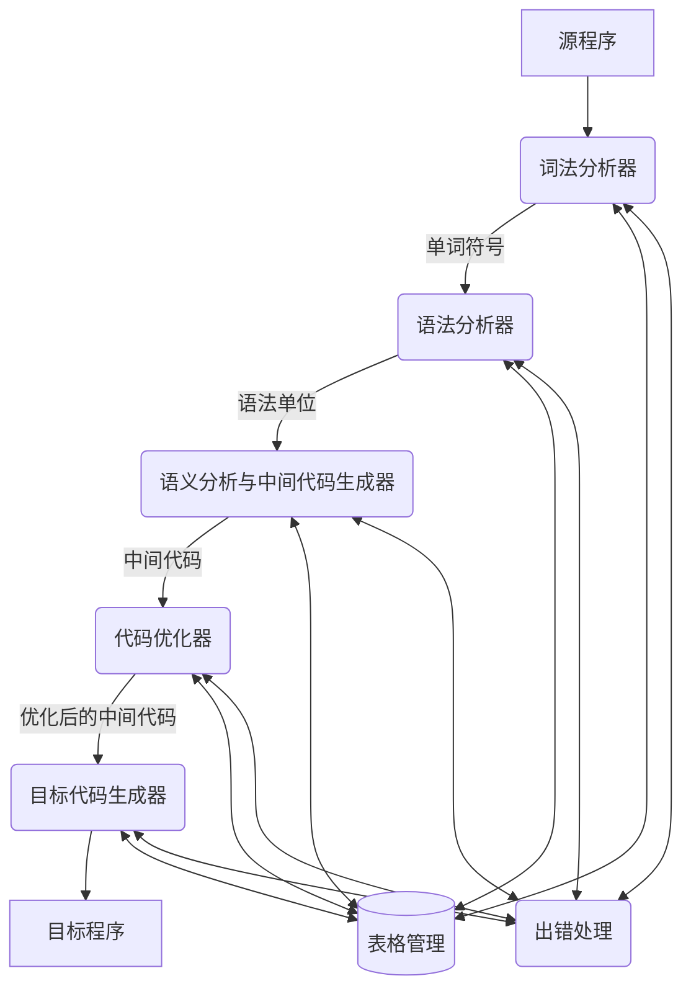

# 第一章 课后作业参考答案

---

### 1. 什么是编译程序？
**解答**：
编译程序（Compiler）是一种翻译程序。它将用某种高级程序设计语言（源语言）书写的源程序，翻译成等价的另一种低级语言（如汇编语言或机器语言，即目标语言）的目标程序。

---

### 2. 计算机执行用高级语言编写的程序有哪些方式？它们之间的主要区别是什么？
**解答**：
*   **执行方式**：
    1.  **编译方式**：先通过编译程序把高级语言源程序翻译成等价的目标程序（机器语言或汇编语言形式），然后再运行这个目标程序。
    2.  **解释方式**：以源程序作为输入，在运行期间不产生独立的目标代码，而是由解释程序边解释边执行源程序本身。
*   **主要区别**：
    *   **是否产生目标代码**。编译方式会产生独立的目标代码文件，编译完成后可独立于源程序和编译程序多次重复运行；而解释方式在运行期间不产生目标代码，每次运行都必须有源程序和解释程序的参与。

---

### 3. 编译过程通常分为哪几个阶段？请给出编译程序总框图。
**解答**：
*   **编译过程划分的阶段**：
    1.  **词法分析**（依循词法规则，识别出单词符号）
    2.  **语法分析**（依循语法规则，将单词符号串分解成各类语法单位）
    3.  **语义分析与中间代码生成**（进行静态语义检查并进行初步翻译，产生中间代码）
    4.  **优化**（对中间代码进行加工变换，使生成的目标代码更高效）
    5.  **目标代码生成**（将中间代码翻译成特定机器的低级语言代码）
    *此外，整个编译阶段都涉及**表格管理**和**出错处理**。*

*   **编译程序总框图**：

