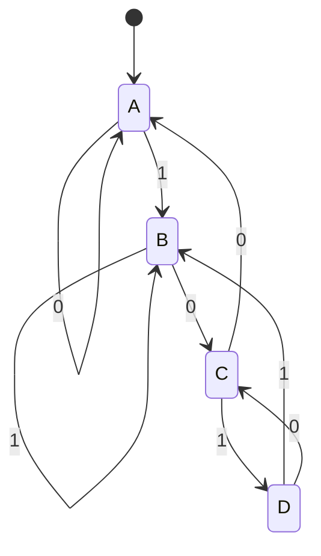
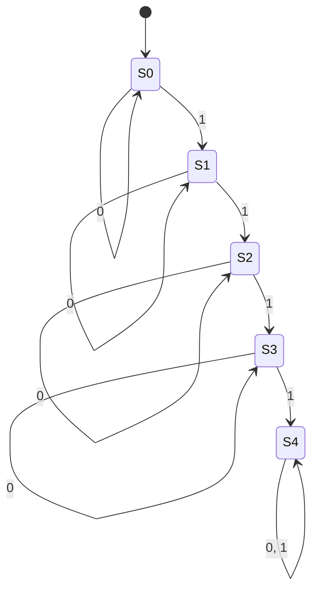
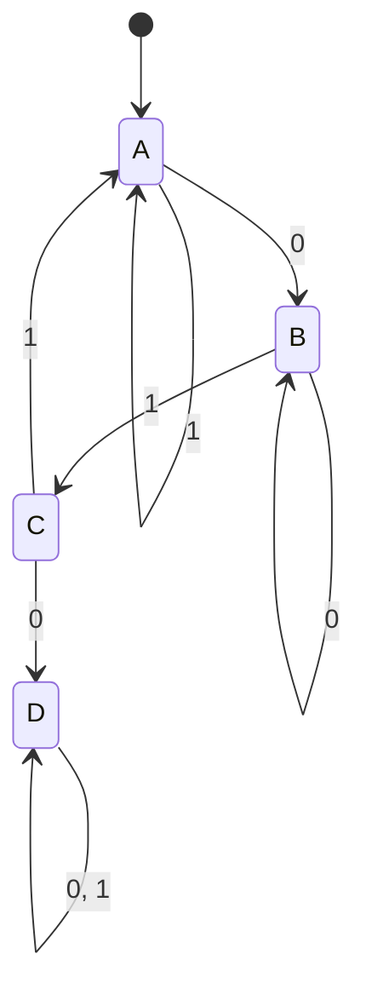
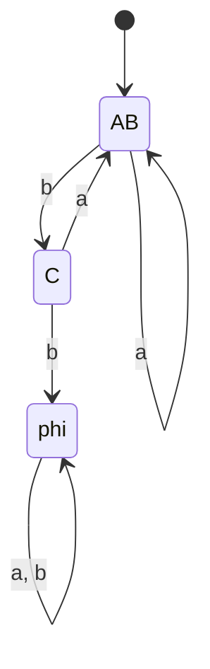
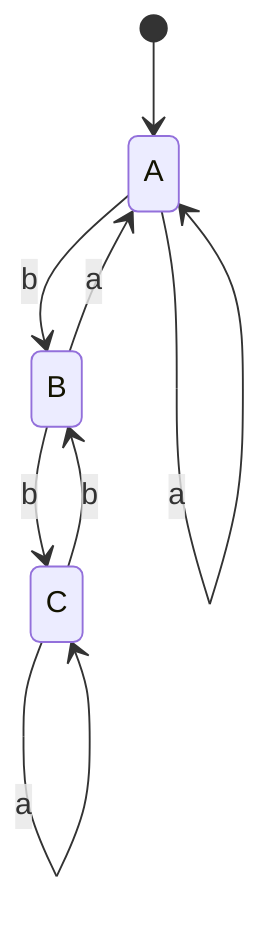

# 第三章 课后作业参考答案

---

### 6. 令 $A$、$B$ 和 $C$ 是任意正规式，证明以下关系成立。
(1) $A \mid A = A$
(2) $(A^*)^* = A^*$
(3) $A^* = \varepsilon \mid A A^*$
(4) $(AB)^*A = A(BA)^*$
(5) $A = b \mid aA$ 当且仅当 $A = a^*b$

**解答**：
**(1) 证明 $A \mid A = A$**：
根据正规式并集运算对应的集合定义，有：
$$ L(A \mid A) = L(A) \cup L(A) = L(A) $$
故 $A \mid A = A$ 成立。

**(2) 证明 $(A^*)^* = A^*$**：
由克林闭包运算定义，对于任意集合 $S$，其闭包为 $S^* = \bigcup_{i=0}^{\infty} S^i$。
则有：
$$ L(A^*) = \bigcup_{i=0}^{\infty} L(A)^i $$
$$ L((A^*)^*) = \bigcup_{j=0}^{\infty} L(A^*)^j = \bigcup_{j=0}^{\infty} \left( \bigcup_{i=0}^{\infty} L(A)^i \right)^j $$
因为上式中右侧项表示对 $L(A)$ 的任意有限次、无限次连接与并集，而这与 $L(A^*)$ 中所包含的元素集合范围完全一致（均由 $\varepsilon$ 以及由 $L(A)$ 中元素连接而成的有限长字串组成），因此两集合相等：
$$ L((A^*)^*) = L(A^*) $$
故 $(A^*)^* = A^*$ 成立。

**(3) 证明 $A^* = \varepsilon \mid A A^*$**：
展开克林闭包 $L(A^*)$：
$$
\begin{aligned}
L(A^*) &= \{\varepsilon\} \cup L(A) \cup L(A)^2 \cup L(A)^3 \cup \dots \\
&= \{\varepsilon\} \cup L(A) \left( \{\varepsilon\} \cup L(A) \cup L(A)^2 \cup \dots \right) \\
&= \{\varepsilon\} \cup L(A) L(A^*) \\
&= L(\varepsilon \mid A A^*)
\end{aligned}
$$
故 $A^* = \varepsilon \mid A A^*$ 成立。

**(4) 证明 $(AB)^*A = A(BA)^*$**：
展开左侧正规式表示的集合：
$$
\begin{aligned}
L((AB)^*A) &= \left( \bigcup_{i=0}^{\infty} (L(A)L(B))^i \right) L(A) \\
&= \{ \varepsilon, AB, ABAB, ABABAB, \dots \} L(A) \\
&= \{ A, ABA, ABABA, ABABABA, \dots \}
\end{aligned}
$$
展开右侧正规式表示的集合：
$$
\begin{aligned}
L(A(BA)^*) &= L(A) \left( \bigcup_{i=0}^{\infty} (L(B)L(A))^i \right) \\
&= L(A) \{ \varepsilon, BA, BABA, BABABA, \dots \} \\
&= \{ A, ABA, ABABA, ABABABA, \dots \}
\end{aligned}
$$
显然两边集合完全一致，故 $(AB)^*A = A(BA)^*$ 成立。

**(5) 证明 $A = b \mid aA$ 当且仅当 $A = a^*b$**：
*   **充分性**（若 $A = a^*b$，则满足等式）：
    将 $A = a^*b$ 带入右式中：
    $$
    \begin{aligned}
    b \mid aA &= b \mid a(a^*b) \\
    &= (\varepsilon \mid a a^*) b
    \end{aligned}
    $$
    由题(3)已证结论知 $\varepsilon \mid a a^* = a^*$，带入后有：
    $$ (\varepsilon \mid a a^*) b = a^*b = A $$
    等式成立。
*   **必要性**（若 $A = b \mid aA$，在 $\varepsilon \notin L(a)$ 的前提下其唯一解为 $a^*b$）：
    根据 Arden 引理（Arden's Lemma），对于集合方程 $X = AX \cup B$，如果空字 $\varepsilon \notin L(A)$，则该方程有唯一的代数解 $X = A^*B$。因此当 $\varepsilon \notin L(a)$ 时，$A = a^*b$ 是 $A = b \mid aA$ 的唯一解。

---

### 7. 构造下列正规式相应的 DFA。
(1) $1(0 \mid 1)^*101$
(2) $0^*10^*10^*10^*$  *(原书标注为第3问)*

**解答**：

#### (1) 对于正规式 $1(0 \mid 1)^*101$
（该 DFA 的子集构造法详细步骤可见[课本大题-答案](file:///D:/Study/ComputerScience/Computer_2026_Spring_Term/Compiler_Principles/exercises/homework/%E7%BC%96%E8%AF%91%E5%8E%9F%E7%90%86_%E8%AF%BE%E6%9C%AC%E5%A4%A7%E9%A2%98_%E7%AD%94%E6%A1%88.md#1-%E5%AF%B9%E4%BA%8E%E6%AD%A3%E8%A7%84%E5%BC%8F-10--1101)）

*   **DFA 状态转移表**：

| 状态 | 输入 $0$ | 输入 $1$ | 是否接受 |
| :--- | :--- | :--- | :--- |
| **$A$** (初态) | $A$ | $B$ | 否 |
| **$B$** | $C$ | $B$ | 否 |
| **$C$** | $A$ | $D$ | 否 |
| **$D$** (终态) | $C$ | $B$ | 是 |

*   **DFA 状态图**：

#### (2) 对于正规式 $0^*10^*10^*10^*$
该语言的特征是：包含**恰好三个**字符 $1$，且在这三个 $1$ 之间和前后允许填充任意多个 $0$。

*   **DFA 状态定义**：
    *   $S_0$：已匹配 $0$ 个 $1$（初态）。
    *   $S_1$：已匹配 $1$ 个 $1$。
    *   $S_2$：已匹配 $2$ 个 $1$。
    *   $S_3$：已匹配 $3$ 个 $1$（终态/接受状态）。
    *   $S_4$：已匹配多于 $3$ 个 $1$（死状态，任何输入均无法再接受）。

*   **状态转移关系**：
    *   $\delta(S_0, 0) = S_0$，$\delta(S_0, 1) = S_1$
    *   $\delta(S_1, 0) = S_1$，$\delta(S_1, 1) = S_2$
    *   $\delta(S_2, 0) = S_2$，$\delta(S_2, 1) = S_3$
    *   $\delta(S_3, 0) = S_3$，$\delta(S_3, 1) = S_4$
    *   $\delta(S_4, 0) = S_4$，$\delta(S_4, 1) = S_4$

---

### 8. 给出下面正规表达式。
(1) 以 `01` 结尾的二进制数串。
(2) 能被 $5$ 整除的十进制整数。
(3) 包含奇数个 $1$ 或奇数个 $0$ 的二进制数串。

**解答**：
(1) **以 `01` 结尾的二进制数串**：
$$ (0 \mid 1)^*01 $$

(2) **能被 $5$ 整除的十进制整数**：
考虑到不应有前导零，可以独立表示整数 $0$，首位非零的其他以 $0$ 或 $5$ 结尾的数字串：
$$ 0 \mid (1 \mid 2 \mid 3 \mid 4 \mid 5 \mid 6 \mid 7 \mid 8 \mid 9)(0 \mid 1 \mid 2 \mid 3 \mid 4 \mid 5 \mid 6 \mid 7 \mid 8 \mid 9)^*(0 \mid 5) $$

(3) **包含奇数个 $1$ 或奇数个 $0$ 的二进制数串**：
*   奇数个 $1$ 的表示式（$0$ 任意）：$(0 \mid 10^*1)^*10^*$
*   奇数个 $0$ 的表示式（$1$ 任意）：$(1 \mid 01^*0)^*01^*$
*   求两者并集：
    $$ (0 \mid 10^*1)^*10^* \mid (1 \mid 01^*0)^*01^* $$

---

### 9. 对下面情况给出 DFA 及正规表达式。
(1) $\{0,1\}$ 上包含子串 `010` 的所有串。

**解答**：
*   **正规表达式**：
    $$ (0 \mid 1)^*010(0 \mid 1)^* $$

*   **DFA 状态与转移关系**：
    *   $A$：初态，表示目前没有匹配子串前缀。
    *   $B$：已匹配到前缀 `0`。
    *   $C$：已匹配到前缀 `01`。
    *   $D$：已完全匹配 `010`，为终态/接受状态。

*   **DFA 转移表**：

| 状态 | 输入 $0$ | 输入 $1$ | 是否接受 |
| :--- | :--- | :--- | :--- |
| **$A$** (初态) | $B$ | $A$ | 否 |
| **$B$** | $B$ | $C$ | 否 |
| **$C$** | $D$ | $A$ | 否 |
| **$D$** (终态) | $D$ | $D$ | 是 |

*   **DFA 状态图**：

---

### 12. 将下面的有限自动机分别确定化和最小化。
**(a) 需确定化的有限自动机。**
**(b) 需最小化的有限自动机。**

**解答**：

#### (a) 有限自动机确定化与最少化过程
原 NFA 转移表（初态与接受状态均为 $0$）：
*   $\delta(0, a) = \{0, 1\}$
*   $\delta(0, b) = \{1\}$
*   $\delta(1, a) = \{0\}$
*   $\delta(1, b) = \emptyset$

**子集确定化步骤**：
1.  **初态集**：$A = [0]$ （由于包含原终态 $0$，为接受状态）
2.  **求转移关系**：
    *   $\text{move}(A, a) = \delta(0, a) = [0, 1] = B$ （接受状态）
    *   $\text{move}(A, b) = \delta(0, b) = [1] = C$ （非接受状态）
3.  **对子集 $B = [0, 1]$ 计算**：
    *   $\text{move}(B, a) = \delta(0, a) \cup \delta(1, a) = \{0, 1\} \cup \{0\} = [0, 1] = B$
    *   $\text{move}(B, b) = \delta(0, b) \cup \delta(1, b) = \{1\} \cup \emptyset = [1] = C$
4.  **对子集 $C = [1]$ 计算**：
    *   $\text{move}(C, a) = \delta(1, a) = [0] = A$
    *   $\text{move}(C, b) = \delta(1, b) = \emptyset = \Phi$ （死状态/空集）
5.  **死状态 $\Phi$ 计算**：
    *   $\text{move}(\Phi, a) = \Phi$，$\text{move}(\Phi, b) = \Phi$

**确定化后的转移表**：

| 确定化状态 | 对应子集 | 输入 $a$ | 输入 $b$ | 是否接受 |
| :--- | :--- | :--- | :--- | :--- |
| **$A$** (初态) | $\{0\}$ | $B$ | $C$ | 是 |
| **$B$** | $\{0, 1\}$ | $B$ | $C$ | 是 |
| **$C$** | $\{1\}$ | $A$ | $\Phi$ | 否 |
| **$\Phi$** | $\emptyset$ | $\Phi$ | $\Phi$ | 否 |

**进行状态最小化（最少化）**：
1.  **初始划分**：
    *   接受状态组：$S_1 = \{A, B\}$
    *   非接受状态组：$S_2 = \{C, \Phi\}$
2.  **检查 $S_1 = \{A, B\}$ 的等价性**：
    *   输入 $a$：$A \xrightarrow{a} B \in S_1$，$B \xrightarrow{a} B \in S_1$ （同组）
    *   输入 $b$：$A \xrightarrow{b} C \in S_2$，$B \xrightarrow{b} C \in S_2$ （同组）
    *   因此 $A$ 和 $B$ 等价，可以合并，记为状态 $AB$（接受状态，也是初态）。
3.  **检查 $S_2 = \{C, \Phi\}$ 的等价性**：
    *   输入 $a$：$C \xrightarrow{a} A \in S_1$，而 $\Phi \xrightarrow{a} \Phi \in S_2$ （分属不同组）
    *   因此 $C$ 和 $\Phi$ 不等价，必须拆分。
4.  **最终化简状态集**为：$\{AB, C, \Phi\}$。

**最小化后的 DFA 转移图**：

---

#### (b) 有限自动机最小化过程
原 DFA 状态集 $S = \{0, 1, 2, 3, 4, 5\}$，初态为 $0$，接受状态集为 $F = \{0, 1\}$。

1.  **初始划分为两个子集**：
    *   接受状态集：$S_1 = \{0, 1\}$
    *   非接受状态集：$S_2 = \{2, 3, 4, 5\}$

2.  **分析划分 $S_2 = \{2, 3, 4, 5\}$**：
    *   考察对输入 $a$ 的转移：
        *   $\delta(2, a) = 1 \in S_1$
        *   $\delta(3, a) = 3 \in S_2$
        *   $\delta(4, a) = 0 \in S_1$
        *   $\delta(5, a) = 5 \in S_2$
    *   由于 $\{2, 4\}$ 转移到 $S_1$，而 $\{3, 5\}$ 转移到 $S_2$，原集合拆分为：
        $$ P_1 = \{ \{0, 1\}, \{2, 4\}, \{3, 5\} \} $$

3.  **分析 $P_1$ 中的各个子集**：
    *   **检查子集 $\{0, 1\}$**：
        *   输入 $a$：$\delta(0, a) = 1 \in \{0, 1\}$，$\delta(1, a) = 1 \in \{0, 1\}$
        *   输入 $b$：$\delta(0, b) = 2 \in \{2, 4\}$，$\delta(1, b) = 4 \in \{2, 4\}$
        *   因为转移目标落在相同分组内，所以 $0$ 和 $1$ 等价。记作状态 $A = \{0, 1\}$。
    *   **检查子集 $\{2, 4\}$**：
        *   输入 $a$：$\delta(2, a) = 1 \in \{0, 1\}$，$\delta(4, a) = 0 \in \{0, 1\}$
        *   输入 $b$：$\delta(2, b) = 3 \in \{3, 5\}$，$\delta(4, b) = 5 \in \{3, 5\}$
        *   因为转移目标落在相同分组内，所以 $2$ 和 $4$ 等价。记作状态 $B = \{2, 4\}$。
    *   **检查子集 $\{3, 5\}$**：
        *   输入 $a$：$\delta(3, a) = 3 \in \{3, 5\}$，$\delta(5, a) = 5 \in \{3, 5\}$
        *   输入 $b$：$\delta(3, b) = 2 \in \{2, 4\}$，$\delta(5, b) = 4 \in \{2, 4\}$
        *   因为转移目标落在相同分组内，所以 $3$ 和 $5$ 等价。记作状态 $C = \{3, 5\}$。

4.  **划分收敛**，最终最小化状态集为 $\{A, B, C\}$：
    *   $A$ （接受状态，包含原初态 $0$，为新初态）
    *   $B$ （非接受状态）
    *   $C$ （非接受状态）

**最小化后的 DFA 转移图**：

