# 《编译原理》历年试题及答案(共7套)

---

# 第一套 《编译原理》历年试题及答案

## 一、选择题(每项选择2分,共20分)

**1. 将编译程序分成若干个"遍"是为了 ( )。**

* A. 提高程序的执行效率
* B. 使程序的结构更加清晰
* C. 利用有限的机器内存并提高机器的执行效率
* D. 利用有限的机器内存但降低了机器的执行效率

**2. 构造编译程序应掌握 ( )。**

* A. 源程序
* B. 目标语言
* C. 编译方法
* D. 以上三项都是

**3. 变量应当 ( )。**

* A. 持有左值
* B. 持有右值
* C. 既持有左值又持有右值
* D. 既不持有左值也不持有右值

**4. 编译程序绝大多数时间花在 ( ) 上。**

* A. 出错处理
* B. 词法分析
* C. 目标代码生成
* D. 管理表格

**5. 词法分析器的输出结果是 ( )。**

* A. 单词的种别编码
* B. 单词在符号表中的位置
* C. 单词的种别编码和自身值
* D. 单词自身值

**6. 正规式 $M_1$ 和 $M_2$ 等价是指 ( )。**

* A. $M_1$ 和 $M_2$ 的状态数相等
* B. $M_1$ 和 $M_2$ 的有向弧条数相等
* C. $M_1$ 和 $M_2$ 所识别的语言集相等
* D. $M_1$ 和 $M_2$ 状态数和有向弧条数相等

**7. 中间代码生成时所依据的是 ( )。**

* A. 语法规则
* B. 词法规则
* C. 语义规则
* D. 等价变换规则

**8. 后缀式 $ab+cd+/$ 可用表达式 ( ) 来表示。**

* A. $a+b/c+d$
* B. $(a+b)/(c+d)$
* C. $a+b/(c+d)$
* D. $a+b+c/d$

**9. 程序所需的数据空间在程序运行前就可确定,称为 ( ) 管理技术。**

* A. 动态存储
* B. 栈式存储
* C. 静态存储
* D. 堆式存储

**10. 堆式动态分配申请和释放存储空间遵守 ( ) 原则。**

* A. 先请先放
* B. 先请后放
* C. 后请先放
* D. 任意

## 二、简答题(每小题10分,共80分)

**1. 画出编译程序的总体结构图,简述各部分的主要功能。**

**2. 已知文法 $G[E]$:$E \to ET+ \mid T$,$T \to TF* \mid F$,$F \to F^ \mid a$。试证 $FF^{\wedge\wedge}*$ 是文法的句型,指出该句型的短语、简单短语和句柄。**

**3. 为正规式 $(a \mid b)^*a(a \mid b)$ 构造一个确定的有限自动机。**

**4. 设文法 $G(S)$:$S \to (L) \mid aS \mid a$,$L \to L,S \mid S$。**

**(1) 消除左递归和回溯;**

**(2) 计算每个非终结符的 $\text{FIRST}$ 和 $\text{FOLLOW}$;**

**(3) 构造预测分析表。**

**5. 已知文法 $A \to aAd \mid aAb \mid \varepsilon$,判断该文法是否是 SLR(1) 文法,若是构造相应分析表,并对输入串 $ab\#$ 给出分析过程。**

**6. 构造算符文法 $G[H]$ 的算符优先关系(含 $\#$)。**

$$
G[H]: H \to H;M \mid M, \quad M \to d \mid aHb
$$

**7. 已构造出文法 $G(S)$:**

**(1) $S \to BB$**

**(2) $B \to aB$**

**(3) $B \to b$**

**(1) 给出 DFA 图;**

**(2) 给出 LR 分析表;**

**(3) 假定输入串为 $abaab$,请给出 LR 分析过程(即状态、符号、输入串的变化过程)。**

**8. 将下面的语句翻译成四元式序列:**

```
while A<C∧B<D do
    if A=1 then C:=C+1
    else while A≤D do
        A:=A+2;
```

**9. 对下面的流图:**

**(1) 求出流图中各结点 $N$ 的必经结点集 $D(n)$;**

**(2) 求出流图中的回边;**

**(3) 求出流图中的循环。**

---

## 参考答案

### 一、单项选择题

**1.** 将编译程序分成若干个"遍"是为了使编译程序的结构更加清晰,故选 B。

**2.** 构造编译程序应掌握源程序、目标语言及编译方法等三方面的知识,故选 D。

**3.** 对编译而言,变量既持有左值又持有右值,故选 C。

**4.** 编译程序打交道最多的就是各种表格,因此选 D。

**5.** 词法分析器输出的结果是单词的种别编码和自身值,选 C。

**6.** 正规式 $M_1$ 和 $M_2$ 所识别的语言集相等,故选 C。

**7.** 选 C。

**8.** 选 B。

**9.** 选 C。

**10.** 堆式动态分配申请和释放存储空间不一定遵守先请后放和后请先放的原则,故选 D。

### 二、简答题

**1.【解答】**

编译程序的总体结构图如图 1.2 所示。

> **注:** 此处原试卷引用了"图 1.2"(编译程序总体结构图),原始图片未包含在文档中。

* 词法分析器:输入源程序,进行词法分析,输出单词符号。
* 语法分析器:在词法分析的基础上,根据语言的语法规则(文法规则)把单词符号串分解成各类语法单位,并判断输入串是否构成语法上正确的"程序"。
* 中间代码生成器:按照语义规则把语法分析器归约(或推导)出的语法单位翻译成一定形式的中间代码,比如说四元式。
* 优化:对中间代码进行优化处理。
* 目标代码生成器:把中间代码翻译成目标语言程序。
* 表格管理模块保存一系列的表格,登记源程序的各类信息和编译各阶段的进展情况。编译程序各阶段所产生的中间结果都记录在表格中,所需信息多数都需从表格中获取,整个编译过程都在不断地和表格打交道。
* 出错处理程序对出现在源程序中的错误进行处理。此外,编译的各阶段都可能出现错误,出错处理程序对发现的错误都及时进行处理。

**2.【解答】**

该句型相对于 $E$ 的短语有 $FF^{\wedge\wedge}*$;相对于 $T$ 的短语有 $FF^{\wedge\wedge}*$, $F$;相对于 $F$ 的短语有 $F^{\wedge}$, $F^{\wedge\wedge}$;简单短语有 $F$, $F^{\wedge}$;句柄为 $F$。

**3.【解答】**

最简 DFA 如图 2.66 所示。

> **注:** 此处原试卷引用了"图 2.66"(正规式 $(a|b)^*a(a|b)$ 的最简 DFA),原始图片未包含在文档中。

**4.【解答】**

(1) 消除左递归:

$$
S \to (L) \mid aS', \quad S' \to S \mid \varepsilon, \quad L \to SL', \quad L' \to SL' \mid \varepsilon
$$

评分细则:消除左递归2分,提公共因子2分。

(2) $\text{FIRST}$ 和 $\text{FOLLOW}$:

| 非终结符 | $\text{FIRST}$ | $\text{FOLLOW}$ |
|---|---|---|
| $S$ | $\{(, a\}$ | $\{\#, ,, )\}$ |
| $S'$ | $\{a, \varepsilon\}$ | $\{\#, ,, )\}$ |
| $L$ | $\{(, a\}$ | $\{)\}$ |
| $L'$ | $\{,, \varepsilon\}$ | $\{)\}$ |

**5.【解答】**

(1) 拓广文法:

$$
(0)\ S' \to A, \quad (1)\ A \to aAd, \quad (2)\ A \to aAb, \quad (3)\ A \to \varepsilon
$$

(2) 构造识别活前缀的 DFA:$\text{FOLLOW}(A) = \{d, b, \#\}$

对于该文法，构造的 LR(0) 项目集规范族与转换关系如下表所示：

| 状态 | $a$ | $b$ | $d$ | $\#$ | $A$ |
|---|---|---|---|---|---|
| **$I_0$**:<br>$S' \to \cdot A$<br>$A \to \cdot aAd$<br>$A \to \cdot aAb$<br>$A \to \cdot$ | $I_2$:<br>$A \to a \cdot Ad$<br>$A \to a \cdot Ab$<br>$A \to \cdot aAd$<br>$A \to \cdot aAb$<br>$A \to \cdot$ | | | | $I_1$:<br>$S' \to A \cdot$ |
| **$I_1$**:<br>$S' \to A \cdot$ | | | | acc | |
| **$I_2$**:<br>$A \to a \cdot Ad$<br>$A \to a \cdot Ab$<br>$A \to \cdot aAd$<br>$A \to \cdot aAb$<br>$A \to \cdot$ | $I_2$ | | | | $I_3$:<br>$A \to aA \cdot d$<br>$A \to aA \cdot b$ |
| **$I_3$**:<br>$A \to aA \cdot d$<br>$A \to aA \cdot b$ | | $I_4$:<br>$A \to aAb \cdot$ | $I_5$:<br>$A \to aAd \cdot$ | | |
| **$I_4$**:<br>$A \to aAb \cdot$ | | | | | |
| **$I_5$**:<br>$A \to aAd \cdot$ | | | | | |

<!--  -->


对于状态 $I_0$:$\text{FOLLOW}(A) \cap \{a\} = \emptyset$

对于状态 $I_1$:$\text{FOLLOW}(A) \cap \{a\} = \emptyset$

因为在 DFA 中无冲突的现象,所以该文法是 SLR(1) 文法。

(3) SLR(1) 分析表:

| 状态 | $a$ | $b$ | $d$ | $\#$ | $A$ |
|---|---|---|---|---|---|
| 0 | S2 | r3 | r3 | r3 | 1 |
| 1 | | | | acc | |
| 2 | S2 | r3 | r3 | r3 | 3 |
| 3 | | S4 | S5 | | |
| 4 | r2 | r2 | r2 | | |
| 5 | r1 | r1 | r1 | | |

(4) 串 $ab\#$ 的分析过程:

| 步骤 | 状态栈 | 符号栈 | 当前字符 | 剩余字符串 | 动作 |
|---|---|---|---|---|---|
| 1 | 0 | $\#$ | $a$ | $b\#$ | 移进 |
| 2 | 02 | $\#a$ | $b$ | $\#$ | 归约 $A \to \varepsilon$ |
| 3 | 023 | $\#aA$ | $b$ | $\#$ | 移进 |
| 4 | 0235 | $\#aAb$ | $\#$ | | 归约 $A \to aAb$ |
| 5 | 01 | $\#A$ | $\#$ | | 接受 |

**6.【解答】**

由 $M \to d$ 和 $M \to a\ldots$ 得:$\text{FIRSTVT}(M) = \{d, a\}$;

由 $H \to H;\ldots$ 得:$\text{FIRSTVT}(H) = \{;\}$;

由 $H \to M$ 得:$\text{FIRSTVT}(M) \subset \text{FIRSTVT}(H)$,即 $\text{FIRSTVT}(H) = \{;, d, a\}$。

由 $M \to d$ 和 $M \to \ldots b$ 得:$\text{LASTVT}(M) = \{d, b\}$;

由 $H \to H;\ldots$ 得:$\text{LASTVT}(H) = \{;\}$;

由 $H \to M$ 得:$\text{LASTVT}(M) \subset \text{LASTVT}(H)$,即 $\text{LASTVT}(H) = \{;, d, b\}$。

对文法开始符 $H$,有 $\#H\#$ 存在,即有 $\# = \#$,$\# < \text{FIRSTVT}(H)$,$\text{LASTVT}(H) > \#$,也即 $\# < ;$,$\# < d$,$\# < a$,$; > \#$,$d > \#$,$b > \#$。

对形如 $P \to \ldots ab \ldots$ 或 $P \to \ldots aQb \ldots$,有 $a = b$,由 $M \to aHb$ 得:$a = b$。

对形如 $P \to \ldots aR \ldots$,而 $b \in \text{FIRSTVT}(R)$,有 $a < b$;对形如 $P \to \ldots Rb \ldots$,而 $a \in \text{LASTVT}(R)$,有 $a > b$。

由 $H \to \ldots;M$ 得:$; < \text{FIRSTVT}(M)$,即 $; < d$,$; < a$。

由 $M \to aH\ldots$ 得:$a < \text{FIRSTVT}(H)$,即 $a < ;$,$a < d$,$a < a$。

由 $H \to H;\ldots$ 得:$\text{LASTVT}(H) > ;$,即 $; > ;$,$d > ;$,$b > ;$。

由 $M \to \ldots Hb$ 得:$\text{LASTVT}(H) > b$,即 $; > b$,$d > b$,$b > b$。

由此得到算符优先关系表,见表 3.5。

> **注:** 此处原试卷引用了"表 3.5"(算符优先关系表),原始图片未包含在文档中。

**7.【解答】**

(1) LR 分析表如下:

(2) 分析表:

| 状态 | $a$ | $b$ | $\#$ | $S$ | $B$ |
|---|---|---|---|---|---|
| 0 | s3 | s4 | | 1 | 2 |
| 1 | | | acc | | |
| 2 | s3 | s4 | | | 5 |
| 3 | s3 | s4 | | | 6 |
| 4 | r3 | r3 | | | |
| 5 | r1 | r1 | r1 | | |
| 6 | r2 | r2 | r2 | | |

(3) 句子 $abaab$ 的分析过程:

| 步骤 | 状态栈 | 符号栈 | 输入串 | 所得产生式 |
|---|---|---|---|---|
| 0 | #0 | $\#$ | $abaab\#$ | |
| 1 | #03 | $\#a$ | $baab\#$ | |
| 2 | #034 | $\#ab$ | $aab\#$ | $B \to b$ |
| 3 | #036 | $\#aB$ | $aab\#$ | $B \to aB$ |
| 4 | #0363 | $\#aBa$ | $ab\#$ | |
| 5 | #03634 | $\#aBab$ | $b\#$ | $B \to b$ |
| 6 | #03636 | $\#aBaB$ | $b\#$ | $B \to aB$ |
| 7 | #036364 | $\#aBaBb$ | $\#$ | $B \to b$ |
| 8 | #036366 | $\#aBaBB$ | $\#$ | $B \to aB$ |
| 9 | #0365 | $\#aBB$ | $\#$ | $S \to BB$ |
| 10 | #025 | $\#BB$ | $\#$ | |
| 11 | #01 | $\#S$ | $\#$ | |
| 12 | # | $\#$ | $\#$ | 识别成功 |

**8.【解答】**

该语句的四元式序列如下(其中 E1、E2 和 E3 分别对应 $A<C \wedge B<D$、$A=1$ 和 $A \le D$,并且关系运算符优先级高):

```
100 (j<, A, C, 102)
101 (j, _, _, 113)         /* E1 为 F */
102 (j<, B, D, 104)        /* E1 为 T */
103 (j, _, _, 113)         /* E1 为 F */
104 (j=, A, 1, 106)        /* E2 为 T */
105 (j, _, _, 108)         /* E2 为 F */
106 (+, C, 1, C)           /* C:=C+1 */
107 (j, _, _, 112)         /* 跳过 else 后的语句 */
108 (j≤, A, D, 110)        /* E3 为 T */
109 (j, _, _, 112)         /* E3 为 F */
110 (+, A, 2, A)           /* A:=A+2 */
111 (j, _, _, 108)         /* 转回内层 while 语句开始处 */
112 (j, _, _, 100)         /* 转回外层 while 语句开始处 */
113
```

**9.【解答】**

(1) 流图中各结点 $N$ 的必经结点集 $D(n)$:

$$
D(1)=\{1\},\ D(2)=\{1,2\},\ D(3)=\{1,2,3\},\ D(4)=\{1,2,3,4\},\ D(5)=\{1,2,5\},\ D(6)=\{1,2,5,6\}
$$

(2) 求出流图中的回边:$5 \to 2$,$4 \to 3$。

(3) 求出流图中的循环:

* 回边 $5 \to 2$ 对应的循环:2、5、3、4;
* 回边 $4 \to 3$ 对应的循环:3、4。

---

# 第二套 《编译原理》模拟试题一

## 一、是非题(请在括号内,正确的划√,错误的划×)(每个2分,共20分)

**1.** 计算机高级语言翻译成低级语言只有解释一种方式。(×)

**2.** 在编译中进行语法检查的目的是为了发现程序中所有错误。(×)

**3.** 甲机上某编译程序在乙机上能直接使用的必要条件是甲机和乙机的操作系统功能完全相同。(×)

**4.** 正则文法其产生式为 $A \to a$,$A \to Bb$,$A,B \in V_N$,$a, b \in V_T$。(×)

**5.** 每个文法都能改写为 LL(1) 文法。(√)

**6.** 递归下降法允许任一非终极符是直接左递归的。(√)

**7.** 算符优先关系表不一定存在对应的优先函数。(×)

**8.** 自底而上语法分析方法的主要问题是候选式的选择。(×)

**9.** LR 法是自顶向下语法分析方法。(×)

**10.** 简单优先文法允许任意两个产生式具有相同右部。(×)

## 二、选择题(请在前括号内选择最确切的一项作为答案划一个勾,多划按错论)(每个4分,共40分)

**1. 一个编译程序中,不仅包含词法分析,_____,中间代码生成,代码优化,目标代码生成等五个部分。**

* A. 语法分析
* B. 文法分析
* C. 语言分析
* D. 解释分析

**2. 词法分析器用于识别_____。**

* A. 字符串
* B. 语句
* C. 单词
* D. 标识符

**3. 语法分析器则可以发现源程序中的_____。**

* A. 语义错误
* B. 语法和语义错误
* C. 错误并校正
* D. 语法错误

**4. 下面关于解释程序的描述正确的是_____。**

(1) 解释程序的特点是处理程序时不产生目标代码
(2) 解释程序适用于 COBOL 和 FORTRAN 语言
(3) 解释程序是为打开编译程序技术的僵局而开发的

* A. (1)(2)
* B. (1)
* C. (1)(2)(3)
* D. (2)(3)

**5. 解释程序处理语言时,大多数采用的是_____方法。**

* A. 源程序命令被逐个直接解释执行
* B. 先将源程序转化为中间代码,再解释执行
* C. 先将源程序解释转化为目标程序,再执行
* D. 以上方法都可以

**6. 编译过程中,语法分析器的任务就是_____。**

(1) 分析单词是怎样构成的
(2) 分析单词串是如何构成语句和说明的
(3) 分析语句和说明是如何构成程序的
(4) 分析程序的结构

* A. (2)(3)
* B. (2)(3)(4)
* C. (1)(2)(3)
* D. (1)(2)(3)(4)

**7. 编译程序是一种_____。**

* A. 汇编程序
* B. 翻译程序
* C. 解释程序
* D. 目标程序

**8. 文法 G 所描述的语言是_____的集合。**

* A. 文法 G 的字母表 V 中所有符号组成的符号串
* B. 文法 G 的字母表 V 的闭包 $V^*$ 中的所有符号串
* C. 由文法的开始符号推出的所有终极符串
* D. 由文法的开始符号推出的所有符号串

**9. 文法分为四种类型,即0型、1型、2型、3型。其中3型文法是_____。**

* A. 短语文法
* B. 正则文法
* C. 上下文有关文法
* D. 上下文无关文法

**10. 一个上下文无关文法 G 包括四个组成部分,它们是:一组非终结符号,一组终结符号,一个开始符号,以及一组 _____。**

* A. 句子
* B. 句型
* C. 单词
* D. 产生式

## 三、填空题(每空1分,共10分)

**1.** 编译程序的工作过程一般可以划分为词法分析、语法分析、语义分析、中间代码生成、代码优化等几个基本阶段,同时还会伴有 **表格处理** 和 **出错处理**。

**2.** 若源程序是用高级语言编写的,**目标程序** 是机器语言程序或汇编程序,则其翻译程序称为 **编译程序**。

**3.** 编译方式与解释方式的根本区别在于 **是否生成目标代码**。

**4.** 对编译程序而言,输入数据是 **源程序**,输出结果是 **目标程序**。

**5.** 产生式是用于定义 **语法成分** 的一种书写规则。

**6.** 语法分析最常用的两类方法是 **自上而下** 和 **自下而上** 分析法。

## 四、简答题(20分)

**1. 什么是句子?什么是语言?**

答:(1) 设 G 是一个给定的文法,S 是文法的开始符号,如果 $S \Rightarrow^* x$(其中 $x \in V_T^*$),则称 x 是文法的一个句子。(2) 设 G[S] 是给定文法,则由文法 G 所定义的语言 L(G) 可描述为:$L(G) = \{x \mid S \Rightarrow^* x, x \in V_T^*\}$。

**2. 写一文法,使其语言是偶正整数的集合,要求:**

**(1) 允许0打头;**

**(2) 不允许0打头。**

解:(1) G[S]=({S,P,D,N},{0,1,2,...,9},P,S)

P: S→PD|D, P→NP|N, D→0|2|4|6|8, N→0|1|2|3|4|5|6|7|8|9

(2) G[S]=({S,P,R,D,N,Q},{0,1,2,...,9},P,S)

P: S→PD|P0|D, P→NR|N, R→QR|Q, D→2|4|6|8, N→1|2|3|4|5|6|7|8|9, Q→0|1|2|3|4|5|6|7|8|9

**3. 已知文法 G[E] 为:$E \to T \mid E+T \mid E-T$,$T \to F \mid T*F \mid T/F$,$F \to (E) \mid i$。**

1 该文法的开始符号(识别符号)是什么?

2 请给出该文法的终结符号集合 $V_T$ 和非终结符号集合 $V_N$。

3 找出句型 $T+T*F+i$ 的所有短语、简单短语和句柄。

解:1 该文法的开始符号(识别符号)是 E。

2 该文法的终结符号集合 $V_T=\{+, -, *, /, (, ), i\}$。非终结符号集合 $V_N=\{E, T, F\}$。

3 句型 $T+T*F+i$ 的短语为 $i$、$T*F$、第一个 $T$、$T+T*F+i$;简单短语为 $i$、$T*F$、第一个 $T$;句柄为第一个 $T$。

**4. 构造正规式相应的 NFA:$1(0|1)^*101$。**

解:$1(0|1)^*101$ 对应的 NFA 如下图所示。

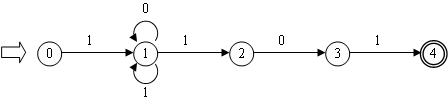
<p align="center">图 4.1 $1(0|1)^*101$ 对应的 NFA</p>

**5. 写出表达式 $(a+b*c)/(a+b)-d$ 的逆波兰表示和三元式序列。**

逆波兰表示:$abc*+ab+/d-$

三元式序列:

1 $(*, b, c)$

2 $(+, a, 1)$

3 $(+, a, b)$

4 $(/, 2, 3)$

5 $(-, 4, d)$

## 五、计算题(10分)

构造下述文法 G[S] 的自动机:$S \to A0$,$A \to A0 \mid S1 \mid 0$。该自动机是确定的吗?若不确定,则对它确定化。

解:由于该文法的产生式 $S \to A0$,$A \to A0 \mid S1$ 中没有字符集 $V_T$ 的输入,所以不是确定的自动机。要将它确定化,必须先用代入法得到它对应的正规式。把 $S \to A0$ 代入产生式 $A \to S1$ 有:$A = A0 \mid A01 \mid 0 = A(0|01) \mid 0 = 0(0|01)^*$。代入 $S \to A0$ 有该文法的正规式:$0(0|01)^*0$。

代入 $S \to A0$ 后得到等价的 NFA 状态图如下：

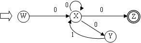
<p align="center">图 5.1 $0(0|01)^*0$ 等价的 NFA</p>

使用子集法将其确定化的状态转换表如下所示：

| 子集 $I$ | $I_0 = \varepsilon\text{-closure}(\text{MoveTo}(I, 0))$ | $I_1 = \varepsilon\text{-closure}(\text{MoveTo}(I, 1))$ |
|---|---|---|
| **$A[W]$** | $B[X]$ | $\emptyset$ |
| **$B[X]$** | $C[X, Y, Z]$ | $\emptyset$ |
| **$C[X, Y, Z]$** | $C[X, Y, Z]$ | $B[X]$ |

<!--  -->

由此得到的确定化 DFA 状态转换图如下所示：

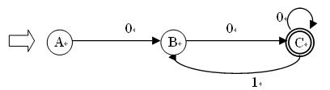
<p align="center">图 5.2 确定化后的 DFA</p>

---

# 第三套 《编译原理》模拟试题二

## 一、是非题(请在括号内,正确的划√,错误的划×)(每个2分,共20分)

**1.** "用高级语言书写的源程序都必须通过编译,产生目标代码后才能投入运行"这种说法。(×)

**2.** 若一个句型中出现了某产生式的右部,则此右部一定是该句型的句柄。(×)

**3.** 一个句型的句柄一定是文法某产生式的右部。(√)

**4.** 在程序中标识符的出现仅为使用性的。(×)

**5.** 仅考虑一个基本块,不能确定一个赋值是否真是无用的。(√)

**6.** 削减运算强度破坏了临时变量在一基本块内仅被定义一次的特性。(√)

**7.** 在中间代码优化中循环上的优化主要有不变表达式外提和削减运算强度。(×)

**8.** 算符优先关系表不一定存在对应的优先函数。(×)

**9.** 数组元素的地址计算与数组的存储方式有关。(×)

**10.** 编译程序与具体的机器有关,与具体的语言无关。(×)

## 二、选择题(请在前括号内选择最确切的一项作为答案划一个勾,多划按错论)(每个4分,共40分)

**1. 通常一个编译程序中,不仅包含词法分析,语法分析,中间代码生成,代码优化,目标代码生成等五个部分,还应包括_____。**

* A. 模拟执行器
* B. 解释器
* C. 表格处理和出错处理
* D. 符号执行器

**2. 文法 $G[N]=(\{b\},\{N,B\},N,\{N \to b \mid bB, B \to bN\})$,该文法所描述的语言是_____。**

* A. $L(G[N])=\{b^i \mid i \ge 0\}$
* B. $L(G[N])=\{b^{2i} \mid i \ge 0\}$
* C. $L(G[N])=\{b^{2i+1} \mid i \ge 0\}$
* D. $L(G[N])=\{b^{2i+1} \mid i \ge 1\}$

**3. 一个句型中的最左_____称为该句型的句柄。**

* A. 短语
* B. 简单短语
* C. 素短语
* D. 终结符号

**4. 设 G 是一个给定的文法,S 是文法的开始符号,如果 $S \Rightarrow^* x$(其中 $x \in V^*$),则称 x 是文法 G 的一个_____。**

* A. 候选式
* B. 句型
* C. 单词
* D. 产生式

**5. 文法 G[E]:$E \to T \mid E+T$,$T \to F \mid T*F$,$F \to a \mid (E)$。该文法句型 $E+F*(E+T)$ 的简单短语是下列符号串中的_____。**

1 $(E+T)$ 2 $E+T$ 3 $F$ 4 $F*(E+T)$

* A. 1和3
* B. 2和3
* C. 3和4
* D. 3

**6. 若一个文法是递归的,则它所产生的语言的句子_____。**

* A. 是无穷多个
* B. 是有穷多个
* C. 是可枚举的
* D. 个数是常量

**7. 词法分析器用于识别_____。**

* A. 句子
* B. 句型
* C. 单词
* D. 产生式

**8. 在语法分析处理中,FIRST 集合、FOLLOW 集合、SELECT 集合均是_____。**

* A. 非终极符集
* B. 终极符集
* C. 字母表
* D. 状态集

**9. 在自底向上的语法分析方法中,分析的关键是_____。**

* A. 寻找句柄
* B. 寻找句型
* C. 消除递归
* D. 选择候选式

**10. 在 LR 分析法中,分析栈中存放的状态是识别规范句型_____的 DFA 状态。**

* A. 句柄
* B. 前缀
* C. 活前缀
* D. LR(0) 项目

## 三、填空题(每空1分,共10分)

**1.** 设 G 是一个给定的文法,S 是文法的开始符号,如果 $S \Rightarrow^* x$(其中 $x \in V_T^*$),则称 x 是文法的一个 **句子**。

**2.** 递归下降法不允许任一非终极符是直接 **左** 递归的。

**3.** 自顶向下的语法分析方法的基本思想是:从文法的 **开始符号** 开始,根据给定的输入串并按照文法的产生式一步一步地向下进行 **直接推导**,试图推导出文法的 **句子**,使之与给定的输入串 **匹配**。

**4.** 自底向上的语法分析方法的基本思想是:从输入串入手,利用文法的产生式一步一步地向上进行 **直接归约**,力求归约到文法的 **开始符号**。

**5.** 常用的参数传递方式有 **传地址**,传值和传名。

**6.** 在使用高级语言编程时,首先可通过编译程序发现源程序的全部 **语法** 错误和语义部分错误。

## 四、简答题(20分)

**1. 已知文法 G[S] 为:$S \to dAB$,$A \to aA \mid a$,$B \to Bb \mid \varepsilon$。G[S] 产生的语言是什么?**

答:G[S] 产生的语言是 $L(G[S])=\{da^nb^m \mid n \ge 1, m \ge 0\}$。

**2. 简述 DFA 与 NFA 有何区别?**

答:DFA 与 NFA 的区别表现为两个方面:一是 NFA 可以有若干个开始状态,而 DFA 仅只有一个开始状态。另一方面,DFA 的映象 M 是从 $K \times \Sigma$ 到 K,而 NFA 的映象 M 是从 $K \times \Sigma$ 到 K 的子集,即映象 M 将产生一个状态集合(可能为空集),而不是单个状态。

**3. 构造正规式相应的 DFA:$1(1010^* \mid 1(010)^*1)^*0$。**

解:$1(1010^* \mid 1(010)^*1)^*0$ 对应的 NFA 如下图所示。

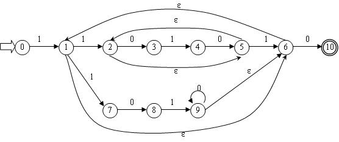
<p align="center">图 2.1 $1(1010^* \mid 1(010)^*1)^*0$ 对应的 NFA</p>

**4. 已知文法 G(S):$S \to a \mid \wedge \mid (T)$,$T \to T,S \mid S$。写出句子 $((a,a),a)$ 的规范归约过程及每一步的句柄。**

解:

| 句型 | 归约规则 | 句柄 |
|---|---|---|
| $((a,a),a)$ | $S \to a$ | $a$ |
| $((S,a),a)$ | $T \to S$ | $S$ |
| $((T,a),a)$ | $S \to a$ | $a$ |
| $((T,S),a)$ | $T \to T,S$ | $T,S$ |
| $((S),a)$ | $T \to S$ | $S$ |
| $((T),a)$ | $S \to (T)$ | $(T)$ |
| $(S,a)$ | $T \to S$ | $S$ |
| $(T,a)$ | $S \to a$ | $a$ |
| $(T,S)$ | $T \to T,S$ | $T,S$ |
| $(T)$ | $S \to (T)$ | $(T)$ |
| $S$ | | |

**5. 何谓优化?按所涉及的程序范围可分为哪几级优化?**

答:(1) 优化:对程序进行各种等价变换,使得从变换后的程序出发,能产生更有效的目标代码。(2) 三种级别:局部优化、循环优化、全局优化。

## 五、计算题(10分)

对下面的文法 G:

$$
E \to TE', \quad E' \to +E \mid \varepsilon, \quad T \to FT', \quad T' \to T \mid \varepsilon, \quad F \to PF', \quad F' \to *F' \mid \varepsilon, \quad P \to (E) \mid a \mid b \mid \wedge
$$

(1) 计算这个文法的每个非终结符的 FIRST 集和 FOLLOW 集。(4分)

(2) 证明这个文法是 LL(1) 的。(4分)

(3) 构造它的预测分析表。(2分)

解:

**(1) FIRST 集合和 FOLLOW 集合:**

FIRST 集合:

$$
\text{FIRST}(E) = \text{FIRST}(T) = \text{FIRST}(F) = \text{FIRST}(P) = \{(, a, b, \wedge\}
$$
$$
\text{FIRST}(E') = \{+, \varepsilon\}
$$
$$
\text{FIRST}(T') = \text{FIRST}(T) \cup \{\varepsilon\} = \{(, a, b, \wedge, \varepsilon\}
$$
$$
\text{FIRST}(F') = \{*, \varepsilon\}
$$

FOLLOW 集合:

$$
\text{FOLLOW}(E) = \{), \#\}
$$
$$
\text{FOLLOW}(E') = \text{FOLLOW}(E) = \{), \#\}
$$
$$
\text{FOLLOW}(T) = \text{FIRST}(E') \cup \text{FOLLOW}(E) = \{+, ), \#\} \quad \text{(不包含} \varepsilon \text{)}
$$
$$
\text{FOLLOW}(T') = \text{FOLLOW}(T) = \{+, ), \#\}
$$
$$
\text{FOLLOW}(F) = \text{FIRST}(T') \cup \text{FOLLOW}(T) = \{(, a, b, \wedge, +, ), \#\} \quad \text{(不包含} \varepsilon \text{)}
$$
$$
\text{FOLLOW}(F') = \text{FOLLOW}(F) = \{(, a, b, \wedge, +, ), \#\}
$$
$$
\text{FOLLOW}(P) = \text{FIRST}(F') \cup \text{FOLLOW}(F) = \{*, (, a, b, \wedge, +, ), \#\} \quad \text{(不包含} \varepsilon \text{)}
$$

**(2) 证明文法是 LL(1) 的:**

各产生式的 SELECT 集合有:

$$
\text{SELECT}(E \to TE') = \text{FIRST}(T) = \{(, a, b, \wedge\}
$$
$$
\text{SELECT}(E' \to +E) = \{+\}
$$
$$
\text{SELECT}(E' \to \varepsilon) = \text{FOLLOW}(E') = \{), \#\}
$$
$$
\text{SELECT}(T \to FT') = \text{FIRST}(F) = \{(, a, b, \wedge\}
$$
$$
\text{SELECT}(T' \to T) = \text{FIRST}(T) = \{(, a, b, \wedge\}
$$
$$
\text{SELECT}(T' \to \varepsilon) = \text{FOLLOW}(T') = \{+, ), \#\}
$$
$$
\text{SELECT}(F \to PF') = \text{FIRST}(P) = \{(, a, b, \wedge\}
$$
$$
\text{SELECT}(F' \to *F') = \{*\}
$$
$$
\text{SELECT}(F' \to \varepsilon) = \text{FOLLOW}(F') = \{(, a, b, \wedge, +, ), \#\}
$$
$$
\text{SELECT}(P \to (E)) = \{(\}
$$
$$
\text{SELECT}(P \to a) = \{a\}, \quad \text{SELECT}(P \to b) = \{b\}, \quad \text{SELECT}(P \to \wedge) = \{\wedge\}
$$

可见,相同左部产生式的 SELECT 集的交集均为空,所以文法 G[E] 是 LL(1) 文法。

**(3) 预测分析表:**

由此构造的 LL(1) 预测分析表如下表所示：

| 非终结符 | $+$ | $*$ | $($ | $)$ | $a$ | $b$ | $\wedge$ | $\#$ |
|:---:|:---:|:---:|:---:|:---:|:---:|:---:|:---:|:---:|
| **$E$** | | | $\to TE'$ | | $\to TE'$ | $\to TE'$ | $\to TE'$ | |
| **$E'$** | $\to +E$ | | | $\to \varepsilon$ | | | | $\to \varepsilon$ |
| **$T$** | | | $\to FT'$ | | $\to FT'$ | $\to FT'$ | $\to FT'$ | |
| **$T'$** | $\to \varepsilon$ | | $\to T$ | $\to \varepsilon$ | $\to T$ | $\to T$ | $\to T$ | $\to \varepsilon$ |
| **$F$** | | | $\to PF'$ | | $\to PF'$ | $\to PF'$ | $\to PF'$ | |
| **$F'$** | $\to \varepsilon$ | $\to *F'$ | $\to \varepsilon$ | $\to \varepsilon$ | $\to \varepsilon$ | $\to \varepsilon$ | $\to \varepsilon$ | $\to \varepsilon$ |
| **$P$** | | | $\to (E)$ | | $\to a$ | $\to b$ | $\to \wedge$ | |

<!--  -->

---

# 第四套 《编译原理》模拟试题三

## 一、是非题(请在括号内,正确的划√,错误的划×)(每个2分,共20分)

**1.** 对于数据空间的存贮分配,FORTRAN 采用动态贮存分配策略。(×)

**2.** 甲机上的某编译程序在乙机上能直接使用的必要条件是甲机和乙机的操作系统功能完全相同。(×)

**3.** 递归下降分析法是自顶向上分析方法。(√)

**4.** 产生式是用于定义词法成分的一种书写规则。(×)

**5.** LR 法是自顶向下语法分析方法。(√)

**6.** 在 SLR(1) 分析法的名称中,S 的含义是简单的。(√)

**7.** 综合属性是用于"自上而下"传递信息。(×)

**8.** 符号表中的信息栏中登记了每个名字的属性和特征等有关信息,如类型、种属、所占单元大小、地址等等。(×)

**9.** 程序语言的语言处理程序是一种应用软件。(×)

**10.** 解释程序适用于 COBOL 和 FORTRAN 语言。(×)

## 二、选择题(请在前括号内选择最确切的一项作为答案划一个勾,多划按错论)(每个4分,共40分)

**1. 文法 G 产生的_____的全体是该文法描述的语言。**

* A. 句型
* B. 终结符集
* C. 非终结符集
* D. 句子

**2. 若文法 G 定义的语言是无限集,则文法必然是_____。**

* A. 递归的
* B. 前后文无关的
* C. 二义性的
* D. 无二义性的

**3. 四种形式语言文法中,1型文法又称为_____文法。**

* A. 短语结构文法
* B. 前后文无关文法
* C. 前后文有关文法
* D. 正规文法

**4. 一个文法所描述的语言是_____。**

* A. 唯一的
* B. 不唯一的
* C. 可能唯一,也可能不唯一
* D. 都不对

**5. _____和代码优化部分不是每个编译程序都必需的。**

* A. 语法分析
* B. 中间代码生成
* C. 词法分析
* D. 目标代码生成

**6. _____是两类程序语言处理程序。**

* A. 高级语言程序和低级语言程序
* B. 解释程序和编译程序
* C. 编译程序和操作系统
* D. 系统程序和应用程序

**7. 数组的内情向量中肯定不含有数组的_____的信息。**

* A. 维数
* B. 类型
* C. 维上下界
* D. 各维的界差

**8. 一个上下文无关文法 G 包括四个组成部分,它们是:一组非终结符号,一组终结符号,一个开始符号,以及一组_____。**

* A. 句子
* B. 句型
* C. 单词
* D. 产生式

**9. 文法分为四种类型,即0型、1型、2型、3型。其中2型文法是_____。**

* A. 短语文法
* B. 正则文法
* C. 上下文有关文法
* D. 上下文无关文法

**10. 文法 G 所描述的语言是_____的集合。**

* A. 文法 G 的字母表 V 中所有符号组成的符号串
* B. 文法 G 的字母表 V 的闭包 $V^*$ 中的所有符号串
* C. 由文法的开始符号推出的所有终极符串
* D. 由文法的开始符号推出的所有符号串

## 三、填空题(每空1分,共10分)

**1.** 一个句型中的最左简单短语称为该句型的 **句柄**。

**2.** 对于文法的每个产生式都配备了一组属性的计算规则,称为 **语义规则**。

**3.** 一个典型的编译程序中,不仅包括 **词法分析**、**语法分析**、**中间代码生成**、代码优化、目标代码生成等五个部分,还应包括表格处理和出错处理。

**4.** 从功能上说,程序语言的语句大体可分为 **执行性** 语句和 **说明性** 语句两大类。

**5.** 扫描器的任务是从 **源程序** 中识别出一个个 **单词符号**。

**6.** 产生式是用于定义 **语法范畴** 的一种书写规则。

## 四、简答题(20分)

**1. 写一个文法,使其语言是奇数集,且每个奇数不以0开头。**

解:文法 G(N):

$$
N \to AB \mid B, \quad A \to AC \mid D, \quad B \to 1 \mid 3 \mid 5 \mid 7 \mid 9, \quad D \to B \mid 2 \mid 4 \mid 6 \mid 8, \quad C \to 0 \mid D
$$

**2. 设文法 G(S):$S \to (L) \mid aS \mid a$,$L \to L,S \mid S$。**

**(1) 消除左递归和回溯;**

**(2) 计算每个非终结符的 FIRST 和 FOLLOW。**

解:

(1) 消除左递归:

$$
S \to (L) \mid aS', \quad S' \to S \mid \varepsilon, \quad L \to SL', \quad L' \to SL' \mid \varepsilon
$$

(2) FIRST 和 FOLLOW:

| 非终结符 | FIRST | FOLLOW |
|---|---|---|
| $S$ | $\{(, a\}$ | $\{\#, ,, )\}$ |
| $S'$ | $\{a, \varepsilon\}$ | $\{\#, ,, )\}$ |
| $L$ | $\{(, a\}$ | $\{)\}$ |
| $L'$ | $\{,, \varepsilon\}$ | $\{)\}$ |

**3. 已知文法 G(E):$E \to T \mid E+T$,$T \to F \mid T*F$,$F \to (E) \mid i$。**

**(1) 给出句型 $(T*F+i)$ 的最右推导;**

**(2) 给出句型 $(T*F+i)$ 的短语、素短语。**

解:

(1) 最右推导:

$$
E \Rightarrow T \Rightarrow F \Rightarrow (E) \Rightarrow (E+T) \Rightarrow (E+F) \Rightarrow (E+i) \Rightarrow (T+i) \Rightarrow (T*F+i)
$$

(2) 短语:$(T*F+i)$,$T*F+i$,$T*F$,$i$;素短语:$T*F$,$i$。

**4. 将下面的语句翻译成四元式序列:**

```
While a>0 ∨ b<0 do
    Begin
        X:=X+1;
        if a>0 then a:=a-1
               else b:=b+1
    End;
```

解:

```
(1)  (j>, a, 0, 5)
(2)  (j, _, _, 3)
(3)  (j<, b, 0, 5)
(4)  (j, _, _, 15)
(5)  (+, X, 1, T1)
(6)  (:=, T1, _, X)
(7)  (j>, a, 0, 9)
(8)  (j, _, _, 12)
(9)  (-, a, 1, T2)
(10) (:=, T2, _, a)
(11) (j, _, _, 1)
(12) (+, b, 1, T3)
(13) (:=, T3, _, b)
(14) (j, _, _, 1)
(15)
```

## 五、计算题(10分)

已知 NFA=({x,y,z},{0,1},M,{x},{z}),其中:$M(x,0)=\{z\}$,$M(y,0)=\{x,y\}$,$M(z,0)=\{x,z\}$,$M(x,1)=\{x\}$,$M(y,1)=\emptyset$,$M(z,1)=\{y\}$,构造相应的 DFA 并最小化。

解:

NFA 状态转换图如下所示：

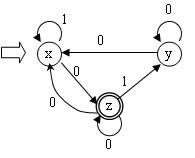
<p align="center">图 1.1 输入 NFA</p>

使用子集法将其确定化的状态转换表如下所示：

| 子集 $I$ | $I_0 = \varepsilon\text{-closure}(\text{MoveTo}(I, 0))$ | $I_1 = \varepsilon\text{-closure}(\text{MoveTo}(I, 1))$ |
|---|---|---|
| **$A[x]$** | $B[z]$ | $A[x]$ |
| **$B[z]$** | $C[x, z]$ | $D[y]$ |
| **$C[x, z]$** | $C[x, z]$ | $E[x, y]$ |
| **$D[y]$** | $E[x, y]$ | $\emptyset$ |
| **$E[x, y]$** | $F[x, y, z]$ | $A[x]$ |
| **$F[x, y, z]$** | $F[x, y, z]$ | $E[x, y]$ |

<!--  -->

由此得到的 DFA 状态转换图如下所示：

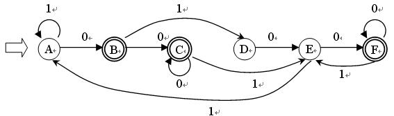
<p align="center">图 1.2 确定化后的 DFA</p>

对上述 DFA 进行最小化，合并等价状态 $C$ 和 $F$。最小化后的 DFA 状态转换图如下所示：

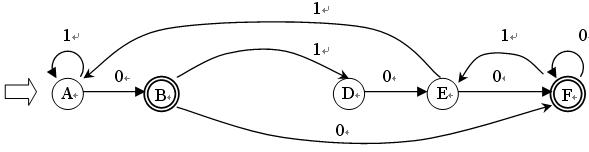
<p align="center">图 1.3 最小化后的 DFA</p>

根据子集法将 NFA 转换为 DFA,然后对 DFA 进行最小化:

(1) 首先将状态集分成两个子集:$P_1=\{A,D,E\}$,$P_2=\{B,C,F\}$

(2) 区分 $P_2$:由于 $F(F,1)=F(C,1)=E$,$F(F,0)=F$ 且 $F(C,0)=C$,所以 F、C 等价。由于 $F(B,0)=F(C,0)=C$,$F(B,1)=D$,$F(C,1)=E$,而 D、E 不等价,从而 B 与 C、F 可以区分。有 $P_{21}=\{C,F\}$,$P_{22}=\{B\}$。

(3) 区分 $P_1$:由于 A、E 输入0到终态,而 D 输入0不到终态,所以 D 与 A、E 可以区分,有 $P_{11}=\{A,E\}$,$P_{12}=\{D\}$。

(4) 由于 $F(A,0)=B$,$F(E,0)=F$,而 B、F 不等价,所以 A、E 可以区分。

(5) 综上所述,DFA 可以区分为 $P=\{\{A\},\{B\},\{D\},\{E\},\{C,F\}\}$。

---

# 第五套 《编译原理》模拟试题四

## 一、是非题(请在括号内,正确的划√,错误的划×)(每个2分,共20分)

**1.** 一个 LL(1) 文法一定是无二义的。(×)

**2.** 正规文法产生的语言都可以用上下文无关文法来描述。(×)

**3.** 一张转换图只包含有限个状态,其中有一个被认为是初态,最多只有一个终态。(√)

**4.** 目标代码生成时,应考虑如何充分利用计算机的寄存器的问题。(×)

**5.** 逆波兰法表示的表达式亦称前缀式。(√)

**6.** 如果一个文法存在某个句子对应两棵不同的语法树,则称这个文法是二义的。(√)

**7.** LR 法是自顶向下语法分析方法。(×)

**8.** 数组元素的地址计算与数组的存储方式有关。(×)

**9.** 算符优先关系表不一定存在对应的优先函数。(×)

**10.** 对于数据空间的存贮分配,FORTRAN 采用动态贮存分配策略。(×)

## 二、选择题(请在前括号内选择最确切的一项作为答案划一个勾,多划按错论)(每个4分,共40分)

**1. 词法分析器用于识别_____。**

* A. 字符串
* B. 语句
* C. 单词
* D. 标识符

**2. 文法分为四种类型,即0型、1型、2型、3型。其中0型文法是_____。**

* A. 短语文法
* B. 正则文法
* C. 上下文有关文法
* D. 上下文无关文法

**3. 一个上下文无关文法 G 包括四个组成部分,它们是:一组非终结符号,一组终结符号,一个开始符号,以及一组_____。**

* A. 句子
* B. 句型
* C. 单词
* D. 产生式

**4. _____是一种典型的解释型语言。**

* A. BASIC
* B. C
* C. FORTRAN
* D. PASCAL

**5. 与编译系统相比,解释系统_____。**

* A. 比较简单,可移植性好,执行速度快
* B. 比较复杂,可移植性好,执行速度快
* C. 比较简单,可移植性差,执行速度慢
* D. 比较简单,可移植性好,执行速度慢

**6. 用高级语言编写的程序经编译后产生的程序叫_____。**

* A. 源程序
* B. 目标程序
* C. 连接程序
* D. 解释程序

**7. 词法分析器用于识别_____。**

* A. 字符串
* B. 语句
* C. 单词
* D. 标识符

**8. 编写一个计算机高级语言的源程序后,到正式上机运行之前,一般要经过_____这几步:**

(1) 编辑 (2) 编译 (3) 连接 (4) 运行

* A. (1)(2)(3)(4)
* B. (1)(2)(3)
* C. (1)(3)
* D. (1)(4)

**9. 把汇编语言程序翻译成机器可执行的目标程序的工作是由_____完成的。**

* A. 编译器
* B. 汇编器
* C. 解释器
* D. 预处理器

**10. 文法 G 所描述的语言是_____的集合。**

* A. 文法 G 的字母表 V 中所有符号组成的符号串
* B. 文法 G 的字母表 V 的闭包 $V^*$ 中的所有符号串
* C. 由文法的开始符号推出的所有终极符串
* D. 由文法的开始符号推出的所有符号串

## 三、填空题(每空1分,共10分)

**1.** 语法分析是依据语言的 **语法** 规则进行的,中间代码产生是依据语言的 **语义** 规则进行的。

**2.** 语法分析器的输入是 **单词符号串**,其输出是 **语法单位**。

**3.** 一个名字的属性包括 **类型** 和 **作用域**。

**4.** 产生式是用于定义 **语法成分** 的一种书写规则。

**5.** 逆波兰式 $ab+c+d*e-$ 所表达的表达式为 **$(a+b+c)*d-e$**。

**6.** 语法分析最常用的两类方法是 **自上而下** 和 **自下而上** 分析法。

## 四、简答题(20分)

**1. 写出下列表达式的三地址形式的中间表示。**

**(1) $5+6*(a+b)$;**

**(2) for j:=1 to 10 do $a[j+j]:=0$。**

答:

(1)
```
100: t1:=a+b
101: t2:=6*t1
102: t3:=5+t2
```

(2)
```
100: j:=1
101: if j>10 goto NEXT
102: i:=j+j
103: a[i]:=0
```

**2. 设基本块 p 由如下语句构成:**

```
T0:=3.14;  T1:=2*T0;  T2:=R+r;  A:=T1*T2;  B:=A;
T3:=2*T0;  T4:=R+r;  T5:=T3*T4;  T6:=R-r;  B:=T5*T6;
```

试给出基本块 p 的 DAG。

解:

构造的 DAG 图如下所示：

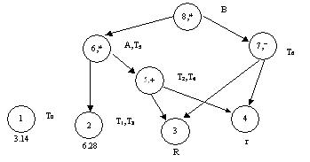
<p align="center">图 4.1 表达式 A 的 DAG 图</p>

**3. 写出表达式 $(a+b)/(a-b-(a+b*c))$ 的三元序列及四元序列。**

解:

(1) 三元式:

1 $(+, a, b)$ 2 $(-, a, b)$ 3 $(/, 1, 2)$ 4 $(*, b, c)$ 5 $(+, a, 4)$ 6 $(-, 3, 5)$

(2) 四元式:

1 $(+, a, b, T1)$ 2 $(-, a, b, T2)$ 3 $(/, T1, T2, T3)$ 4 $(*, b, c, T4)$ 5 $(+, a, T4, T5)$ 6 $(-, T3, T5, T6)$

**4. 写一个文法使其语言为偶数集,且每个偶数不以0开头。**

解:文法 G(S):

$$
S \to AB \mid B \mid A0, \quad A \to AD \mid C, \quad B \to 2 \mid 4 \mid 6 \mid 8, \quad C \to 1 \mid 3 \mid 5 \mid 7 \mid 9 \mid B, \quad D \to 0 \mid C
$$

**5. 设文法 G(S):$S \to S+aF \mid aF \mid +aF$,$F \to *aF \mid *a$。**

**(1) 消除左递归和回溯;**

**(2) 构造相应的 FIRST 和 FOLLOW 集合。**

解:

(1)
$$
S \to aFS' \mid +aFS', \quad S' \to +aFS' \mid \varepsilon, \quad F \to *aF', \quad F' \to F \mid \varepsilon
$$

(2)
$$
\text{FIRST}(S) = \{a, +\}, \quad \text{FOLLOW}(S) = \{\#\}
$$
$$
\text{FIRST}(S') = \{+, \varepsilon\}, \quad \text{FOLLOW}(S') = \{\#\}
$$
$$
\text{FIRST}(F) = \{*\}, \quad \text{FOLLOW}(F) = \{+, \#\}
$$
$$
\text{FIRST}(F') = \{*, \varepsilon\}, \quad \text{FOLLOW}(F') = \{+, \#\}
$$

## 五、计算题(10分)

已知文法为:$S \to a \mid \wedge \mid (T)$,$T \to T,S \mid S$。构造它的 LR(0) 分析表。

解:加入非终结符 S',原文法的增广文法为:

$$
S' \to S, \quad S \to a, \quad S \to \wedge, \quad S \to (T), \quad T \to T,S, \quad T \to S
$$

构造的 LR(0) 项目集规范族如下表所示：

| 状态 | $a$ | $\wedge$ | $($ | $)$ | $,$ | $\#$ | $S$ | $T$ |
|:---|:---|:---|:---|:---|:---|:---|:---|:---|
| **$I_0$**:<br>$S' \to \cdot S$<br>$S \to \cdot a$<br>$S \to \cdot \wedge$<br>$S \to \cdot (T)$ | $I_2$:<br>$S \to a \cdot$ | $I_3$:<br>$S \to \wedge \cdot$ | $I_4$:<br>$S \to (\cdot T)$<br>$T \to \cdot T, S$<br>$T \to \cdot S$<br>$S \to \cdot a$<br>$S \to \cdot \wedge$<br>$S \to \cdot (T)$ | | | | $I_1$:<br>$S' \to S \cdot$ | |
| **$I_1$**:<br>$S' \to S \cdot$ | | | | | | acc | | |
| **$I_2$**:<br>$S \to a \cdot$ | | | | | | | | |
| **$I_3$**:<br>$S \to \wedge \cdot$ | | | | | | | | |
| **$I_4$**:<br>$S \to (\cdot T)$<br>$T \to \cdot T, S$<br>$T \to \cdot S$<br>$S \to \cdot a$<br>$S \to \cdot \wedge$<br>$S \to \cdot (T)$ | $I_2$ | $I_3$ | $I_4$ | | | | $I_6$:<br>$T \to S \cdot$ | $I_5$:<br>$S \to (T \cdot)$<br>$T \to T \cdot, S$ |
| **$I_5$**:<br>$S \to (T \cdot)$<br>$T \to T \cdot, S$ | | | | $I_7$:<br>$S \to (T) \cdot$ | $I_8$:<br>$T \to T, \cdot S$<br>$S \to \cdot a$<br>$S \to \cdot \wedge$<br>$S \to \cdot (T)$ | | | |
| **$I_6$**:<br>$T \to S \cdot$ | | | | | | | | |
| **$I_7$**:<br>$S \to (T) \cdot$ | | | | | | | | |
| **$I_8$**:<br>$T \to T, \cdot S$<br>$S \to \cdot a$<br>$S \to \cdot \wedge$<br>$S \to \cdot (T)$ | $I_2$ | $I_3$ | $I_4$ | | | | $I_9$:<br>$T \to T, S \cdot$ | |
| **$I_9$**:<br>$T \to T, S \cdot$ | | | | | | | | |

<!--  -->

对应的分析表如下表所示（此处为识别活前缀的分析表）：

| 状态 | ACTION | | | | | | GOTO | |
|:---:|:---:|:---:|:---:|:---:|:---:|:---:|:---:|:---:|
| | $a$ | $\wedge$ | $($ | $)$ | $,$ | $\#$ | $S$ | $T$ |
| **0** | $S_2$ | $S_3$ | $S_4$ | | | | 1 | |
| **1** | | | | | | acc | | |
| **2** | $r_1$ | $r_1$ | $r_1$ | $r_1$ | $r_1$ | $r_1$ | | |
| **3** | $r_2$ | $r_2$ | $r_2$ | $r_2$ | $r_2$ | $r_2$ | | |
| **4** | $S_2$ | $S_3$ | $S_4$ | | | | 6 | 5 |
| **5** | | | | $S_7$ | $S_8$ | | | |
| **6** | $r_5$ | $r_5$ | $r_5$ | $r_5$ | $r_5$ | $r_5$ | | |
| **7** | $r_3$ | $r_3$ | $r_3$ | $r_3$ | $r_3$ | $r_3$ | | |
| **8** | $S_2$ | $S_3$ | $S_4$ | | | | 9 | |
| **9** | $r_4$ | $r_4$ | $r_4$ | $r_4$ | $r_4$ | $r_4$ | | |

<!--  -->


从项目集规范族可看出,不存在移进-归约冲突以及归约-归约冲突,该文法是 LR(0) 文法。

---

# 第六套 《编译原理》模拟试题五

## 一、是非题(请在括号内,正确的划√,错误的划×)(每个2分,共20分)

**1.** 编译程序是对高级语言程序的解释执行。(×)

**2.** 一个有限状态自动机中,有且仅有一个唯一的终态。(×)

**3.** 一个算符优先文法可能不存在算符优先函数与之对应。(√)

**4.** 语法分析时必须先消除文法中的左递归。(×)

**5.** LR 分析法在自左至右扫描输入串时就能发现错误,但不能准确地指出出错地点。(√)

**6.** 逆波兰表示法表示表达式时无须使用括号。(√)

**7.** 静态数组的存储空间可以在编译时确定。(×)

**8.** 进行代码优化时应着重考虑循环的代码优化,这对提高目标代码的效率将起更大作用。(×)

**9.** 两个正规集相等的必要条件是他们对应的正规式等价。(×)

**10.** 一个语义子程序描述了一个文法所对应的翻译工作。(×)

## 二、选择题(请在前括号内选择最确切的一项作为答案划一个勾,多划按错论)(每个4分,共40分)

**1. 词法分析器的输出结果是_____。**

* A. 单词的种别编码
* B. 单词在符号表中的位置
* C. 单词的种别编码和自身值
* D. 单词自身值

**2. 正规式 $M_1$ 和 $M_2$ 等价是指_____。**

* A. $M_1$ 和 $M_2$ 的状态数相等
* B. $M_1$ 和 $M_2$ 的有向边条数相等
* C. $M_1$ 和 $M_2$ 所识别的语言集相等
* D. $M_1$ 和 $M_2$ 状态数和有向边条数相等

**3. 文法 G:$S \to xSx \mid y$ 所识别的语言是_____。**

* A. $xyx$
* B. $(xyx)^*$
* C. $x^nyx^n (n \ge 0)$
* D. $x^*yx^*$

**4. 如果文法 G 是无二义的,则它的任何句子 $\alpha$ _____。**

* A. 最左推导和最右推导对应的语法树必定相同
* B. 最左推导和最右推导对应的语法树可能不同
* C. 最左推导和最右推导必定相同
* D. 可能存在两个不同的最左推导,但它们对应的语法树相同

**5. 构造编译程序应掌握_____。**

* A. 源程序
* B. 目标语言
* C. 编译方法
* D. 以上三项都是

**6. 四元式之间的联系是通过_____实现的。**

* A. 指示器
* B. 临时变量
* C. 符号表
* D. 程序变量

**7. 表达式 $(\neg A \vee B) \wedge (C \vee D)$ 的逆波兰表示为_____。**

* A. $\neg AB \vee \wedge CD \vee$
* B. $A\neg B \vee CD \vee \wedge$
* C. $AB \vee \neg CD \vee \wedge$
* D. $A\neg B \vee \wedge CD \vee$

**8. 优化可生成_____的目标代码。**

* A. 运行时间较短
* B. 占用存储空间较小
* C. 运行时间短但占用内存空间大
* D. 运行时间短且占用存储空间小

**9. 下列_____优化方法不是针对循环优化进行的。**

* A. 强度削弱
* B. 删除归纳变量
* C. 删除多余运算
* D. 代码外提

**10. 编译程序使用_____区别标识符的作用域。**

* A. 说明标识符的过程或函数名
* B. 说明标识符的过程或函数的静态层次
* C. 说明标识符的过程或函数的动态层次
* D. 标识符的行号

## 三、填空题(每空1分,共10分)

**1.** 计算机执行用高级语言编写的程序主要有两种途径:**解释** 和 **编译**。

**2.** 扫描器是 **词法分析器**,它接受输入的 **源程序**,对源程序进行 **词法分析** 并识别出一个个单词符号,其输出结果是单词符号,供语法分析器使用。

**3.** 自上而下分析法采用 **移进**、归约、错误处理、**接受** 等四种操作。

**4.** 一个 LR 分析器包括两部分:一个总控程序和 **一张分析表**。

**5.** 后缀式 $abc-/$ 所代表的表达式是 **$a/(b-c)$**。

**6.** 局部优化是在 **基本块** 范围内进行的一种优化。

## 四、简答题(20分)

**1. 简要说明语义分析的基本功能。**

答:语义分析的基本功能包括:确定类型、类型检查、语义处理和某些静态语义检查。

**2. 考虑文法 G[S]:$S \to (T) \mid a+S \mid a$,$T \to T,S \mid S$。消除文法的左递归及提取公共左因子。**

解:

消除左递归:
$$
S \to (T) \mid a+S \mid a, \quad T \to ST', \quad T' \to ,ST' \mid \varepsilon
$$

提取公共左因子:
$$
S \to (T) \mid aS', \quad S' \to +S \mid \varepsilon, \quad T \to ST', \quad T' \to ,ST' \mid \varepsilon
$$

**3. 试为表达式 $w+(a+b)*(c+d/(e-10)+8)$ 写出相应的逆波兰表示。**

解:$wab+cde10-/+8+*+$

**4. 按照三种基本控制结构文法将下面的语句翻译成四元式序列:**

```
while (A<C ∧ B<D)
{
    if (A>=1) C=C+1;
    else while (A<=D) A=A+2;
}
```

解:

```
100 (j<, A, C, 102)
101 (j, _, _, 113)
102 (j<, B, D, 104)
103 (j, _, _, 113)
104 (j=, A, 1, 106)
105 (j, _, _, 108)
106 (+, C, 1, C)
107 (j, _, _, 112)
108 (j≤, A, D, 110)
109 (j, _, _, 112)
110 (+, A, 2, A)
111 (j, _, _, 108)
112 (j, _, _, 100)
113
```

**5. 已知文法 G[S] 为 $S \to aSb \mid Sb \mid b$,试证明文法 G[S] 为二义文法。**

证明:由文法 G[S]:$S \to aSb \mid Sb \mid b$,对句子 $aabbbb$ 可以对应两棵不同的语法树,因此文法 G[S] 为二义文法。

对句子 $aabbbb$ 可以构造两棵不同的语法树，如下图所示：

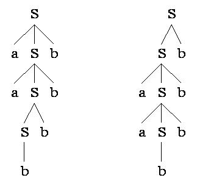
<p align="center">图 1.1 aabbbb 的两棵语法树</p>

## 五、计算题(10分)

已知文法 $A \to aAd \mid aAb \mid \varepsilon$,判断该文法是否是 SLR(1) 文法,若是构造相应分析表,并对输入串 $ab\#$ 给出分析过程。

解:增加一个非终结符 S' 后,产生原文法的增广文法有:

$$
S' \to A, \quad A \to aAd \mid aAb \mid \varepsilon
$$

构造 LR(0) 项目集规范族。从项目集可看出,状态 $I_0$ 和 $I_2$ 存在移进-归约冲突,该文法不是 LR(0) 文法。

对于 $I_0$:$\text{FOLLOW}(A) \cap \{a\} = \{b,d,\#\} \cap \{a\} = \emptyset$,所以在 $I_0$ 状态下面临输入符号为 a 时移进,为 b、d、# 时归约。对于 $I_2$ 也有完全相同的结论。因此该文法是 SLR(1) 文法。

其构造的 SLR(1) 分析表如下表所示：

| 状态 | $a$ | $b$ | $d$ | $\#$ | $A$ |
|---|---|---|---|---|---|
| 0 | S2 | r3 | r3 | r3 | 1 |
| 1 | | | | acc | |
| 2 | S2 | r3 | r3 | r3 | 3 |
| 3 | | S4 | S5 | | |
| 4 | r2 | r2 | r2 | r2 | |
| 5 | r1 | r1 | r1 | r1 | |

<!--  -->

对输入串 $ab\#$ 的分析过程如下表所示：

| 步骤 | 状态栈 | 符号栈 | 当前字符 | 剩余字符串 | 动作 |
|---|---|---|---|---|---|
| 1 | 0 | $\#$ | $a$ | $b\#$ | $S_2$ |
| 2 | 0 2 | $\#a$ | $b$ | $\#$ | $r_3$（$A \to \varepsilon$） |
| 3 | 0 2 3 | $\#aA$ | $b$ | $\#$ | $S_4$ |
| 4 | 0 2 3 4 | $\#aAb$ | $\#$ | | $r_2$（$A \to aAb$） |
| 5 | 0 1 | $\#A$ | $\#$ | | acc |

<!--  -->

---

# 第七套 《编译原理》模拟试题六

## 一、是非题(请在括号内,正确的划√,错误的划×)(每个2分,共20分)

**1.** 设 r 和 s 分别是正规式，则有 $L(r|s)=L(r)L(s)$。（×）

**2.** 确定的自动机以及不确定的自动机都能正确地识别正规集。（√）

**3.** 词法分析作为单独的一遍来处理较好。（×）

**4.** 构造 LR 分析器的任务就是产生 LR 分析表。（√）

**5.** 规范归约和规范推导是互逆的两个过程。（×）

**6.** 同心集的合并有可能产生新的“移进”/“归约”冲突。（×）

**7.** LR 分析技术无法适用二义文法。（×）

**8.** 树形表示和四元式不便于优化，而三元式和间接三元式则便于优化。（×）

**9.** 程序中的表达式语句在语义翻译时不需要回填技术。（√）

**10.** 对中间代码的优化依赖于具体的计算机。（×）

## 二、选择题(请在前括号内选择最确切的一项作为答案划一个勾,多划按错论)(每个4分,共40分)

**1. 编译程序绝大多数时间花在_____上。**

* A. 出错处理
* B. 词法分析
* C. 目标代码生成
* D. 表格管理

**2. 编译程序是对_____。**

* A. 汇编程序的翻译
* B. 高级语言程序的解释执行
* C. 机器语言的执行
* D. 高级语言的翻译

**3. 采用自上而下分析,必须_____。**

* A. 消除左递归
* B. 消除右递归
* C. 消除回溯
* D. 提取公共左因子

**4. 在规范归约中,用_____来刻画可归约串。**

* A. 直接短语
* B. 句柄
* C. 最左素短语
* D. 素短语

**5. 若 a 为终结符,则 $A \to \alpha \cdot a\beta$ 为_____项目。**

* A. 归约
* B. 移进
* C. 接受
* D. 待约

**6. 间接三元式表示法的优点为_____。**

* A. 采用间接码表,便于优化处理
* B. 节省存储空间,不便于表的修改
* C. 便于优化处理,节省存储空间
* D. 节省存储空间,不便于优化处理

**7. 基本块内的优化为_____。**

* A. 代码外提,删除归纳变量
* B. 删除多余运算,删除无用赋值
* C. 强度削弱,代码外提
* D. 循环展开,循环合并

**8. 在目标代码生成阶段,符号表用于_____。**

* A. 目标代码生成
* B. 语义检查
* C. 语法检查
* D. 地址分配

**9. 若项目集 $I_k$ 含有 $A \to \alpha \cdot$,则在状态 k 时,仅当面临的输入符号 $a \in \text{FOLLOW}(A)$ 时,才采取"$A \to \alpha \cdot$"动作的一定是_____。**

* A. LALR 文法
* B. LR(0) 文法
* C. LR(1) 文法
* D. SLR(1) 文法

**10. 堆式动态分配申请和释放存储空间遵守_____原则。**

* A. 先请先放
* B. 先请后放
* C. 后请先放
* D. 任意

## 三、填空题(每空1分,共10分)

**1.** 词法分析基于 **正则** 文法进行，即识别的单词是该类文法的句子。

**2.** 语法分析基于 **上下文无关** 文法进行，即识别的是该类文法的句子。语法分析的有效工具是 **语法树**。

**3.** 分析句型时，应用算符优先分析技术时，每步被直接归约的是 **最左素短语**，而应用 LR 分析技术时，每步被直接归约的是 **句柄**。

**4.** 语义分析阶段所生成的与源程序等价的中间表示形式可以有 **逆波兰**、**四元式表示** 与 **三元式表示** 等。

**5.** 按 Chomsky 分类法，文法按照 **规则定义的形式** 进行分类。

**6.** 一个文法能用有穷多个规则描述无穷的符号串集合（语言）是因为文法中存在有 **递归** 定义的规则。

## 四、简答题(20分)

**1. 文法 G[S] 为:$S \to Ac \mid aB$,$A \to ab$,$B \to bc$。写出 $L(G[S])$ 的全部元素。**

解:$S \Rightarrow Ac \Rightarrow abc$ 或 $S \Rightarrow aB \Rightarrow abc$,所以 $L(G[S])=\{abc\}$。

**2. 构造正规式 $1(0|1)^*101$ 相应的 DFA。**

解:先构造 NFA,然后用子集法确定化,重新命名状态后得到 DFA。

构造的 NFA 状态转换图如下所示：

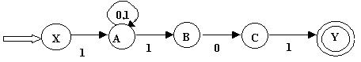
<p align="center">图 2.1 输入 NFA</p>

使用子集法将其确定化的状态转换表如下所示：

| 子集 $I$ | $I_0 = \varepsilon\text{-closure}(\text{MoveTo}(I, 0))$ | $I_1 = \varepsilon\text{-closure}(\text{MoveTo}(I, 1))$ |
|---|---|---|
| **$X$** | $\emptyset$ | $A$ |
| **$A$** | $A$ | $AB$ |
| **$AB$** | $AC$ | $AB$ |
| **$AC$** | $A$ | $ABY$ |
| **$ABY$** | $AC$ | $AB$ |

<!--  -->

重新命名状态后的转换表（$D$ 为接受状态 $ABY$，$B$ 代表 $AB$，$C$ 代表 $AC$）：

| 状态 | $0$ | $1$ |
|---|---|---|
| **$X$** | $\emptyset$ | $A$ |
| **$A$** | $A$ | $B$ |
| **$B$** | $C$ | $B$ |
| **$C$** | $A$ | $D$ |
| **$D$** | $C$ | $B$ |

<!--  -->

由此得到的确定化 DFA 状态转换图如下所示：

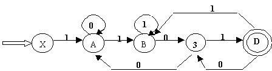
<p align="center">图 2.2 确定化后的 DFA</p>

**3. 文法 $S \to a \mid \wedge \mid (T)$,$T \to T,S \mid S$。对 $(a,(a,a)$ 和 $(((a,a),\wedge,(a)),a)$ 的最左推导。**

解:

对 $(a,(a,a)$ 的最左推导为:

$$
S \Rightarrow (T) \Rightarrow (T,S) \Rightarrow (S,S) \Rightarrow (a,S) \Rightarrow (a,(T)) \Rightarrow (a,(T,S)) \Rightarrow (a,(S,S)) \Rightarrow (a,(a,S)) \Rightarrow (a,(a,a))
$$

对 $(((a,a),\wedge,(a)),a)$ 的最左推导为:

$$
S \Rightarrow (T) \Rightarrow (T,S) \Rightarrow (S,S) \Rightarrow ((T),S) \Rightarrow ((T,S),S) \Rightarrow ((T,S,S),S) \Rightarrow ((S,S,S),S)
$$
$$
\Rightarrow (((T),S,S),S) \Rightarrow (((T,S),S,S),S) \Rightarrow (((S,S),S,S),S) \Rightarrow (((a,S),S,S),S)
$$
$$
\Rightarrow (((a,a),S,S),S) \Rightarrow (((a,a),\wedge,S),S) \Rightarrow (((a,a),\wedge,(T)),S) \Rightarrow (((a,a),\wedge,(S)),S)
$$
$$
\Rightarrow (((a,a),\wedge,(a)),S) \Rightarrow (((a,a),\wedge,(a)),a)
$$

**4. 文法:$S \to MH \mid a$,$H \to LSo \mid \varepsilon$,$K \to dML \mid \varepsilon$,$L \to eHf$,$M \to K \mid bLM$。判断 G 是否为 LL(1) 文法,如果是,构造 LL(1) 分析表。**

解:各符号的 FIRST 集和 FOLLOW 集如下:

构造的 FIRST 集合和 FOLLOW 集合如下表所示：

| 非终结符 | $\text{FIRST}$ | $\text{FOLLOW}$ |
|:---:|:---|:---|
| **$S$** | $\{a, d, b, \varepsilon, e\}$ | $\{\#, o\}$ |
| **$M$** | $\{d, \varepsilon, b\}$ | $\{e, \#, o\}$ |
| **$H$** | $\{\varepsilon, e\}$ | $\{\#, f, o\}$ |
| **$L$** | $\{e\}$ | $\{a, d, b, e, o, \#\}$ |
| **$K$** | $\{d, \varepsilon\}$ | $\{e, \#, o\}$ |

<!--  -->

由此构造的预测分析表如下表所示：

| 非终结符 | $a$ | $o$ | $d$ | $e$ | $f$ | $b$ | $\#$ |
|:---:|:---:|:---:|:---:|:---:|:---:|:---:|:---:|
| **$S$** | $\to a$ | $\to MH$ | $\to MH$ | $\to MH$ | | $\to MH$ | $\to MH$ |
| **$M$** | | $\to K$ | $\to K$ | $\to K$ | | $\to bLM$ | $\to K$ |
| **$H$** | | $\to \varepsilon$ | | $\to LSo$ | $\to \varepsilon$ | | $\to \varepsilon$ |
| **$L$** | | | | $\to eHf$ | | | |
| **$K$** | | $\to \varepsilon$ | $\to dML$ | $\to \varepsilon$ | | | $\to \varepsilon$ |

<!--  -->

由于预测分析表中无多重入口,所以可判定文法是 LL(1) 的。

## 五、计算题(10分)

已知文法 G[S] 为:$S \to a \mid \wedge \mid (T)$,$T \to T,S \mid S$。

(1) 计算 G[S] 的 FIRSTVT 和 LASTVT。

(2) 构造 G[S] 的算符优先关系表并说明 G[S] 是否为算符优先文法。

(3) 计算 G[S] 的优先函数。

(4) 给出输入串 $(a,a)\#$ 的算符优先分析过程。

解:

其构造的 FIRSTVT 和 LASTVT 集合表如下：

| 非终结符 | $\text{FIRSTVT}$ | $\text{LASTVT}$ |
|:---:|:---|:---|
| **$S$** | $\{a, \wedge, (\}$ | $\{a, \wedge, )\}$ |
| **$T$** | $\{,, a, \wedge, (\}$ | $\{,, a, \wedge, )\}$ |

<!--  -->

算符优先关系表如下所示：

| | $a$ | $($ | $)$ | $,$ | $\wedge$ | $\#$ |
|:---:|:---:|:---:|:---:|:---:|:---:|:---:|
| **$a$** | | | $\gtrdot$ | $\gtrdot$ | | $\gtrdot$ |
| **$($** | $\lessdot$ | $\lessdot$ | $\doteq$ | | $\lessdot$ | |
| **$)$** | | | $\gtrdot$ | $\gtrdot$ | | $\gtrdot$ |
| **$,$** | $\lessdot$ | $\lessdot$ | $\gtrdot$ | $\gtrdot$ | $\lessdot$ | |
| **$\wedge$** | | | $\gtrdot$ | $\gtrdot$ | | $\gtrdot$ |
| **$\#$** | $\lessdot$ | $\lessdot$ | | | $\lessdot$ | |

<!--  -->

构造的优先函数表如下所示：

| | $a$ | $($ | $)$ | $,$ | $\wedge$ | $\#$ |
|:---:|:---:|:---:|:---:|:---:|:---:|:---:|
| **$f$** | 2 | 1 | 2 | 2 | 2 | 1 |
| **$g$** | 3 | 3 | 1 | 1 | 3 | 1 |

<!--  -->

对输入串 $(a,a)\#$ 的算符优先分析过程如下表所示：

| 步骤 | 栈 | 优先关系 | 当前符号 | 剩余输入串 | 移进或归约 |
|:---:|:---|:---:|:---:|:---|:---|
| 1 | $\#$ | $\# \lessdot ($ | $($ | $a,a)\#$ | 移进 |
| 2 | $\#($ | $( \lessdot a$ | $a$ | $,a)\#$ | 移进 |
| 3 | $\#(a$ | $a \gtrdot ,$ | $,$ | $a)\#$ | 归约 (按 $S \to a$) |
| 4 | $\#(F$ | $( \lessdot ,$ | $,$ | $a)\#$ | 移进 |
| 5 | $\#(F,$ | $, \lessdot a$ | $a$ | $)\#$ | 移进 |
| 6 | $\#(F,a$ | $a \gtrdot )$ | $)$ | $\#$ | 归约 (按 $S \to a$) |
| 7 | $\#(F,F$ | $, \gtrdot )$ | $)$ | $\#$ | 归约 (按 $T \to T,S$) |
| 8 | $\#(F$ | $( \doteq )$ | $)$ | $\#$ | 移进 |
| 9 | $\#(F)$ | $) \gtrdot \#$ | $\#$ | | 归约 (按 $S \to (T)$) |
| 10 | $\#F$ | $\# \doteq \#$ | $\#$ | | 接受 |

<!--  -->

(1) 各符号的 FIRSTVT 和 LASTVT:

$$
\text{FIRSTVT}(S) = \{a, \wedge, (\}, \quad \text{LASTVT}(S) = \{a, \wedge, )\}
$$
$$
\text{FIRSTVT}(T) = \{a, \wedge, (, ,\}, \quad \text{LASTVT}(T) = \{a, \wedge, ), ,\}
$$

(2) 算符优先关系表中不存在冲突,G[S] 是算符优先文法。

(3) 对应的算符优先函数可通过 Bell 方法求得。

(4) 句子 $(a,a)\#$ 的算符优先分析过程按最左素短语归约进行。
