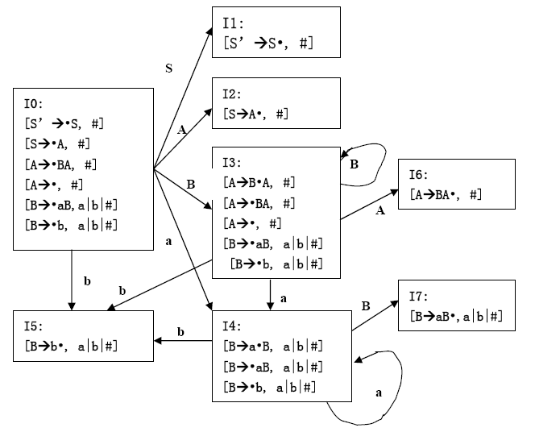
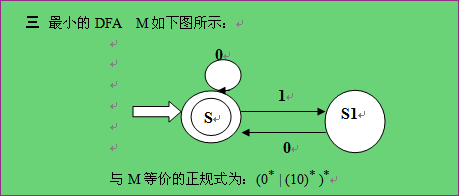
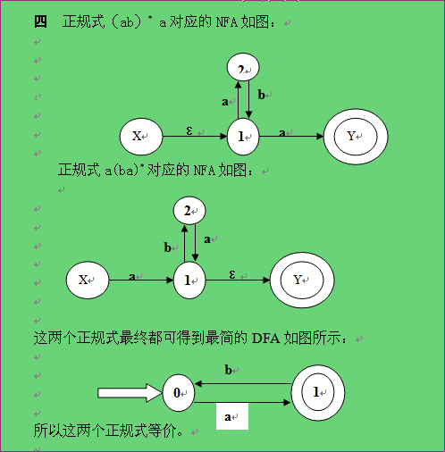

# 《编译原理》期末试题（一）

## 一、是非题（请在括号内，正确的划√，错误的划×）（每个2分，共20分）

**1.** 编译程序是对高级语言程序的解释执行。(×)

**2.** 一个有限状态自动机中，有且仅有一个唯一的终态。(×)

**3.** 一个算符优先文法可能不存在算符优先函数与之对应。(√)

**4.** 语法分析时必须先消除文法中的左递归。(×)

**5.** LR分析法在自左至右扫描输入串时就能发现错误，但不能准确地指出出错地点。(√)

**6.** 逆波兰表示法表示表达式时无须使用括号。(√)

**7.** 静态数组的存储空间可以在编译时确定。(×)

**8.** 进行代码优化时应着重考虑循环的代码优化，这对提高目标代码的效率将起更大作用。(×)

**9.** 两个正规集相等的必要条件是他们对应的正规式等价。(×)

**10.** 一个语义子程序描述了一个文法所对应的翻译工作。(×)

## 二、选择题（请在前括号内选择最确切的一项作为答案划一个勾，多划按错论）（每个4分，共40分）

**1.** 词法分析器的输出结果是_____。

* A. 单词的种别编码
* B. 单词在符号表中的位置
* C. 单词的种别编码和自身值
* D. 单词自身值

**2.** 正规式 $M_1$ 和 $M_2$ 等价是指_____。

* A. $M_1$ 和 $M_2$ 的状态数相等
* B. $M_1$ 和 $M_2$ 的有向边条数相等
* C. $M_1$ 和 $M_2$ 所识别的语言集相等
* D. $M_1$ 和 $M_2$ 状态数和有向边条数相等

**3.** 文法 $G$：$S \to xSx \mid y$ 所识别的语言是_____。

* A. $xyx$
* B. $(xyx)^*$
* C. $x^nyx^n (n \geq 0)$
* D. $x^*yx^*$

**4.** 如果文法 $G$ 是无二义的，则它的任何句子 $\alpha$ _____。

* A. 最左推导和最右推导对应的语法树必定相同
* B. 最左推导和最右推导对应的语法树可能不同
* C. 最左推导和最右推导必定相同
* D. 可能存在两个不同的最左推导，但它们对应的语法树相同

**5.** 构造编译程序应掌握______。

* A. 源程序
* B. 目标语言
* C. 编译方法
* D. 以上三项都是

**6.** 四元式之间的联系是通过_____实现的。

* A. 指示器
* B. 临时变量
* C. 符号表
* D. 程序变量

**7.** 表达式 $(\neg A \lor B) \land (C \lor D)$ 的逆波兰表示为_____。

* A. $\neg AB \lor \land CD \lor$
* B. $A \neg B \lor CD \lor \land$
* C. $AB \lor \neg CD \lor \land$
* D. $A \neg B \lor \land CD \lor$

**8.** 优化可生成_____的目标代码。

* A. 运行时间较短
* B. 占用存储空间较小
* C. 运行时间短但占用内存空间大
* D. 运行时间短且占用存储空间小

**9.** 下列______优化方法不是针对循环优化进行的。

* A. 强度削弱
* B. 删除归纳变量
* C. 删除多余运算
* D. 代码外提

**10.** 编译程序使用_____区别标识符的作用域。

* A. 说明标识符的过程或函数名
* B. 说明标识符的过程或函数的静态层次
* C. 说明标识符的过程或函数的动态层次
* D. 标识符的行号

## 三、填空题（每空1分，共10分）

**1.** 计算机执行用高级语言编写的程序主要有两种途径：___解释__和__编译___。

**2.** 扫描器是__词法分析器___，它接受输入的__源程序___，对源程序进行___词法分析__并识别出一个个单词符号，其输出结果是单词符号，供语法分析器使用。

**3.** 自上而下分析法采用___移进__、归约、错误处理、___接受__等四种操作。

**4.** 一个LR分析器包括两部分：一个总控程序和___一张分析表__。

**5.** 后缀式 $abc-/$ 所代表的表达式是___$a/(b-c)$__。

**6.** 局部优化是在__基本块___范围内进行的一种优化。

## 四、简答题（20分）

**1.** 简要说明语义分析的基本功能。

答：语义分析的基本功能包括：确定类型、类型检查、语义处理和某些静态语义检查。

**2.** 考虑文法 $G[S]$：

$S \to (T) \mid a+S \mid a$

$T \to T,S \mid S$

消除文法的左递归及提取公共左因子。

解：消除文法 $G[S]$ 的左递归：

$S \to (T) \mid a+S \mid a$

$T \to ST'$

$T' \to ,ST' \mid \varepsilon$

提取公共左因子：

$S \to (T) \mid aS'$

$S' \to +S \mid \varepsilon$

$T \to ST'$

$T' \to ,ST' \mid \varepsilon$

**3.** 试为表达式 $w+(a+b)*(c+d/(e-10)+8)$ 写出相应的逆波兰表示。

解：$w \; a \; b \; + \; c \; d \; e \; 10 \; - \; / \; + \; 8 \; + \; * \; +$

**4.** 已知文法 $G[S]$ 为 $S \to aSb \mid Sb \mid b$，试证明文法 $G[S]$ 为二义文法。

证明：由文法 $G[S]$：$S \to aSb \mid Sb \mid b$，对句子 $aabbbb$ 可以构造两棵不同的语法树。因此，文法 $G[S]$ 为二义文法。


<p align="center">图 4.1 aabbbb 的两棵语法树</p>

## 五、计算题（10分）

已知文法 $A \to aAd \mid aAb \mid \varepsilon$，判断该文法是否是 SLR(1) 文法，若是构造相应分析表，并对输入串 $ab\#$ 给出分析过程。

下面构造它的 LR(0) 项目集规范族与转换关系表：

| 状态 | $a$ | $b$ | $d$ | $\#$ | $A$ |
| :--- | :--- | :--- | :--- | :--- | :--- |
| **$I_0$**:<br>$S' \to \cdot A$<br>$A \to \cdot aAd$<br>$A \to \cdot aAb$<br>$A \to \cdot$ | $I_2$:<br>$A \to a \cdot Ad$<br>$A \to a \cdot Ab$<br>$A \to \cdot aAd$<br>$A \to \cdot aAb$<br>$A \to \cdot$ | | | | $I_1$:<br>$S' \to A\cdot$ |
| **$I_1$**:<br>$S' \to A\cdot$ | | | | acc | |
| **$I_2$**:<br>$A \to a\cdot Ad$<br>$A \to a\cdot Ab$<br>$A \to \cdot aAd$<br>$A \to \cdot aAb$<br>$A \to \cdot$ | $I_2$ | | | | $I_3$:<br>$A \to aA\cdot d$<br>$A \to aA\cdot b$ |
| **$I_3$**:<br>$A \to aA\cdot d$<br>$A \to aA\cdot b$ | | $I_4$:<br>$A \to aAb\cdot$ | $I_5$:<br>$A \to aAd\cdot$ | | |
| **$I_4$**:<br>$A \to aAb\cdot$ | | | | | |
| **$I_5$**:<br>$A \to aAd\cdot$ | | | | | |

<!--  -->

从上表可看出，状态 $I_0$ 和 $I_2$ 存在移进-归约冲突，该文法不是 LR(0) 文法。对于 $I_0$ 来说有：$\text{FOLLOW}(A) \cap \{a\} = \{b,d,\#\} \cap \{a\} = \Phi$，所以在 $I_0$ 状态下面临输入符号为 $a$ 时移进，为 $b,d,\#$ 时归约，为其他时报错。对于 $I_2$ 来说也有与 $I_0$ 完全相同的结论。这就是说，以上的移进-归约冲突是可以解决的，因此该文法是 SLR(1) 文法。其 SLR(1) 分析表如下表所示：

| 状态 | ACTION | | | | GOTO |
| :--- | :--- | :--- | :--- | :--- | :--- |
| | $a$ | $b$ | $d$ | $\#$ | $A$ |
| **0** | $S_2$ | $r_3$ | $r_3$ | $r_3$ | 1 |
| **1** | | | | acc | |
| **2** | $S_2$ | $r_3$ | $r_3$ | $r_3$ | 3 |
| **3** | | $S_4$ | $S_5$ | | |
| **4** | $r_2$ | $r_2$ | $r_2$ | $r_2$ | |
| **5** | $r_1$ | $r_1$ | $r_1$ | $r_1$ | |

<!--  -->

对输入串 $ab\#$ 的分析过程如下表所示：

| 步骤 | 状态栈 | 符号栈 | 输入串 | ACTION | GOTO |
| :--- | :--- | :--- | :--- | :--- | :--- |
| 1 | 0 | $\#$ | $ab\#$ | $S_2$ | |
| 2 | 0 2 | $\#a$ | $b\#$ | $r_3$（$A \to \varepsilon$） | 3 |
| 3 | 0 2 3 | $\#aA$ | $b\#$ | $S_4$ | |
| 4 | 0 2 3 4 | $\#aAb$ | $\#$ | $r_2$（$A \to aAb$） | 1 |
| 5 | 0 1 | $\#A$ | $\#$ | acc | |

<!--  -->


---

# 《编译原理》期末试题（二）

## 一、是非题

**1.** 一个上下文无关文法的开始符，可以是终结符或非终结符。(×)

**2.** 一个句型的直接短语是唯一的。(×)

**3.** 已经证明文法的二义性是可判定的。(×)

**4.** 每个基本块可用一个DAG表示。(√)

**5.** 每个过程的活动记录的体积在编译时可静态确定。(√)

**6.** 2型文法一定是3型文法。(×)

**7.** 一个句型一定是句子。(×)

**8.** 算符优先分析法每次都是对句柄进行归约。(×)

**9.** 采用三元式实现三地址代码时，不利于对中间代码进行优化。(√)

**10.** 编译过程中，语法分析器的任务是分析单词是怎样构成的。(×)

**11.** 一个优先表一定存在相应的优先函数。(×)

**12.** 目标代码生成时，应考虑如何充分利用计算机的寄存器的问题。(√)

**13.** 递归下降分析法是一种自下而上分析法。(×)

**14.** 并不是每个文法都能改写成LL(1)文法。(√)

**15.** 每个基本块只有一个入口和一个出口。(√)

**16.** 一个LL(1)文法一定是无二义的。(√)

**17.** 逆波兰法表示的表达式亦称前缀式。(×)

**18.** 目标代码生成时，应考虑如何充分利用计算机的寄存器的问题。(√)

**19.** 正规文法产生的语言都可以用上下文无关文法来描述。(√)

**20.** 一个优先表一定存在相应的优先函数。(×)

**21.** 3型文法一定是2型文法。(√)

**22.** 如果一个文法存在某个句子对应两棵不同的语法树，则文法是二义性的。(√)

答案：1.× 2.× 3.× 4.√ 5.√ 6.× 7.× 8.× 9.√ 10.× 11.× 12.√ 13.× 14.√ 15.√ 16.√ 17.× 18.√ 19.√ 20.× 21.√ 22.√

## 二、填空题

**1.** 编译过程可分为（词法分析），（语法分析），（语义分析与中间代码生成），（优化）和（目标代码生成）五个阶段。

**2.** 如果一个文法存在某个句子对应两棵不同的语法树，则称这个文法是（二义性的）。

**3.** 从功能上说，程序语言的语句大体可分为（执行性）语句和（说明性）语句两大类。

**4.** 语法分析器的输入是（单词符号），其输出是（语法单位）。

**5.** 扫描器的任务是从（源程序）中识别出一个个（单词符号）。

**6.** 符号表中的信息栏中登记了每个名字的有关的性质，如（类型、种属、所占单元大小、地址）等等。

**7.** 一个过程相应的DISPLAY表的内容为（现行活动记录地址和所有外层最新活动记录的地址）。

**8.** 常用的两种动态存贮分配办法是（栈式）动态分配和（堆式）动态分配。

**9.** 一个名字的属性包括（类型）和（作用域）。

**10.** 常用的参数传递方式有（传地址），（传值），（传名）。

**11.** 根据优化所涉及的程序范围，可将优化分成为（局部优化），（循环优化），（全局优化）三个级别。

**12.** 语法分析的方法大致可分为两类，一类是（自上而下）分析法，另一类是（自下而上）分析法。

**13.** 预测分析程序是使用一张（分析表）和一个（符号栈）进行联合控制的。

**14.** 一张转换图只包含有限个状态，其中有一个被认为是（初）态；而且实际上至少要有一个（终）态。

**15.** 语法分析是依据语言的（语法）规则进行。中间代码产生是依据语言的（语义）规则进行的。

**16.** 一个文法 $G$，若它的预测分析表 $M$ 不含多重定义，则该文法是（LL(1) 文法）。

**17.** 对于数据空间的存贮分配，FORTRAN采用（静态）策略，PASCAL采用（动态）策略。

**18.** 最右推导亦称为（规范推导），由此得到的句型称为（规范）句型。

**19.** 对于文法 $G$，仅含终结符号的句型称为（句子）。

**20.** 所谓自上而下分析法是指（从开始符号出发，向下推导，推出句子）。

**21.** 局限于基本块范围的优化称（局部优化）。

**22.** 2型文法又称为（上下文无关）文法；3型文法又称为（正则）文法。

**23.** 每条指令的执行代价定义为（指令访问主存次数加1）。

**24.** 算符优先分析法每次都是对（最左素短语）进行归约。

## 三、简答题

**1.** 写一个文法 $G$，使其语言为不以0开头的偶数集。

答：所求文法是 $G[S]$：

$S \to AB \mid B$

$A \to AD \mid C$

$B \to 2 \mid 4 \mid 6 \mid 8$

$C \to 1 \mid 3 \mid 5 \mid 7 \mid 9 \mid B$

$D \to 0 \mid C$

**2.** 已知文法 $G(S)$ 及相应翻译方案

$S \to aAb$ $\{ \text{print "1"} \}$

$S \to a$ $\{ \text{print "2"} \}$

$A \to AS$ $\{ \text{print "3"} \}$

$A \to c$ $\{ \text{print "4"} \}$

输入 $acab$，输出是什么？

答：输出是 4231。

**3.** 已知文法 $G(S)$

$S \to bAa$

$A \to (B \mid a$

$B \to Aa)$

写出句子 $b(aa)b$ 的规范归约过程。

答：句子 $b(aa)b$ 的规范归约过程：

| 步骤 | 符号栈 | 输入串 | 动作 |
|------|--------|--------|------|
| 0 | # | $b(aa)b#$ | 预备 |
| 1 | #b | $(aa)b#$ | 移进 |
| 2 | #b( | $aa)b#$ | 移进 |
| 3 | #b(a | $a)b#$ | 移进 |
| 4 | #b(A | $a)b#$ | 归约 |
| 5 | #b(Ma | $)b#$ | 移进 |
| 6 | #b(Ma) | $b#$ | 移进 |
| 7 | #b(B | $b#$ | 归约 |
| 8 | #bA | $b#$ | 归约 |
| 9 | #bAb | $#$ | 移进 |
| 10 | #S | $#$ | 接受 |

**4.** 考虑下面的程序：

```
procedure p(x, y, z);
begin
  y:=x+y;
  z:=z*z;
end
begin
  A:=2;
  B:=A*2;
  P(A, A, B);
  Print A, B
end.
```

试问，若参数传递的方式分别采用传地址和传值时，程序执行后输出 A, B 的值是什么？

答：传地址 A=6, B=16；传值 A=2, B=4。

**5.** 文法 $G(S)$

$S \to dAB$

$A \to aA \mid a$

$B \to Bb \mid \varepsilon$

描述的语言是什么？

答：$L(G) = \{ da^nb^m \mid n>0, m \geq 0 \}$。

**6.** 证明文法 $G(S)$：$S \to SaS \mid \varepsilon$ 是二义性的。

证明：因为文法 $G[S]$ 存在句子 $aa$ 有两个不同的最左推导，所以文法 $G[S]$ 是二义性的。

$S \Rightarrow SaS \Rightarrow SaSaS \Rightarrow aSaS \Rightarrow aaS \Rightarrow aa$

$S \Rightarrow SaS \Rightarrow aS \Rightarrow aSaS \Rightarrow aaS \Rightarrow aa$

**7.** 已知文法 $G(S)$

$S \to BA$

$A \to BS \mid d$

$B \to aA \mid bS \mid c$

的预测分析表如下：

| | $a$ | $b$ | $c$ | $d$ | # |
|---|---|---|---|---|---|
| $S$ | $S \to BA$ | $S \to BA$ | $S \to BA$ | | |
| $A$ | $A \to BS$ | $A \to BS$ | $A \to BS$ | $A \to d$ | |
| $B$ | $B \to aA$ | $B \to bS$ | $B \to c$ | | |

给出句子 $adccd$ 的分析过程。

答：句子 $adccd$ 的分析过程：

| 步骤 | 符号栈 | 输入串 | 产生式 |
|------|--------|--------|--------|
| 0 | #S | $adccd\#$ | |
| 1 | #BA | $adccd\#$ | $S \to BA$ |
| 2 | #BaA | $adccd\#$ | $B \to aA$ |
| 3 | #BA | $dccd\#$ | 匹配 $a$ |
| 4 | #Bd | $dccd\#$ | $A \to d$ |
| 5 | #B | $ccd\#$ | 匹配 $d$ |
| 6 | #BSc | $ccd\#$ | $A \to BS$ |
| 7 | #BS | $cd\#$ | 匹配 $c$ |
| 8 | #Bc | $cd\#$ | $B \to c$ |
| 9 | #B | $d\#$ | 匹配 $c$ |
| 10 | #BaA | $d\#$ | $B \to aA$ |
| 11 | #Ba | $\#$ | $A \to d$（错误） |

（注：原题答案存在格式问题，此处保留原题分析框架。）

**8.** 写一个文法 $G$，使其语言为 $L(G)=\{a^l b^m c^l a^n b^n \mid l \geq 0, m \geq 1, n \geq 2\}$。

答：所求文法是 $G[S]$：

$S \to AB$

$A \to aAc \mid D$

$D \to bD \mid b$

$B \to aBb \mid aabb$

**9.** 已知文法 $G(S)$：

$S \to a \mid (T)$

$T \to T,S \mid S$

的优先关系表如下：

| | $a$ | $($ | $)$ | $,$ | # |
|---|---|---|---|---|---|
| $a$ | | | $>$ | $>$ | $>$ |
| $($ | $<$ | $<$ | $=$ | $<$ | |
| $)$ | | | $>$ | $>$ | $>$ |
| $,$ | $<$ | $<$ | $>$ | $>$ | |
| # | $<$ | $<$ | | | $=$ |

请计算出该优先关系表所对应的优先函数表。

答：

| | $f$ | $g$ |
|---|---|---|
| $a$ | 4 | 5 |
| $($ | 2 | 4 |
| $)$ | 5 | 2 |
| $,$ | 4 | 3 |
| # | 1 | 1 |

**10.** 何谓优化？按所涉及的程序范围可分为哪几级优化？

答：优化：对程序进行各种等价变换，使得从变换后的程序出发，能产生更有效的目标代码。三种级别：局部优化、循环优化、全局优化。

**11.** 目标代码有哪几种形式？生成目标代码时通常应考虑哪几个问题？

答：目标代码通常采用三种形式：机器语言、汇编语言、待装配机器语言模块。应着重考虑的问题：(1) 如何使生成的目标代码较短；(2) 如何充分利用寄存器，以减少访问内存次数；(3) 如何充分利用指令系统的特点。

**12.** 一字母表 $\Sigma=\{a, b\}$，试写出 $\Sigma$ 上所有以 $a$ 为首的字组成的正规集相对应的正规式。

答：正规式 $a(a \mid b)^*$。

**13.** 基本的优化方法有哪几种？

答：删除多余运算，代码外提，强度削弱，变换循环控制条件，合并已知量，复写传播和删除无用赋值。

**14.** 写一个文法 $G$，使其语言为 $L(G)=\{ab^nc^n \mid n \geq 0\}$。

答：文法 $G[S]$：

$S \to aB \mid a$

$B \to bc \mid bBc$

**15.** 考虑下面的程序：

```
procedure p(x, y, z);
begin
  y:=y+z;
  z:=y*z+x
end;
begin
  a:=5;
  b:=2;
  p(a+b, a-b, a);
  print a
end.
```

试问，若参数传递的方式分别采用传地址和传值时，程序执行后输出 $a$ 的值是什么？

答：传值 $a=2$；传地址 $a=15$。

**16.** 写出表达式 $a+b*(c-d)/e$ 的逆波兰式和三元序列。

答：逆波兰式：$abcd-*e/+$

三元序列：

| | op | arg1 | arg2 |
|---|---|---|---|
| (1) | $-$ | $c$ | $d$ |
| (2) | $*$ | $b$ | (1) |
| (3) | $/$ | (2) | $e$ |
| (4) | $+$ | $a$ | (3) |

**17.** 证明文法 $G(A)$：$A \to AA \mid (A) \mid \varepsilon$ 是二义性的。

证明：因为文法 $G[A]$ 存在句子 $()$ 有两个不同的最左推导，所以文法 $G[A]$ 是二义性的。

$A \Rightarrow AA \Rightarrow (A)A \Rightarrow ()A \Rightarrow ()$

$A \Rightarrow AA \Rightarrow A \Rightarrow (A) \Rightarrow ()$

**18.** 令 $\Sigma=\{a,b\}$，则正规式 $a^*b \mid b^*a$ 表示的正规集是什么？

答：$\{a^*b \mid b^*a\} = \{a, b, ab, ba, aab, bba, \ldots\}$

**19.** 何谓DISPLAY表？其作用是什么？

答：DISPLAY表是嵌套层次显示表。由于过程嵌套允许内层过程引用外层过程定义的数据，因此，当一个过程运行时必须跟踪它的所有外层过程的最新活动记录起始地址，DISPLAY表就是用于登记每个外层过程的最新活动记录起始地址。

**20.** 考虑下面的程序：

```
procedure p(x, y, z);
begin
  y:=y+2;
  z:=z+x;
end
begin
  a:=5;
  b:=2;
  p(a+b, a-b, a);
  print a
end.
```

试问，若参数传递的方式分别采用传地址和传值时，程序执行后输出 $a$ 的值是什么？

答：传地址 $a=12$；传值 $a=5$。

**21.** 写一个文法 $G$，使其语言为 $L(G)=\{a^nb^nc^m \mid n>0 \text{ 为奇数}, m>0 \text{ 为偶数}\}$。

答：所求文法是 $G[S]$：

$S \to AC$

$A \to aaAbb \mid ab$

$C \to ccC \mid cc$

**22.** 写出表达式 $a:=(b+c)*e+(b+c)/f$ 的逆波兰式和三元序列。

答：逆波兰式：$abc+e*bc+f/+:=$

三元序列：

| | op | arg1 | arg2 |
|---|---|---|---|
| (1) | $+$ | $b$ | $c$ |
| (2) | $*$ | (1) | $e$ |
| (3) | $+$ | $b$ | $c$ |
| (4) | $/$ | (3) | $f$ |
| (5) | $+$ | (2) | (4) |
| (6) | $:=$ | $a$ | (5) |

**23.** 一个文法 $G$ 是 LL(1) 文法的充要条件是什么？

答：一个文法 $G$ 是 LL(1) 文法的充要条件是：

(1) $\text{FIRST}(\alpha) \cap \text{FIRST}(\beta) = \Phi$

(2) 如果 $\beta \stackrel{*}{\Rightarrow} \varepsilon$，则 $\text{FIRST}(\alpha) \cap \text{FOLLOW}(A) = \Phi$

**24.** 已知文法 $G[S]$

$S \to S*aF \mid aF \mid *aF$

$F \to +aF \mid +a$

消除文法左递归和提公共左因子。

答：消除左递归：

$S \to aFS' \mid *aFS'$

$S' \to *aFS' \mid \varepsilon$

$F \to +aF \mid +a$

提公共左因子，文法 $G'(S)$：

$S \to aFS' \mid *aFS'$

$S' \to *aFS' \mid \varepsilon$

$F \to +aF'$

$F' \to F \mid \varepsilon$

**25.** 符号表的作用是什么？符号表查找和整理技术有哪几种？

答：作用：登记源程序中出现的各种名字及其信息，以及了解各阶段的进展状况。主要技术：线性表，对折查找，杂凑技术。

## 四、简答题（续）

**1.** 设文法 $G(S)$：

$S \to \text{\^{}} \mid a \mid (T)$

$T \to T,S \mid S$

(1) 消除左递归；

(2) 构造相应的FIRST和FOLLOW集合；

(3) 构造预测分析表。

**2.** 语句 if E then S

(1) 改写文法，使之适合语法制导翻译；

(2) 写出改写后产生式的语义动作。

**3.** 设某语言的for语句的形式为

`for i:=E(1) to E(2) do S`

其语义解释为

```
i:=E(1)
LIMIT:=E(2)
again: if i<=LIMIT then
  Begin
    i:=i+1
    goto again
  End;
```

(1) 写出适合语法制导翻译的产生式；

(2) 写出每个产生式对应的语义动作。

**4.** 把语句

```
while a<10 do
  if c>0 then a:=a+1
  else a:=a*3-1;
```

翻译成四元式序列。

答：

| | 四元式 |
|---|---|
| (1) | $(j<, a, 10, (3))$ |
| (2) | $(j, \_, \_, (12))$ |
| (3) | $(j>, c, 0, (5))$ |
| (4) | $(j, \_, \_, (8))$ |
| (5) | $(+, a, 1, T_1)$ |
| (6) | $(:=, T_1, \_, a)$ |
| (7) | $(j, \_, \_, (1))$ |
| (8) | $(*, a, 3, T_2)$ |
| (9) | $(-, T_2, 1, T_3)$ |
| (10) | $(:=, T_3, \_, a)$ |
| (11) | $(j, \_, \_, (1))$ |

**5.** 设有基本块

```
D:=A-C
E:=A*C
F:=D*E
S:=2
T:=A-C
Q:=A*C
G:=2*S
J:=T*Q
K:=G*5
L:=K+J
M:=L
```

假设基本块出口时只有 $M$ 还被引用，请写出优化后的四元序列。

答：优化后的四元序列：

```
D:=A-C
E:=A*C
F:=D*E
M:=F+20
```

**6.** 已知文法 $G(S)$

$S \to a \mid \text{\^{}} \mid (T)$

$T \to T,S \mid S$

(1) 给出句子 $(a,(a,a))$ 的最左推导；

(2) 给出句型 $((T,S),a)$ 的短语、直接短语、句柄。

答：最左推导：

$S \Rightarrow (T) \Rightarrow (T,S) \Rightarrow (S,S) \Rightarrow (a,S) \Rightarrow (a,(T)) \Rightarrow (a,(T,S)) \Rightarrow (a,(S,S)) \Rightarrow (a,(a,S)) \Rightarrow (a,(a,a))$

**7.** 对于 C 语言 do S while E 语句

(1) 改写文法，使之适合语法制导翻译；

(2) 写出改写后产生式的语义动作。

答：

(1) $S \to do \; M_1 \; S_1 \; while \; M_2 \; E$

$M \to \varepsilon$

(2) $M \to \varepsilon$ $\{ M.quad = nextquad; \}$

$S \to do \; M_1 \; S_1 \; while \; M_2 \; E$ $\{ backpatch(S_1.nextlist, M_2.quad); backpatch(E.truelist, M_1.quad); S.nextlist = E.falselist; \}$

**8.** 已知文法 $G(S)$

$S \to aAcBe$

$A \to Ab \mid b$

$B \to d$

(1) 给出句子 $abbcde$ 的最左推导及画出语法树；

(2) 给出句型 $aAbcde$ 的短语、素短语。

答：(1) $S \Rightarrow aAcBe \Rightarrow aAbcBe \Rightarrow abbcBe \Rightarrow abbcde$

(2) 短语：$aAbcde$，$Ab$，$d$。素短语：$Ab$，$d$。

**9.** 设文法 $G(S)$：

$S \to (T) \mid aS \mid a$

$T \to T,S \mid S$

(1) 消除左递归和提公共左因子；

(2) 构造相应的FIRST和FOLLOW集合；

(3) 构造预测分析表。

答：(1) $S \to (L) \mid aS'$，$S' \to S \mid \varepsilon$，$L \to SL'$，$L' \to ,SL' \mid \varepsilon$

(2) $\text{FIRST}(S)=\{a, (\}$，$\text{FIRST}(S')=\{a, (, \varepsilon\}$，$\text{FIRST}(L)=\{a, (\}$，$\text{FIRST}(L')=\{,, \varepsilon\}$，$\text{FOLLOW}(S)=\{,, ), \#\}$，$\text{FOLLOW}(S')=\{,, ), \#\}$，$\text{FOLLOW}(L)=\{)\}$，$\text{FOLLOW}(L')=\{)\}$

(3) 预测分析表：

| | $($ | $)$ | $a$ | $,$ | # |
|---|---|---|---|---|---|
| $S$ | $S \to (L)$ | | $S \to aS'$ | | |
| $S'$ | $S' \to S$ | $S' \to \varepsilon$ | $S' \to S$ | $S' \to \varepsilon$ | $S' \to \varepsilon$ |
| $L$ | $L \to SL'$ | | $L \to SL'$ | | |
| $L'$ | | $L' \to \varepsilon$ | | $L' \to ,SL'$ | |

**10.** 把语句

```
if X>0 ∨ Y<0
then while X>0 do X:=A*3
else Y:=B+3;
```

翻译成四元式序列。

答：

| | 四元式 |
|---|---|
| (1) | $(j>, X, 0, (5))$ |
| (2) | $(j, \_, \_, (3))$ |
| (3) | $(j<, Y, 0, (5))$ |
| (4) | $(j, \_, \_, (11))$ |
| (5) | $(j>, X, 0, (7))$ |
| (6) | $(j, \_, \_, (11))$ |
| (7) | $(*, A, 3, T_1)$ |
| (8) | $(:=, T_1, \_, X)$ |
| (9) | $(j, \_, \_, (5))$ |
| (10) | $(j, \_, \_, (12))$ |
| (11) | $(+, B, 3, T_2)$ |
| (12) | $(:=, T_2, \_, Y)$ |

**11.** 已知文法 $G(S)$

$E \to E+T \mid T$

$T \to T*F \mid F$

$F \to (E) \mid i$

(1) 给出句型 $(i+i)*i+i$ 的最左推导及画出语法树；

(2) 给出句型 $(E+T)*i+F$ 的短语，素短语和最左素短语。

答：(1) 最左推导：

$E \Rightarrow E+T \Rightarrow T+T \Rightarrow T*F+T \Rightarrow F*F+T \Rightarrow (E)*F+T \Rightarrow (E+T)*F+T \Rightarrow (T+T)*F+T \Rightarrow (F+T)*F+T \Rightarrow (i+T)*F+T \Rightarrow (i+F)*F+T \Rightarrow (i+i)*F+T \Rightarrow (i+i)*i+T \Rightarrow (i+i)*i+F \Rightarrow (i+i)*i+i$

(2) 短语：$i$，$E+T$，$(E+T)*i+F$，$(E+T)*i$。素短语：$i$，$E+T$。最左素短语：$E+T$。

## 五、计算题

**1.** 设文法 $G(S)$：

$S \to \text{\^{}} \mid a \mid (T)$

$T \to T,S \mid S$

(1) 消除左递归；

(2) 构造相应的FIRST和FOLLOW集合；

(3) 构造预测分析表。

**2.** 语句 if E then S

(1) 改写文法，使之适合语法制导翻译；

(2) 写出改写后产生式的语义动作。

答：
(1) 产生式：
- $C \to \text{if} \; E \; \text{then}$
- $S \to C S^{(1)}$

(2) 语义动作：
- $C \to \text{if} \; E \; \text{then}$
  $$
  \{ \text{BACK}(E.TC, \text{NXQ}); \; C.chain := E.FC \}
  $$
- $S \to C S^{(1)}$
  $$
  \{ S.chain := \text{MERG}(C.chain, S^{(1)}.chain) \}
  $$

**3.** 设某语言的for语句的形式为

`for i:=E(1) to E(2) do S`

(1) 写出适合语法制导翻译的产生式；

(2) 写出每个产生式对应的语义动作。

答：
(1) 产生式：
- $F \to \text{for} \; i:=E^{(1)} \; \text{to} \; E^{(2)} \; \text{do}$
- $S \to F S^{(1)}$

(2) 语义动作：
- $F \to \text{for} \; i:=E^{(1)} \; \text{to} \; E^{(2)} \; \text{do}$
  $$
  \begin{aligned}
  & \{ \text{GEN}(:=, E^{(1)}.place, \_, \text{entry}(i)); \\
  & \;\; F.place := \text{entry}(i); \\
  & \;\; \text{LIMIT} := \text{Newtemp}; \\
  & \;\; \text{GEN}(:=, E^{(2)}.place, \_, \text{LIMIT}); \\
  & \;\; Q := \text{NXQ}; \\
  & \;\; F.QUAD := q; \\
  & \;\; \text{GEN}(j{\le}, \text{entry}(i), \text{LIMIT}, q+2); \\
  & \;\; F.chain := \text{NXQ}; \\
  & \;\; \text{GEN}(j, \_, \_, 0) \}
  \end{aligned}
  $$
- $S \to F S^{(1)}$
  $$
  \begin{aligned}
  & \{ \text{BACKPATCH}(S^{(1)}.chain, \text{NXQ}); \\
  & \;\; \text{GEN}(+, F.place, 1, F.place); \\
  & \;\; \text{GEN}(j, \_, \_, F.QUAD); \\
  & \;\; S.chain := F.chain \}
  \end{aligned}
  $$

---

# 《编译原理》期末试题（三）

## 一、简答题

**1.** 从优化的范围的角度，优化可以分哪两类？对循环的优化可以有哪三种？

答：从优化的范围的角度，优化可以分为局部优化和全局优化两类；对循环的优化有三种：循环不变表达式外提、归纳变量删除与计算强度削减。

**2.** 写出表达式 $a=b*c+b*d$ 对应的逆波兰式、四元式序列和三元式序列。

答：逆波兰式：$abc*bd*+:=$

四元式序列：

| | OP | ARG1 | ARG2 | RESULT |
|---|---|---|---|---|
| (1) | $*$ | $b$ | $c$ | $t_1$ |
| (2) | $*$ | $b$ | $d$ | $t_2$ |
| (3) | $+$ | $t_1$ | $t_2$ | $t_3$ |
| (4) | $:=$ | $t_3$ | | $a$ |

三元式序列：

| | OP | ARG1 | ARG2 |
|---|---|---|---|
| (1) | $*$ | $b$ | $c$ |
| (2) | $*$ | $b$ | $d$ |
| (3) | $+$ | (1) | (2) |
| (4) | $:=$ | (3) | $a$ |

**3.** 对于文法 $G(S)$：$S \to (T) \mid a$，$T \to T,S \mid S$，画出句子 $(a,(a,a))$ 的语法树，并给出句型 $(T,a,(T))$ 的所有短语、直接短语、句柄。

答：短语：$a$，$T,a$，$(T)$，$T,a,(T)$，$(T,a,(T))$。直接短语：$a$，$(T)$。句柄：$a$。

**4.** 设有字母表 $\{a,b\}$ 上的正规式 $R=(ab|a)^*$。

(1) 构造相应的NFA；

(2) 将NFA确定化为DFA；

(3) 对DFA化简；

(4) 令状态分别对应非终结符，写出等价文法。

答：(1) NFA构造略。

(2) 确定化后的DFA状态转换表：

| 状态 | $a$ | $b$ |
|---|---|---|
| $\to 0$ | $\{1,2\}$ | |
| $1$ | | $\{0\}$ |
| $+2$ | $\{1,2\}$ | |

(3) 化简：合并状态0和2为状态2。

(4) 文法：$A \to aB \mid \varepsilon$，$B \to aB \mid bA \mid \varepsilon$

**5.** 设将文法 $G$ 改写成等价的 LL(1) 文法，并构造预测分析表。

$G$：$S \to S*aT \mid aT \mid *aT$，$T \to +aT \mid +a$

答：消除左递归后的文法 $G'$：

$S \to aTS' \mid *aTS'$

$S' \to *aTS' \mid \varepsilon$

$T \to +aT \mid +a$

提取左公因子得文法 $G''$：

$S \to aTS' \mid *aTS'$

$S' \to *aTS' \mid \varepsilon$

$T \to +aT'$

$T' \to T \mid \varepsilon$

验证 $G''$ 是 LL(1) 文法：

$\text{Select}(S \to aTS') \cap \text{Select}(S \to *aTS') = \{a\} \cap \{*\} = \Phi$

$\text{Select}(S' \to *aTS') \cap \text{Select}(S' \to \varepsilon) = \{*\} \cap \{\#\} = \Phi$

$\text{Select}(T \to +aT') = \{+\}$

$\text{Select}(T' \to T) \cap \text{Select}(T' \to \varepsilon) = \{+\} \cap \{*,\#\} = \Phi$

所以该文法是 LL(1) 文法。

预测分析表：

| | $+$ | $*$ | $a$ | # |
|---|---|---|---|---|
| $S$ | | $S \to *aTS'$ | $S \to aTS'$ | |
| $S'$ | | $S' \to *aTS'$ | | $S' \to \varepsilon$ |
| $T$ | $T \to +aT'$ | | | |
| $T'$ | $T' \to T$ | $T' \to \varepsilon$ | | $T' \to \varepsilon$ |

**6.** 设文法 $G$ 为：$S \to A$，$A \to BA \mid \varepsilon$，$B \to aB \mid b$

(1) 拓广文法 $G'$；

(2) 构造识别活前缀的DFA；

(3) 构造 LR(1) 分析表；

(4) 分析输入串 $abab$。

答：(1) 拓广文法 $G'$：

(0) $S' \to S$，(1) $S \to A$，(2) $A \to BA$，(3) $A \to \varepsilon$，(4) $B \to aB$，(5) $B \to b$

$\text{FIRST}(A) = \{\varepsilon, a, b\}$，$\text{FIRST}(B) = \{a, b\}$

(2) 构造的DFA（项目集规范族）如下图所示：


<p align="center">图 6.1 LR(1) 活前缀 DFA</p>

(3) 从项目集规范族看出，不存在冲突动作，∴该文法是 LR(1) 文法。其 LR(1) 分析表如下表所示：

| 状态 | ACTION | | | GOTO | | |
|---|---|---|---|---|---|---|
| | $a$ | $b$ | $\#$ | $S$ | $A$ | $B$ |
| **0** | $S_4$ | $S_5$ | $r_3$ | 1 | 2 | 3 |
| **1** | | | acc | | | |
| **2** | | | $r_1$ | | | |
| **3** | $S_4$ | $S_5$ | $r_3$ | | 6 | 3 |
| **4** | $S_4$ | $S_5$ | | | | 7 |
| **5** | $r_5$ | $r_5$ | $r_5$ | | | |
| **6** | | | $r_2$ | | | |
| **7** | $r_4$ | $r_4$ | $r_4$ | | | |

<!--  -->

(4) 对输入串 $abab\#$ 的分析过程如下表所示：

| 步骤 | 状态栈 | 符号栈 | 剩余输入串 | ACTION | GOTO |
|---|---|---|---|---|---|
| 1 | 0 | $\#$ | $abab\#$ | $S_4$ | |
| 2 | 0 4 | $\#a$ | $bab\#$ | $S_5$ | |
| 3 | 0 4 5 | $\#ab$ | $ab\#$ | $r_5$（$B \to b$） | 7 |
| 4 | 0 4 7 | $\#aB$ | $ab\#$ | $r_4$（$B \to aB$） | 3 |
| 5 | 0 3 | $\#B$ | $ab\#$ | $S_4$ | |
| 6 | 0 3 4 | $\#Ba$ | $b\#$ | $S_5$ | |
| 7 | 0 3 4 5 | $\#Bab$ | $\#$ | $r_5$（$B \to b$） | 7 |
| 8 | 0 3 4 7 | $\#BaB$ | $\#$ | $r_4$（$B \to aB$） | 3 |
| 9 | 0 3 3 | $\#BB$ | $\#$ | $r_3$（$A \to \varepsilon$） | 6 |
| 10 | 0 3 3 6 | $\#BBA$ | $\#$ | $r_2$（$A \to BA$） | 6 |
| 11 | 0 3 6 | $\#BA$ | $\#$ | $r_2$（$A \to BA$） | 2 |
| 12 | 0 2 | $\#A$ | $\#$ | $r_1$（$S \to A$） | 1 |
| 13 | 0 1 | $\#S$ | $\#$ | acc | |

**7.** 简答题：设有文法 $G[S]$：$S \to S(S)S \mid \varepsilon$，该文法是否为二义文法？说明理由。

答：是二义的，因为对于 $()()$ 可以构造两棵不同的语法树。

**8.** 给定文法 $G[S]$：

$S \to aA \mid bQ$，$A \to aA \mid bB \mid b$，$B \to bD \mid aQ$，$Q \to aQ \mid bD \mid b$，$D \to bB \mid aA$

构造相应的最小的DFA。

答：先构造其NFA，用子集法将NFA确定化：

| | $a$ | $b$ |
|---|---|---|
| $S$ | $A$ | $Q$ |
| $A$ | $A$ | $BZ$ |
| $Q$ | $Q$ | $DZ$ |
| $BZ$ | $Q$ | $D$ |
| $DZ$ | $A$ | $B$ |
| $D$ | $A$ | $B$ |
| $B$ | $Q$ | $D$ |

将 $S, A, Q, BZ, DZ, D, B$ 重新命名为 $0, 1, 2, 3, 4, 5, 6$。因为3、4中含有Z，所以它们为终态。

| | $a$ | $b$ |
|---|---|---|
| 0 | 1 | 2 |
| 1 | 1 | 3 |
| 2 | 2 | 4 |
| 3 | 2 | 5 |
| 4 | 1 | 6 |
| 5 | 1 | 6 |
| 6 | 2 | 5 |

最小化：令 $P_0 = (\{0,1,2,5,6\}, \{3,4\})$，用 $b$ 进行分割得 $P_1 = (\{0,5,6\}, \{1,2\}, \{3,4\})$，再用 $b$ 进行分割得 $P_2 = (\{0\}, \{5,6\}, \{1,2\}, \{3,4\})$。

令 $\{0\}$ 为 $A$，$\{1,2\}$ 为 $B$，$\{3,4\}$ 为 $C$，$\{5,6\}$ 为 $D$。

| | $a$ | $b$ |
|---|---|---|
| $A$ | $B$ | $B$ |
| $B$ | $B$ | $C$ |
| $C$ | $B$ | $D$ |
| $D$ | $B$ | $D$ |

**9.** 对文法 $G(S)$：$S \to a \mid \text{\^{}} \mid (T)$，$T \to T,S \mid S$

(1) 构造算符优先关系表；

(2) 判断是否是算符优先文法；

(3) 给出输入串 $(a,a)\#$ 的算符优先分析过程。

答：(1)(2) 是算符优先文法，因为任何两个终结符之间至多只有一种优先关系。

(3) 输入串 $(a,a)\#$ 的算符优先分析过程：

| 步骤 | 栈 | 当前输入字符 | 剩余输入串 | 动作 |
|------|-----|------------|-----------|------|
| 1 | # | $($ | $a,a\#$ | $#<($ 移进 |
| 2 | #($ | $a$ | $,a)\#$ | $(<a$ 移进 |
| 3 | #(a | $,$ | $a)\#$ | $a>,$ 归约 |
| 4 | #(N | $,$ | $a)\#$ | $(<,$ 移进 |
| 5 | #(N, | $a$ | $)\#$ | $,<a$ 移进 |
| 6 | #(N,a | $)$ | $\#$ | $a>)$ 归约 |
| 7 | #(N,N | $)$ | $\#$ | $,>)$ 归约 |
| 8 | #(N) | | $\#$ | $(=)$ 移进 |
| 9 | #(N) | # | | $)>#$ 归约 |
| 10 | #N | # | | 接受 |

---

# 《编译原理》期末试题（四）

## 一、简述编译程序的工作过程（10分）

编译程序的工作过程，是指从输入源程序开始到输出目标程序为止的整个过程，是非常复杂的，就其过程而言，一般可以划分为五个工作阶段：

① 词法分析，对构成源程序的字符串进行扫描和分解，识别出一个个的单词；

② 语法分析，根据语言的语法规则，把单词符号串分解成各类语法单位；

③ 语义分析与中间代码产生，即对各类语法单位，分析其含义并进行初步翻译；

④ 代码优化，以期产生更高效的代码；

⑤ 目标代码生成，把中间代码变换成特定机器上的低级语言指令形式。

## 二、构造下列正规式相应的DFA（用状态转换图表示）（15分）

1. $1(0|1)^*1$
2. $0^*10^*10^*10^*1$
3. $letter(letter|digit)^*$

（DFA状态转换图略）

## 三、给出下面语言的相应文法（15分）

$L_1=\{a^nb^n \mid n \geq 1\}$，$L_2=\{a^nb^{m+n}a^m \mid n \geq 1, m \geq 0\}$

答：

$G_1$：$A \to aAb \mid ab$

$G_1$：$S \to AB$，$A \to aAb \mid ab$，$B \to bB \mid \varepsilon$

## 四、对下面的文法 $G$（15分）

$S \to a \mid b \mid (T)$

$T \to T,S \mid S$

(1) 消去文法的左递归，得到等价的文法 $G_2$；

(2) 判断文法 $G_2$ 是否 LL(1) 文法，如果是，给出其预测分析表。

答：$G_2$：

$S \to a \mid b \mid (T)$

$T \to ST'$

$T' \to ,ST' \mid \varepsilon$

$G_2$ 是 LL(1) 文法。

预测分析表：

| | $a$ | $b$ | $($ | $)$ | $,$ | # |
|---|---|---|---|---|---|---|
| $S$ | $S \to a$ | $S \to b$ | $S \to (T)$ | | | |
| $T$ | $T \to ST'$ | $T \to ST'$ | $T \to ST'$ | | | |
| $T'$ | | | | $T' \to \varepsilon$ | $T' \to ,ST'$ | $T' \to \varepsilon$ |

## 五、设有文法 $G[A]$（15分）

$A \to BCc \mid gDB$

$B \to bCDE \mid \varepsilon$

$C \to DaB \mid ca$

$D \to dD \mid \varepsilon$

$E \to gAf \mid c$

(1) 计算该文法的每一个非终结符的FIRST集和FOLLOW集；

(2) 试判断该文法是否为 LL(1) 文法。

答：（计算略）是 LL(1) 文法。

## 六、有定义二进制整数的文法如下（15分）

$L \to LB \mid B$，$B \to 0 \mid 1$

构造一个翻译模式，计算该二进制数的值（十进制的值）。

答：引入 $L$、$B$ 的综合属性 $val$，翻译模式为：

$S \to L$ $\{ print(L.val) \}$

$L \to L_1B$ $\{ L.val = L_1.val \times 2 + B.val \}$

$L \to B$ $\{ L.val = B.val \}$

$B \to 0$ $\{ B.val = 0 \}$

$B \to 1$ $\{ B.val = 1 \}$

---

# 《编译原理》期末试题（五）

## 一、单项选择题（共10小题，每小题2分，共20分）

**1.** 语言是

* A. 句子的集合
* B. 产生式的集合
* C. 符号串的集合
* D. 句型的集合

**2.** 编译程序前三个阶段完成的工作是

* A. 词法分析、语法分析和代码优化
* B. 代码生成、代码优化和词法分析
* C. 词法分析、语法分析、语义分析和中间代码生成
* D. 词法分析、语法分析和代码优化

**3.** 一个句型中称为句柄的是该句型的最左

* A. 非终结符号
* B. 短语
* C. 句子
* D. 直接短语

**4.** 下推自动机识别的语言是

* A. 0型语言
* B. 1型语言
* C. 2型语言
* D. 3型语言

**5.** 扫描器所完成的任务是从字符串形式的源程序中识别出一个个具有独立含义的最小语法单位即

* A. 字符
* B. 单词
* C. 句子
* D. 句型

**6.** 对应Chomsky四种文法的四种语言之间的关系是

* A. $L_0 \subset L_1 \subset L_2 \subset L_3$
* B. $L_3 \subset L_2 \subset L_1 \subset L_0$
* C. $L_3 = L_2 \subset L_1 \subset L_0$
* D. $L_0 \subset L_1 \subset L_2 = L_3$

**7.** 词法分析的任务是

* A. 识别单词
* B. 分析句子的含义
* C. 识别句子
* D. 生成目标代码

**8.** 常用的中间代码形式不含

* A. 三元式
* B. 四元式
* C. 逆波兰式
* D. 语法树

**9.** 代码优化的目的是

* A. 节省时间
* B. 节省空间
* C. 节省时间和空间
* D. 把编译程序进行等价交换

**10.** 代码生成阶段的主要任务是

* A. 把高级语言翻译成汇编语言
* B. 把高级语言翻译成机器语言
* C. 把中间代码变换成依赖具体机器的目标代码
* D. 把汇编语言翻译成机器语言

## 二、填空题（本大题共5小题，每小题2分，共10分）

**1.** 编译程序首先要识别出源程序中每个（单词），然后再分析每个（句子）并翻译其意义。

**2.** 编译器常用的语法分析方法有（自底向上）和（自顶向下）两种。

**3.** 通常把编译过程分为分析前端与综合后端两大阶段。词法、语法和语义分析是对源程序的（分析），中间代码生成、代码优化与目标代码的生成则是对源程序的（综合）。

**4.** 程序设计语言的发展带来了日渐多变的运行时存储管理方案，主要分为两大类，即（静态存储分配）方案和（动态存储分配）方案。

**5.** 对编译程序而言，输入数据是（源程序），输出结果是（目标程序）。

## 三、名词解释题（共5小题，每小题4分，共20分）

**1.** 词法分析

答：词法分析的主要任务是从左向右扫描每行源程序的符号，按照词法规则从构成源程序的字符串中识别出一个个具有独立意义的最小语法单位，并转换成统一的内部表示（token），送给语法分析程序。

**2.** LL(1)文法

答：若文法的任何两个产生式 $A \to \alpha \mid \beta$ 都满足下面两个条件：

(1) $\text{FIRST}(\alpha) \cap \text{FIRST}(\beta) = \Phi$；

(2) 若 $\beta \stackrel{*}{\Rightarrow} \varepsilon$，那么 $\text{FIRST}(\alpha) \cap \text{FOLLOW}(A) = \Phi$。

我们把满足这两个条件的文法叫做LL(1)文法，其中的第一个L代表从左向右扫描输入，第二个L表示产生最左推导，1代表在决定分析器的每步动作时向前看一个输入符号。除了没有公共左因子外，LL(1)文法还有一些明显的性质，它不是二义的，也不含左递归。

**3.** 语法树

答：句子的树结构表示法称为语法树（语法分析树或语法推导树）。给定文法 $G=(V_N, V_T, P, S)$，对于 $G$ 的任何句型都能构造与之关联的语法树。这棵树具有下列特征：

(1) 根节点的标记是开始符号 $S$。

(2) 每个节点的标记都是 $V$ 中的一个符号。

(3) 若一棵子树的根节点为 $A$，且其所有直接子孙的标记从左向右的排列次序为 $A_1A_2 \cdots A_R$，那么 $A \to A_1A_2 \cdots A_R$ 一定是 $P$ 中的一条产生式。

(4) 若一标记为 $A$ 的节点至少有一个除它以外的子孙，则 $A \in V_N$。

(5) 若树的所有叶节点上的标记从左到右排列为字符串 $w$，则 $w$ 是文法 $G$ 的句型；若 $w$ 中仅含终结符号，则 $w$ 为文法 $G$ 所产生的句子。

**4.** LR(0)分析器

答：所谓LR(0)分析，是指从左至右扫描和自底向上的语法分析，且在分析的每一步，只须根据分析栈当前已移进和归约出的全部文法符号，并至多再向前查看0个输入符号，就能确定相对于某一产生式左部符号的句柄是否已在分析栈的顶部形成，从而也就可以确定当前所应采取的分析动作（是移进还是按某一产生式进行归约等）。

**5.** 语言和文法

答：文法就是语言结构的定义和描述，是有穷非空的产生式集合。文法 $G$ 定义为四元组的形式：$G=(V_N, V_T, P, S)$，其中：$V_N$ 是非空有穷集合，称为非终结符号集合；$V_T$ 是非空有穷集合，称为终结符号集合；$P$ 是产生式的集合（非空）；$S$ 是开始符号（或识别符号）。这里，$V_N \cap V_T = \Phi$，$S \in V_N$。$V = V_N \cup V_T$，称为文法 $G$ 的字母表，它是出现文法产生式中的一切符号的集合。

文法 $G$ 所描述的语言用 $L(G)$ 表示，它由文法 $G$ 所产生的全部句子组成，即 $L(G) = \{x \mid S \stackrel{*}{\Rightarrow} x, \text{其中} S \text{为文法开始符号，且} x \in V_T^*\}$。简单的说，文法描述的语言是该文法一切句子的集合。

## 四、简答题（共4小题，每小题5分，共20分）

**1.** 编译程序和高级语言有什么区别？

答：用汇编语言或高级语言编写的程序，必须先送入计算机，经过转换成用机器语言表示的目标程序（这个过程即编译），才能由计算机执行。执行转换过程的程序叫编译程序。编译程序的工作情况有三种：汇编型、解释型和编译型。汇编型编译程序用来将汇编语言编写的程序，按照一一对应的关系，转换成用机器语言表示的程序。解释型编译程序将高级语言程序的一个语句，先解释成为一组机器语言的指令，然后立即执行。编译型编译程序将高级语言编写的程序，一次全部翻译成机器语言表示的程序。

**2.** 编译程序的工作分为哪几个阶段？

答：词法分析、语法分析和语义分析是对源程序进行的分析（称为编译程序的前端），而中间代码生成、代码优化和代码生成三个阶段合称为对源程序进行综合（称为编译程序的后端），它们从源程序的中间表示建立起和源程序等价的目标程序。

**3.** 简述自下而上的分析方法。

答：所谓自下而上分析法就是从输入串开始，逐步进行"归约"，直至归约到文法的开始符号；或者说从语法树的末端开始，步步向上"归约"，直到根节点。

**4.** 简述代码优化的目的和意义。

答：代码优化是尽量生成"好"的代码的编译阶段。也就是要对程序代码进行一种等价变换，在保证变换前后代码执行结果相同的前提下，尽量使目标程序运行时所需要的时间短，同时所占用的存储空间少。

## 五、综合应用题（共3小题，每小题10分，共30分）

**1.** 证明下述文法 $G$：$S \to aSbS \mid aS \mid d$ 是二义性文法。

答：一个文法，如果存在某个句子有不只一棵语法分析树与之对应，那么称这个文法是二义性文法。句子 $aadbd$ 有两棵语法树，由此可知，$S \to aSbS \mid aS \mid d$ 定义的文法是二义性文法。

**2.** 对于文法 $G[S]$：$S \to AB$，$A \to Aa \mid bB$，$B \to a \mid Sb$，求句型 $baSb$ 的全部短语、直接短语和句柄？

答：$baSb$ 为句型 $baSb$ 的相对于 $S$ 的短语，$ba$ 为句型 $baSb$ 的相对于 $A$ 的短语，$Sb$ 为句型 $baSb$ 的相对于 $B$ 的短语，且为直接短语，$a$ 为句型 $baSb$ 的相对于 $B$ 的短语，且为直接短语和句柄。

**3.** 设有非确定的有限自动机 NFA $M=(\{A,B,C\}, \{0,1\}, \delta, \{A\}, \{C\})$，其中：$\delta(A,0)=\{C\}$，$\delta(A,1)=\{A,B\}$，$\delta(B,1)=\{C\}$，$\delta(C,1)=\{C\}$。请画出状态转换矩阵和状态转换图。

答：状态转换矩阵为：

| | 0 | 1 |
|---|---|---|
| $A$ | $C$ | $A,B$ |
| $B$ | | $C$ |
| $C$ | | $C$ |

状态转换图略。

---

# 《编译原理》期末试题（六）

## 一、单项选择题

**1.** ____型文法也称为正规文法。

* A. 0
* B. 1
* C. 2
* D. 3

**2.** ____文法不是LL(1)的。

* A. 递归
* B. 右递归
* C. 2型
* D. 含有公共左因子的

**3.** 文法 $E \to E+E \mid E*E \mid i$ 的句子 $i*i+i*i$ 的不同语法分析树的总数为______。

* A. 1
* B. 3
* C. 5
* D. 7

**4.** 四元式之间的联系是通过______实现。

* A. 临时变量
* B. 指示器
* C. 符号表
* D. 程序变量

**5.** 同心集合并可能会产生的新冲突为______。

* A. 二义
* B. 移进/移进
* C. 移进/归约
* D. 归约/归约

**6.** 代码优化时所依据的是______。

* A. 语法规则
* B. 词法规则
* C. 等价变换规则
* D. 语义规则

**7.** 表达式 $a-(-b)*c$ 的逆波兰表示为______。（注：@为单目减运算符）

* A. $a-b@c*$
* B. $ab@c*-$
* C. $ab@-$
* D. $ab@c-*$

**8.** 过程的DISPLAY表记录了______。

* A. 过程的连接数据
* B. 过程的嵌套层次
* C. 过程的返回地址
* D. 过程的入口地址

## 二、填空题

**1.** 对于文法 $G_1$ 和 $G_2$，若有 $L(G_1)=L(G_2)$（或 $G_1$ 和 $G_2$ 的语言相同），则称文法 $G_1$ 和 $G_2$ 是等价的。

**2.** 对于文法 $G[E]$：$E \to T \mid E+T$，$T \to F \mid T*F$，$F \to P \text{\^{}} F \mid P$，$P \to (E) \mid i$，句型 $T+T*F+i$ 的句柄是 $T$，最左素短语是 $T*F$。

**3.** 最右推导的逆过程称为规范归约，也称为最左归约。

**4.** 规范归约中的可归约串是句柄，算符优先分析中的可归约串是最左素短语。

**5.** $(A \lor B) \land (C \lor \neg D \land E)$ 的逆波兰式是 $AB \lor CD \neg E \land \lor \land$。

**6.** 在属性文法中文法符号的两种属性分别称为继承属性和综合属性（次序可换）。

**7.** 符号表的每一项是由名字栏和地址分配两个栏目组成。在目标代码生成阶段，符号表是地址分配的依据。

**8.** 一个过程的DISPLAY表的内容是它的直接外层的DISPLAY表的内容加上本过程的SP的地址。

## 三、有穷自动机

构造一个最小的DFA $M$，使其接受字母表 $\Sigma=\{0,1\}$ 上所有满足下述条件的串：每个1都有0直接跟在右边。并构造和 $M$ 等价的正规式。

答：最小的 DFA $M$ 如下图所示：


<p align="center">图 3.1 最小的 DFA M</p>

与 $M$ 等价的正规式为：$(0^* \mid (10)^*)^*$ （或写为更简化的 $(0 \mid 10)^*$）

## 四、证明题

证明正规式 $(ab)^*a$ 与正规式 $a(ba)^*$ 等价（用构造它们的最小的DFA方法）。

答：证明过程如下图所示：


<p align="center">图 4.2 正规式等价性构造证明</p>

## 五、写一个文法

写一个文法，使其语言是 $L = \{1^n0^m1^m0^n \mid m,n \geq 0\}$。

答：文法 $G$：$S \to 1S0 \mid A$，$A \to 0A1 \mid \varepsilon$

## 六、对文法 $G[S]$

$S \to aSb \mid P$

$P \to bPc \mid bQc$

$Q \to Qa \mid a$

(1) 它是否是算符优先文法？请构造算符优先关系表。

(2) 文法 $G[S]$ 消除左递归、提取左公因子后是否是 LL(1) 文法？请证实。

答：消除左递归和提取左公因子后的文法为：

$S \to aSb \mid P$

$P \to bP'$

$P' \to Pc \mid Qc$

$Q \to aQ'$

$Q' \to aQ' \mid \varepsilon$

求具有相同左部的两个产生式的Select集的交集：

$\text{Select}(S \to aSb) \cap \text{Select}(S \to P) = \{a\} \cap \text{First}(P) = \{a\} \cap \{b\} = \Phi$

$\text{Select}(P' \to Pc) \cap \text{Select}(P' \to Qc) = \text{First}(P) \cap \text{First}(Q) = \{b\} \cap \{a\} = \Phi$

$\text{Select}(Q' \to aQ') \cap \text{Select}(Q' \to \varepsilon) = \{a\} \cap \text{Follow}(Q) = \{a\} \cap \{c\} = \Phi$

所以修改后的文法是 LL(1) 文法。

---

# 《编译原理》期末试题（七）

## 一、回答下列问题（30分）

**1.** 什么是S-属性文法？什么是L-属性文法？它们之间有什么关系？

答：S-属性文法是只含有综合属性的属性文法。

L-属性文法要求对于每个产生式 $A \to X_1X_2 \cdots X_n$，其每个语义规则中的每个属性或者是综合属性，或者是 $X_j$ 的一个继承属性，且该属性仅依赖于：产生式 $X_j$ 的左边符号 $X_1,X_2 \cdots X_{j-1}$ 的属性；$A$ 的继承属性。

S-属性文法是L-属性文法的特例。

**2.** 什么是句柄？什么是素短语？

答：一个句型的最左直接短语称为该句型的句柄。素短语是这样的一个短语，它至少包含一个终结符并且不包含更小的素短语。

**3.** 划分程序的基本块时，确定基本块的入口语句的条件是什么？

答：(1) 程序第一个语句；或 (2) 能由条件转移语句或无条件转移语句转移到的语句；或 (3) 紧跟在条件转移语句后面的语句。

**4.** 运行时的DISPLAY表的内容是什么？它的作用是什么？

答：DISPLAY表是嵌套层次显示表。每当进入一个过程后，在建立它的活动记录区的同时建立一张嵌套层次显示表display。假定现在进入的过程层次为 $i$，则它的display表含有 $i+1$ 个单元，自顶向下每个单元依次存放着现行层、直接外层、…、直至最外层（主程序，0层）等每层过程的最新活动记录的起始地址。通过DISPLAY表可以访问其外层过程的变量。

## 二、写一个文法（6分）

写一个文法使其语言为 $L(G)=\{a^nb^ma^mb^n \mid m,n \geq 1\}$。

答：文法 $G(S)$：$S \to aSb \mid B$，$B \to bBa \mid ba$

## 三、对于文法 $G(E)$（8分）

$E \to T \mid E+T$

$T \to F \mid T*F$

$F \to (E) \mid i$

**1.** 写出句型 $(T*F+i)$ 的最右推导并画出语法树。

答：$E \Rightarrow T \Rightarrow F \Rightarrow (E) \Rightarrow (E+T) \Rightarrow (E+F) \Rightarrow (E+i) \Rightarrow (T+i) \Rightarrow (T*F+i)$

**2.** 写出上述句型的短语，直接短语、句柄和素短语。

答：短语：$(T*F+i)$，$T*F+i$，$T*F$，$i$。直接短语：$T*F$，$i$。句柄：$T*F$。素短语：$T*F$，$i$。

## 四、将语句翻译成四元式（8分）

将语句 `if (A<X) ∧ (B>0) then while C>0 do C:=C+D` 翻译成四元式。

答：

| | 四元式 |
|---|---|
| 100 | $(j<, A, X, 102)$ |
| 101 | $(j, -, -, 109)$ |
| 102 | $(j>, B, 0, 104)$ |
| 103 | $(j, -, -, 109)$ |
| 104 | $(j>, C, 0, 106)$ |
| 105 | $(j, -, -, 109)$ |
| 106 | $(+, C, D, T_1)$ |
| 107 | $(:=, T_1, -, C)$ |
| 108 | $(j, -, -, 104)$ |
| 109 | |

---

# 《编译原理》期末大题

## 1. 消除左递归

设有如下文法 $G(S)$，试消除其左递归。

$G(S)$：$S \to Ac \mid c$，$A \to Bb \mid b$，$B \to Sa \mid a$

解：$S \to abcS' \mid bcS' \mid cS'$，$S' \to abcS' \mid \varepsilon$

## 2. 构造无左递归文法

试构造与下面 $G(S)$ 等价的无左递归的文法。

$G(S)$：$S \to Sa \mid Nb \mid c$，$N \to Sd \mid Ne \mid f$

解：$S \to fN'bS' \mid cS'$，$S' \to aS' \mid dN'bS' \mid \varepsilon$，$N' \to eN' \mid \varepsilon$

## 3. 构造LL(1)分析表

设有文法 $G(S)$：$S \to aBc \mid bAB$，$A \to aAb \mid b$，$B \to b \mid \varepsilon$

(1) 求各产生式的FIRST集，FOLLOW(A)和FOLLOW(B)，以及各产生式的SELECT集。

(2) 构造LL(1)分析表，并分析符号串 $baabbb$ 是否是该文法的句子。

解：(1)

$\text{FIRST}(aBc)=\{a\}$，$\text{FIRST}(bAB)=\{b\}$，$\text{FIRST}(aAb)=\{a\}$，$\text{FIRST}(b)=\{b\}$，$\text{FIRST}(\varepsilon)=\{\varepsilon\}$

$\text{FOLLOW}(A)=\{b, \#\}$，$\text{FOLLOW}(B)=\{c, \#\}$

$\text{SELECT}(S \to aBc)=\{a\}$，$\text{SELECT}(S \to bAB)=\{b\}$，$\text{SELECT}(A \to aAb)=\{a\}$，$\text{SELECT}(A \to b)=\{b\}$，$\text{SELECT}(B \to b)=\{b\}$，$\text{SELECT}(B \to \varepsilon)=\{c, \#\}$

(2) LL(1)分析表：

| | $a$ | $b$ | $c$ | # |
|---|---|---|---|---|
| $S$ | $S \to aBc$ | $S \to bAB$ | | |
| $A$ | $A \to aAb$ | $A \to b$ | | |
| $B$ | | $B \to b$ | $B \to \varepsilon$ | $B \to \varepsilon$ |

分析符号串 $baabbb$ 成功，$baabbb$ 是该文法的句子。

## 4. 最左推导和语法树

已知文法 $G(S)$：$S \to a \mid (T)$，$T \to T,S \mid S$

(1) 给出句子 $((a,a),a)$ 的最左推导并画出语法树；

(2) 给出句型 $(T,a,(T))$ 所有的短语、直接短语、素短语、最左素短语、句柄和活前缀。

解：(1) 最左推导：$S \Rightarrow (T) \Rightarrow (T,S) \Rightarrow (S,S) \Rightarrow (a,S) \Rightarrow (a,(T)) \Rightarrow (a,(T,S)) \Rightarrow (a,(S,S)) \Rightarrow (a,(a,S)) \Rightarrow (a,(a,a))$

语法树略。

(2) 句型 $(T,a,(T))$ 的分析：

短语：$a$，$T,a$，$(T)$，$T,a,(T)$，$(T,a,(T))$

直接短语：$a$，$(T)$

素短语：$a$，$(T)$

最左素短语：$a$

句柄：$a$

活前缀：$\varepsilon$，$($，$(T$，$(T,$，$(T,a$，$(T,a,($，$(T,a,(T$，$(T,a,(T)$

## 5. LR(0)项目集族和SLR(1)分析表

设文法 $G(S)$ 为：$S \to a \mid aAb$，$S \to b \mid bBa$，$A \to 1A0 \mid \varepsilon$，$B \to 1B0 \mid \varepsilon$

(1) 求LR(0)项目集族；

(2) 构造识别文法 $G(E)$ 的DFA；

(3) 构造文法 $G(E)$ 的SLR(1)分析表；

(4) 分析句子 $a1100b$ 的识别过程。

解：(1)(2) LR(0)项目集族和识别活前缀的DFA略。

(3)(4) 略。
