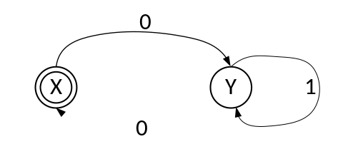

# 学堂在线测试 —— 编译原理

## 词法分析 习题

---

## 一、 单项选择题（本题共 27 小题，每小题 1 分，共 27 分）

**1. 词法分析器的输入是 ______。**

* A. 单词符号串
* B. 源程序
* C. 语法单位
* D. 目标程序

**2. 词法分析阶段的任务是 ( )。**

* A. 识别表达式
* B. 识别单词
* C. 识别语言
* D. 识别程序

**3. 编译过程中扫描器的任务包括 ______。**
① 组织源程序的输入
② 按词法规则分割单词，识别出其属性，并转换成 Token 串输出
③ 删除注解
④ 删除空格及无用字符
⑤ 行计数、列计数
⑥ 发现并定位词法错误
⑦ 建立符号表

* A. ②③④⑦
* B. ②③④⑥⑦
* C. ①②③④⑥⑦
* D. ①②③④⑤⑥⑦

**4. 在词法分析阶段不能识别的是 ______。**

* A. 标识符
* B. 运算符
* C. 四元式
* D. 常数

**5. 如图 3.2 所示的状态转换图接受的字集是 ______。**

* A. 以 0 开头的二进制数组成的集合
* B. 以 0 结尾 of 二进制数组成的集合
* C. 含奇数个 0 的二进制数组成的集合
* D. 含偶数个 0 的二进制数组成的集合

图 3.2 状态转换图

**6. 正规式 $M_1$ 和 $M_2$ 等价是指 ______。**

* A. $M_1$ 和 $M_2$ 的状态数相等
* B. $M_1$ 和 $M_2$ 的有向弧条数相等
* C. $M_1$ 和 $M_2$ 所表示的语言集相等
* D. $M_1$ 和 $M_2$ 的状态数与有向弧条数相等

**7. 与正规式 $(a \mid b)^*$ 等价的正规式是 ( )。**

* A. $(a \mid b)^+$
* B. $(a \mid b^*)^*$
* C. $(ab)^*$
* D. $a^* \mid b^*$

**8. 词法分析器的输出结果是 ( )。**

* A. 单词的种别编码
* B. 单词的种别编号和属性值
* C. 单词的属性值
* D. 单词在符号表中的位置

**9. 编译过程中，对源程序进行词法分析的目的是 ( )。**

* A. 识别语句中的关键字
* B. 将源程序分解为具有独立意义的最小语法单位（单词）
* C. 检查源程序的语法错误
* D. 生成中间代码

**10. 词法分析器输出的单词符号通常不包括 ( )。**

* A. 关键字
* B. 标识符
* C. 表达式
* D. 常数

**11. 下列哪项不属于词法分析器输出的单词符号类型 ( )。**

* A. 关键字 (如 `if`、`while`)
* B. 标识符 (如变量名 `x`、函数名 `f`)
* C. 语法树节点
* D. 常量 (如整数 `123`、字符串 `"abc"`)

**12. 词法分析中，“超前搜索” 是指 ( )。**

* A. 提前读取整个源程序再进行分析
* B. 为确定当前单词的边界，需要多读几个字符
* C. 同时分析多个源程序文件
* D. 跳过注释和空格等无关字符

**13. 正则表达式常被用于 ( )。**

* A. 描述语法规则
* B. 定义单词符号的结构
* C. 进行语义检查
* D. 生成目标代码

**14. 下列关于词法分析与语法分析的关系，说法正确的是 ( )。**

* A. 词法分析必须独立于语法分析先行完成
* B. 词法分析可以作为语法分析的子过程，按需调用
* C. 语法分析的结果会影响词法分析的过程
* D. 两者没有关联，可并行进行

**15. 词法分析阶段不负责处理的错误是 ( )。**

* A. 非法字符 (如源程序中出现 `@` 但文法不允许)
* B. 关键字拼写错误 (如 `whle` 代替 `while`)
* C. 变量未声明
* D. 常量格式错误 (如 `12a3` 不是合法整数)

**16. 下列关于单词符号 (Token) 的描述，正确的是 ( )。**

* A. 每个 Token 仅包含单词的类型，不包含具体值
* B. 标识符作为 Token 时，其值是标识符的名称
* C. 关键字的 Token 值通常为空
* D. 运算符的 Token 类型无需区分（如 `+` 和 `*` 视为同一类型）

**17. 词法分析中处理注释和空格的方式通常是 ( )。**

* A. 将其作为特殊 Token 输出
* B. 忽略它们，不纳入 Token 流
* C. 报错并终止编译
* D. 替换为特定字符后保留

**18. 下列工具中，专门用于生成词法分析器的是 ( )。**

* A. Yacc/Bison
* B. Lex/Flex
* C. GCC
* D. Java Compiler

**19. 词法分析器在识别单词时，通常依据的是 ( )。**

* A. 上下文无关文法
* B. 正则文法
* C. 上下文有关文法
* D. 短语结构文法

**20. 在 C 语言中，词法分析器遇到字符串 `"123abc"` 时，会将其识别为 ( )。**

* A. 一个整数常量
* B. 一个标识符
* C. 非法单词（错误）
* D. 整数和标识符的组合

**21. 词法分析中，“最长匹配原则” 是指 ( )。**

* A. 优先选择长度最长的产生式进行推导
* B. 从输入串中尽可能长地提取一个合法单词
* C. 优先匹配包含字符最多的关键字
* D. 对不确定的单词选择最长的可能类型

**22. 词法分析器的输出结果被直接用于 ( )。**

* A. 语义分析
* B. 代码生成
* C. 语法分析
* D. 代码优化

**23. 下列哪种情况不属于词法错误 ( )。**

* A. 源程序中出现未定义的运算符 `\$`
* B. 字符串缺少闭合引号 (如 `"hello`)
* C. 函数调用时实参与形参类型不匹配
* D. 数值常量中出现字母 (如 `12.3e-4f` 是合法的，但 `12a3` 不合法)

**24. 有限自动机中，$\varepsilon$ 转换 the 含义是 ( )。**

* A. 输入任意字符均可转换状态
* B. 无需输入字符即可从一个状态转换到另一个状态
* C. 转换失败时的默认状态
* D. 只能在初始状态使用的转换

**25. NFA 中的 $\varepsilon$-转换 (空转换) 表示 ( )。**

* A. 输入一个特殊的 “$\varepsilon$” 符号时的状态转换
* B. 不输入任何符号即可进行的状态转换
* C. 只有接受状态才能进行的转换
* D. 从初始状态出发的唯一转换

**26. 将 NFA 转换为等价 DFA 的过程中，核心步骤是 ( )**

* A. 消除所有接受状态
* B. 合并所有初始状态
* C. 用 “状态子集” 表示 DFA 的状态（子集构造法）
* D. 增加 $\varepsilon$-转换

**27. 若两个有限自动机等价，则它们 ( )**

* A. 状态数相同
* B. 接受的语言相同
* C. 都有 $\varepsilon$-转换
* D. 初始状态数量相同

---

## 二、 多项选择题（本题共 5 小题，每小题 2 分，共 10 分。多选、少选、错选均不得分）

**1. 有限自动机中，确定有限自动机 (DFA) 与非确定有限自动机 (NFA) 的主要区别是 ( )。**

* A. DFA 的状态数更少
* B. DFA 对于每个输入符号只有一个后继状态
* C. NFA 不能识别正规语言
* D. DFA 没有空转移

**2. 有限自动机与词法分析的关系是 ( )。**

* A. 有限自动机是描述语法规则 of 工具
* B. 确定有限自动机 (DFA) 可直接用于实现词法分析器
* C. 非确定有限自动机 (NFA) 无法转换为词法分析器
* D. 有限自动机用于优化目标代码

**3. 下列关于确定有限自动机 (DFA) 的说法，正确的是 ( )。**

* A. DFA 中存在多个初始状态
* B. 对于某个状态和输入字符，可能有多个下一状态
* C. DFA 的状态转换是确定的，可直接用于实现词法分析
* D. DFA 无法识别正则语言

**4. 非确定有限自动机 (NFA) 与 DFA 的主要区别在于 ( )。**

* A. NFA 不能识别正则语言，DFA 可以
* B. NFA 的状态转换可能不确定（同一状态和输入有多个下一状态）
* C. NFA 没有接受状态，DFA 有
* D. NFA 只能处理短输入串，DFA 可处理任意长度

**5. 下列关于确定有限自动机 (DFA) 的描述，正确的是 ( )。**

* A. DFA 的一个状态对同一输入符号可以有多个不同的后继状态
* B. DFA 的初始状态可以有多个
* C. DFA 的转换函数是从 “状态 × 输入符号” 到 “状态” 的单值映射
* D. DFA 可以没有接受状态

---

## 三、 填空题（本题共 1 小题，每小题 10 分，共 10 分）

**1. 令 $\Sigma = \{a, b\}$，$\Sigma$ 上的正规式 $(a \mid b)^*(aa \mid bb)(a \mid b)^*$ 代表的语言是 ______。**

---

## 四、 主观题（本题共 1 小题，每小题 10 分，共 10 分）

**1. 为正规式 $b(a \mid b)^*aa$ 构造与之等价且状态最少的 DFA。**