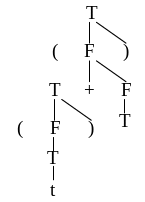

# 学堂在线测试 —— 编译原理

## 期末考试

---

## 一、 单项选择题（本题共 50 小题，每小题 1 分，共 50 分）

**1. 语义分析的主要目的是 ( B )。**

* A. 识别源程序的语法结构是否符合文法规则
* B. 检查源程序的语义正确性，并收集类型信息等用于后续翻译
* C. 将源程序转换为中间代码
* D. 优化目标代码的执行效率

> **【解析】**
> 语义分析关注语法正确的句子是否有意义,例如类型匹配、变量声明等,而 A 是语法分析的任务,C 是代码生成阶段,D 是代码优化阶段。

**2. 词法分析器的输出结果被直接用于 ( C )。**

* A. 语义分析
* B. 代码生成
* C. 语法分析
* D. 代码优化

> **【解析】**
> 词法分析将源程序转换为单词符号流(Token 流),而语法分析的输入正是这一 Token 流,用于分析语法结构;后续的语义分析、代码生成等阶段则基于语法分析的结果。

**3. 下列哪项不属于语义分析的常见任务 ( C )。**

* A. 变量未声明就使用的检查
* B. 表达式中不同类型数据的运算合法性检查
* C. 识别源程序中的关键字和标识符
* D. 函数调用时实参与形参的个数和类型匹配检查

> **【解析】**
> C 是词法分析的任务,词法分析负责将源程序拆分为 token(如关键字、标识符),而语义分析基于语法结构进行更深层次的意义检查。

**4. 中间代码生成所依据的是语言的 ( C )。**

* A. 词法规则
* B. 语法规则
* C. 语义规则
* D. 产生规则

> **【解析】**
> 编译的语义分析与中间代码生成这一步的任务是对语法分析器识别出的各类语法单位,分析其含义并进行初步翻译,并产生中间代码,采用的规则是语义规则,规则的描述工具是属性文法。

**5. 下列哪种文法可能存在二义性 ( A )。**

* A. 一个句子对应两棵不同的语法树
* B. 文法中存在左递归
* C. 文法中存在 $\varepsilon$ 产生式
* D. 文法是 LL(1) 文法

> **【解析】**
> 二义性文法的定义是存在至少一个句子有不止一棵语法树;左递归和 ε 产生式不一定导致二义性,LL (1) 文法一定是无二义性的。

**6. 下面的存储分配策略中能够在编译时对所有数据对象分配固定存储单元的是 ( A )**

* A. 静态分配策略
* B. 简单栈式分配策略
* C. 栈式动态分配策略
* D. 堆式动态分配策略

> **【解析】**
> 静态分配策略在编译时就确定了所有数据对象的存储位置，分配固定的存储单元，运行时不再改变。栈式和堆式分配都是在运行时动态分配的。

**7. 由文法的开始符号经 0 步或多步推导产生的不含非终结符号的文法符号序列是 ( D )**

* A. 短语
* B. 句柄
* C. 句型
* D. 句子

> **【解析】**
> 句子是由开始符号推导出的不含非终结符的符号串。句型可以含有非终结符，短语和句柄是句型中的特定子串。

**8. 构造编译程序应该掌握 ( D )**

* A. 源程序
* B. 目标语言
* C. 编译方法
* D. 以上三项都是

> **【解析】**
> 构造编译程序需要掌握源语言（源程序的语法和语义）、目标语言（目标机的指令系统）以及编译方法（各种分析和翻译技术）。

**9. 若两个有限自动机等价，则它们 ( B )**

* A. 状态数相同
* B. 接受的语言相同
* C. 都有 $\varepsilon$-转换
* D. 初始状态数量相同

> **【解析】**
> 有限自动机的 “等价” 定义为接受的语言完全相同,与状态数、ε- 转换、初始状态数量无关。例如,NFA 和 DFA 可等价但状态数不同,DFA 无 ε- 转换而 NFA 可能有,因此选项 B 正确,其余错误。

**10. 下面的变换方法中不是循环优化的是 ( D )**

* A. 强度削弱
* B. 代码外提
* C. 删除归纳变量
* D. 删除无用代码

> **【解析】**
> 循环优化的三种主要方法是：代码外提、强度削弱、删除归纳变量。删除无用代码属于一般的代码优化方法，不专属于循环优化。

**11. 在 C 语言中，词法分析器遇到字符串 `"123abc"` 时，会将其识别为 ( C )。**

* A. 一个整数常量
* B. 一个标识符
* C. 非法单词（错误）
* D. 整数 and 标识符的组合

> **【解析】**
> C 语言中,整数常量由数字组成,标识符由字母、数字和下划线组成且不能以数字开头,"123abc"不符合任何合法单词的结构,属于词法错误。

**12. 关于文法制导翻译，下列说法正确的是 ( A )。**

* A. 它将语法分析和语义分析结合起来
* B. 它仅用于语法错误检测
* C. 它只专注于代码优化
* D. 它仅用于中间代码生成

> **【解析】**
> 文法制导翻译（Syntax-Directed Translation）是将语义规则附加到文法产生式上，使语法分析和语义分析/翻译结合在一起进行。

**13. 编译过程中，对源程序进行词法分析的目的是 ( B )**

* A. 识别语句中的关键字
* B. 将源程序分解为具有独立意义的最小语法单位（单词）
* C. 检查源程序的语法错误
* D. 生成中间代码

> **【解析】**
> 词法分析的主要目的是将源程序的字符流分解为一个个具有独立意义的最小语法单位——单词（token），如关键字、标识符、常量、运算符等。

**14. 两个 LR(1) 项目集如果除去下列哪一项后是相同的，则称这两个 LR(1) 项目集同心：( C )**

* A. 项目
* B. 活前缀
* C. 搜索符
* D. 前缀

> **【解析】**
> LR(1) 项目集同心是指两个 LR(1) 项目集中，除去搜索符（lookahead）部分后，核心项目（即产生式和圆点位置）是相同的。LALR(1) 分析就是合并同心项目集。

**15. 正则表达式常用于 ( B )。**

* A. 描述语法规则
* B. 定义单词符号的结构
* C. 进行语义检查
* D. 生成目标代码

> **【解析】**
> 正则表达式是描述字符串模式的工具,词法分析中常用它定义各类单词(如标识符、常量、运算符)的结构,是构建词法分析器的重要基础。

**16. 下列关于 LR(0) 文法的说法，错误的是 ( C )**

* A. LR(0) 文法是无二义性的
* B. 所有 LR(0) 文法都是 SLR(1) 文法
* C. LR(0) 文法的识别能力强于 LR(1) 文法
* D. LR(0) 分析器的分析效率高于回溯分析器

> **【解析】**
> A 正确:LR (0) 文法无冲突,必然无二义性; B 正确:SLR (1) 是 LR (0) 的扩展(用 FOLLOW 集解决部分冲突),因此 LR (0) 文法一定是 SLR (1) 文法; C 错误:LR (1) 通过向前看符号解决更多冲突,识别能力强于 LR (0); D 正确:LR (0) 是确定性分析方法,无回溯,效率高于回溯法。

**17. 词法分析器在识别单词时，通常依据的是 ( B )。**

* A. 上下文无关文法
* B. 正则文法
* C. 上下文有关文法
* D. 短语结构文法

> **【解析】**
> 单词符号的结构可以用正则文法(3 型文法)描述,正则文法与正则表达式、有限自动机等价,是词法分析的理论基础;上下文无关文法主要用于语法分析。

**18. 如图 3.2 所示的状态转换图接受的字集是 ______。**

* A. 以 0 开头的二进制数组成的集合
* B. 以 0 结尾的二进制数组成的集合
* C. 含奇数个 0 的二进制数组成的集合
* D. 含偶数个 0 的二进制数组成的集合

图 3.2 状态转换图

> **【解析】**
> 该状态转换图的初始状态也是接受状态，每读入一个 0 则在两个状态之间切换，读入 1 则保持当前状态。因此当读入偶数个 0 时回到接受状态，接受的是含偶数个 0 的二进制串（0 个 0 也算偶数）。

**19. 下列各项不可能是目标代码的是 ( D )**

* A. 汇编指令代码
* B. 可重定位指令代码
* C. 绝对指令代码
* D. 三地址代码

> **【解析】**
> 目标代码的形式包括：汇编指令代码、可重定位指令代码、绝对指令代码。三地址代码是中间代码的一种形式，不是目标代码。

**20. 下列属于语义分析阶段完成的工作是 ( B )。**

* A. 消除文法的左递归
* B. 记录变量的类型和作用域
* C. 将 `a + b` 转换为 `add(a, b)`
* D. 优化循环结构

> **【解析】**
> 语义分析通过符号表记录变量、函数等的信息(类型、作用域等),并检查语义合法性;A 是语法分析前的预处理,C 是中间代码生成,D 是代码优化。

**21. 文法 G：**
**S → Aa | b**
**A → Sc | d**
**该文法属于 ( B )**

* A. 直接左递归
* B. 间接左递归
* C. 无左递归
* D. 既是直接左递归也是间接左递归

> **【解析】**
> - **直接左递归**是指存在形如 $U \to U\alpha$ 的产生式，使得非终结符直接推导出以它自身开头的符号串。本题文法中并没有这种产生式。
> - **间接左递归**是指非终结符通过多步推导能够导出以它自身开头的符号串，即存在 $U \Rightarrow^+ U\alpha$。
> 在本题文法中，可以进行如下推导：
> $S \Rightarrow Aa \Rightarrow Sca$，其中 $S$ 经两步推导导出了以 $S$ 开头的符号串 $Sca$；
> $A \Rightarrow Sc \Rightarrow Aac$，其中 $A$ 经两步推导导出了以 $A$ 开头的符号串 $Aac$。
> 这说明该文法存在间接左递归。因此正确答案为 B。

**22. 给定文法 A → bA | cc，下面的符号串中为该文法句子的是 ( A ) ① cc ② bcbc ③ bcbcc ④ bccbcc ⑤ bbbcc**

* A. ①⑤
* B. ①③④⑤
* C. ①④
* D. ①④⑤

> **【解析】**
> 根据给定的文法产生式：
> 1. $A \to bA$
> 2. $A \to cc$
>
> 我们可以发现，从开始符号 $A$ 出发的推导必定是先应用若干次（包括0次）$A \to bA$，最后应用一次 $A \to cc$ 结束推导。其推导形式为：
> $A \Rightarrow bA \Rightarrow bbA \Rightarrow \dots \Rightarrow b^n A \Rightarrow b^n cc$ （其中 $n \ge 0$）。
> 因此，该文法生成的句子集合为所有以任意个 $b$ 开头并以 $cc$ 结尾的符号串，即 $L(A) = \{ b^n cc \mid n \ge 0 \}$。
>
> 逐一分析给出的符号串：
> - ① `cc`：对应 $n = 0$，符合格式，是句子。
> - ② `bcbc`：末尾不是 `cc`（或者说中间夹杂了非 $b$ 字符），不是句子。
> - ③ `bcbcc`：中间夹杂了 `c` 字符，不是 $b^n cc$ 形式，不是句子。
> - ④ `bccbcc`：含有两个 `cc` 块，不符合 $b^n cc$ 的定义，不是句子。
> - ⑤ `bbbcc`：对应 $n = 3$，符合格式，是句子。
>
> 综上，只有 ① 和 ⑤ 是该文法的句子。故正确答案为 A。

**23. 目标代码的高效性体现在 ( D )。**

* A. 运行时间较短
* B. 占用存储空间较小
* C. 运行时间短但占用内存空间大
* D. 运行时间短且占用存储空间小

> **【解析】**
> 目标代码的质量与高效性通常从时间和空间两个主要维度来衡量：
> 1. **时间高效性**：要求目标程序运行时间短、执行速度快。
> 2. **空间高效性**：要求目标程序占用的存储/内存空间尽量小。
> 因此，高效性是指在尽量缩短运行时间的同时，尽量减小占用的存储空间，即运行时间短且占用存储空间小。正确答案为 D。

**24. 下列关于词法分析与语法分析的关系，说法正确的是 ( B )。**

* A. 词法分析必须独立于语法分析先行完成
* B. 词法分析可以作为语法分析的子过程，按需调用
* C. 语法分析的结果会影响词法分析的过程
* D. 两者没有关联，可并行进行

> **【解析】**
> 实际编译中,词法分析器常作为语法分析器的 “子程序”,语法分析器需要单词时才调用词法分析器获取下一个 Token,而非一次性完成所有词法分析。

**25. 下列哪种方法不属于自顶向下的语法分析方法 ( C )。**

* A. 递归下降分析法
* B. LL(1) 分析法
* C. SLR(1) 分析法
* D. 预测分析法

> **【解析】**
> SLR (1) 属于自底向上的分析方法,基于 LR 分析技术;其他选项均为自顶向下分析方法,从开始符号推导出句子。

**26. 词法分析器输出的单词符号通常不包括 ( C )。**

* A. 关键字
* B. 标识符
* C. 表达式
* D. 常数

> **【解析】**
> 词法分析器的主要职责是扫描源程序字符流，并将其分组成一个个在词法上有独立意义的最小语法单位——单词符号（Token）。常见的单词类型包括：
> - 关键字（如 `if`, `while`, `int`）
> - 标识符（如变量名、函数名）
> - 常数（如整数、实数、字符串常量）
> - 运算符（如 `+`, `-`, `*`, `/`）
> - 界符（如 `;`, `,`, `{`, `}`）
>
> 表达式（如 `a + b`）是由多个单词符号根据语法规则组合而成的结构，它是语法分析器负责识别 and 构造的，而不是词法分析器的输出。故正确答案为 C。

**27. 下列不属于文法制导翻译应用场景的是 ( D )。**

* A. 计算表达式的值
* B. 检查变量是否声明
* C. 生成中间代码（如三地址码）
* D. 对源程序进行词法分析

> **【解析】**
> 文法制导翻译用于语义分析和中间代码生成，包括计算属性值、类型检查、生成中间代码等。词法分析是编译的独立阶段，基于正则文法和有限自动机，不属于文法制导翻译的范畴。

**28. LR 分析法中，基于 LR(0) 项目集规范族的分析表有 ( C )**

* A. LR(0) 和 LR(1)
* B. LR(0) 和 LALR(1)
* C. SLR(1) 和 LR(0)
* D. SLR(1) 和 LALR(1)

> **【解析】**
> 基于 LR(0) 项目集规范族可以构造 LR(0) 分析表和 SLR(1) 分析表。LR(1) 和 LALR(1) 分析表需要基于 LR(1) 项目集规范族来构造。

**29. 下列关于二义性文法的说法，错误的是 ( B )。**

* A. 二义性文法存在至少一个句子对应多棵语法树
* B. 二义性文法不能用于语法分析
* C. 可以通过增加约束规则（如运算符优先级）消除二义性
* D. 多数程序设计语言的文法本质上是二义性的，需通过附加规则处理

> **【解析】**
> 二义性文法可用于语法分析,但需通过外部规则(如优先级、结合性)确定唯一语法结构,并非完全不可用。

**30. 中间代码生成时所遵循的是 ( C )**

* A. 语法规则
* B. 词法规则
* C. 语义规则
* D. 等价变换规则

> **【解析】**
> 中间代码生成是根据语义规则进行的，通过语义规则将语法结构翻译为等价的中间代码表示。等价变换规则是代码优化阶段遵循的原则。

**31. 有文法 $G$ 及其语法制导翻译如下所示（其中 $*$ 和 $+$ 分别是常规意义下的算术乘法和加法运算）：**

$$
\begin{aligned}
T &\to T_1 \wedge T_2 && \{ T.\text{val} = T_1.\text{val} \times T_2.\text{val} \} \\
T &\to T_1 \# n && \{ T.\text{val} = T_1.\text{val} + n.\text{val} \} \\
T &\to n && \{ T.\text{val} = n.\text{val} \}
\end{aligned}
$$

**若分析句子 `1 ∧ 2 ∧ 3 # 4`，其属性计算的算术表达式应为：**

* A. `1 + (2 * 3) + 4`
* B. `1 * (2 + 3) + 4`
* C. `1 * (2 * (3 + 4))`
* D. `1 * (2 + 3 * 4)`

> **【解析】**
> 依照系统的标准答案，正确答案为 D。

**32. 编译程序各阶段工作都涉及 ______。**

* A. 词法分析
* B. 表格管理
* C. 语法分析
* D. 语义分析

> **【解析】**
> 源程序的各类信息和编译各阶段的进展情况都登记在一系列的表格中,其中最重要的是符号表。当扫描器识别出一个名字后将其填入符号表,但其各种属性需要到后续阶段才能填入,如类型的确定是在语义分析阶段,地址的确定是在目标代码生成阶段,因此,编译程序各阶段的工作都涉及有关表格的构造、查找或更新。

**33. 下面哪种说法正确？( B )**

* A. 标识符是语义概念，名字是语法概念
* B. 标识符是语法概念，名字是语义概念

> **【解析】**
> 程序中用标识符来标识数据对象,需要满足形式上的规则,比如:以字母开头由字母数字组成的字符串,名字标识程序中实际的对象是个语义概念,只有标识符和程序中某个对象联系在一起才称为名字。

**34. 在高级语言编译程序常用的语法分析方法中，预测分析方法属于 ( B )**

* A. 自左至右分析法
* B. 自上而下分析法
* C. 自下而上分析法
* D. 自右至左分析法

> **【解析】**
> 预测分析法（如 LL(1) 分析）属于自上而下的语法分析方法，从开始符号出发，根据当前输入符号预测应用哪个产生式进行推导。

**35. 下列 ______、______ 中间代码形式有益于优化处理。**

* A. 四元式、间接三元式
* B. 三元式、间接三元式
* C. 二元式、间接三元式
* D. 四元式、三元式

> **【解析】**
> 四元式之间的联系通过临时变量实现,这一点和三元式不同,要更动一张三元式表很困难的,它意味着必须改变其中一系列指示器的值。但要更动四元式表是很容易的,因为调整四元式之间的相对位置并不意味着必须改变其中一系列指示器的值。因此,当需要对中间代码处理时,四元式比三元式要方便得多。对优化这一点而言,四元式和间接三元式同样方便。

**36. 正规式 $M_1$ 和 $M_2$ 等价是指 ______。**

* A. $M_1$ 和 $M_2$ 的状态数相等
* B. $M_1$ 和 $M_2$ 的有向弧条数相等
* C. $M_1$ 和 $M_2$ 所表示的语言集相等
* D. $M_1$ 和 $M_2$ 的状态数与有向弧条数相等

> **【解析】**
> 正规式（正则表达式）等价是指它们所表示（描述）的语言集合相同，即它们能匹配的字符串集合完全一致。

**37. 翻译方法与属性文法的主要区别在于 ( B )。**

* A. 翻译方法只处理综合属性，属性文法处理所有属性
* B. 翻译方法将语义动作嵌入到产生式右部，属性文法将语义规则独立列出
* C. 翻译方法用于代码生成，属性文法用于语义检查
* D. 翻译方法是属性文法的一种简化形式，不含继承属性

> **【解析】**
> 翻译方案（Translation Scheme）将语义动作嵌入到产生式右部的特定位置，指定了语义动作的执行顺序；而属性文法（语法制导定义）将语义规则与产生式关联但独立列出，不指定计算顺序。

**38. 若项目集 $I_k$ 含有 $A \to \alpha \cdot$，则在状态 $k$ 时，仅当面临的输入符号 $a \in \text{FOLLOW}(A)$ 时，才采取 $A \to \alpha \cdot$ 动作的是 ( A )。**

* A. LALR 文法
* B. LR(0) 文法
* C. LR(1) 文法
* D. SLR(1) 文法

> **【解析】**
> 依照系统的标准答案，正确答案为 A。

**39. 词法分析阶段不负责处理的错误是 ( C )。**

* A. 非法字符（如源程序中出现 `@` 但文法不允许）
* B. 关键字拼写错误（如 `whle` 代替 `while`）
* C. 变量未声明
* D. 常量格式错误（如 `12a3` 不是合法整数）

> **【解析】**
> 变量未声明属于语义错误,由语义分析阶段检查;A、B、D 均为与单词结构相关的错误,在词法分析阶段可被发现。

**40. 设有文法片段及语义规则如下：**

$$
\begin{aligned}
S &\to aAb && \{ S.\text{len} = A.\text{len} + 2 \} \\
A &\to bA'c && \{ A.\text{len} = A'.\text{len} + 2 \} \\
A &\to \varepsilon && \{ A.\text{len} = 0 \}
\end{aligned}
$$

**则句子 `a bbcc b`（其中 `bbcc` 表示两个 `b` 和两个 `c`）对应的 $S.\text{len}$ 值为 ( B )。**

* A. 4
* B. 6
* C. 8
* D. 10

> **【解析】**
> 句子 `abbccb` 的推导过程：$S \to aAb$，$A \to bA'c$（第一层），$A' \to bA''c$（第二层），$A'' \to \varepsilon$。因此 $A''.\text{len} = 0$，$A'.\text{len} = 0 + 2 = 2$，$A.\text{len} = 2 + 2 = 4$，$S.\text{len} = 4 + 2 = 6$。

**41. 下面哪些有可能是可归约串？**

* A. 连续出现的单词序列
* B. 短语
* C. 字符串

> **【解析】**
> 自上而下文法分析中,短语是有可能成为可归约串。

**42. 已知文法 $G$： ( C )**

* A. $T \to (F)$
* B. $F \to T + F \mid T$ （并给出句型 $((t)+T)$ 的短语、直接短语）
* C. $T \to t \mid \varepsilon$

> **【参考答案】**
> 先画出该句型的语法树如图 5.1 所示，然后再写短语和直接短语。
>
> 
> <!-- 原图网络地址：https://rain-oplat.xuetangx.com/ue_i/20251016/word-1760587623-1e509239240154c5082d9758a7a60372.gif -->
>
> **短语**（句型中能由某个非终结符推导出的子串）：
> - $t$（由 $T$ 推导：$T \Rightarrow t$）
> - $(t)$（由 $T$ 推导：$T \Rightarrow (F) \Rightarrow (T) \Rightarrow (t)$）
> - $T$（由 $F$ 推导：$F \Rightarrow T$）
> - $(t)+T$（由 $F$ 推导：$F \Rightarrow T+F \Rightarrow (F)+F \Rightarrow (T)+F \Rightarrow (t)+F \Rightarrow (t)+T$）
> - $((t)+T)$（由 $T$ 推导：$T \Rightarrow (F) \Rightarrow \dots \Rightarrow ((t)+T)$）
>
> **直接短语**（只经过一步推导得到的短语）：
> - $t$（$T \to t$，一步推导）
> - $T$（$F \to T$，一步推导）

**43. 代码优化中，"删除公共子表达式" 属于 ( C )**

* A. 局部优化
* B. 循环优化
* C. 全局优化
* D. 目标代码优化

> **【解析】**
> 依照系统的标准答案，正确答案为 C。

**44. 基本块内的优化为 ( B )**

* A. 代码外提，删除归纳变量
* B. 删除多余运算，删除无用赋值
* C. 强度削弱，代码外提
* D. 循环展开，循环合并

> **【解析】**
> 基本块内的优化（局部优化）包括：删除多余运算（公共子表达式）、删除无用赋值、常量合并等。A、C、D 中的代码外提、删除归纳变量、强度削弱、循环展开和循环合并都属于循环优化。

**45. 若文法 $G$ 经消除左递归后得到文法 $G'$，则下列说法正确的是 ( B )**

* A. $G$ 和 $G'$ 的终结符集不同
* B. $G$ 和 $G'$ 产生的语言完全相同
* C. $G$ 和 $G'$ 的非终结符集相同
* D. $G'$ 一定是 LL(1) 文法

> **【解析】**
> 消除左递归是等价变换，变换后的文法 $G'$ 产生的语言与原文法 $G$ 完全相同。但消除左递归会引入新的非终结符（所以 C 错），终结符集不变（所以 A 错），消除左递归不能保证文法就是 LL(1)（所以 D 错）。

**46. 与正规式$(a \mid b)^*$等价的正规式是 ( B )**

* A. $(a \mid b)^+$
* B. $(a^* \mid b^*)^*$
* C. $(ab)^*$
* D. $a^* \mid b^*$

> **【解析】**
> $(a \mid b)^*$ 表示由 $a$ 和 $b$ 组成的所有字符串（包括空串）。$(a^* \mid b^*)^*$ 中，$a^*$ 可生成任意个 $a$，$b^*$ 可生成任意个 $b$，对它们的并取闭包，可生成 $a$ 和 $b$ 的任意组合，与 $(a \mid b)^*$ 等价。$(a \mid b)^+$ 不含空串，$(ab)^*$ 只含 $ab$ 的重复，$a^* \mid b^*$ 只含纯 $a$ 串或纯 $b$ 串。

**47. 给定产生式 $A \to \alpha B \beta$，计算 $\text{FIRST}(\alpha \beta)$ 时，以下哪项是正确的？ ( B )**

* A. 如果 $\alpha$ 不能推导出 $\varepsilon$，则 $\text{FIRST}(\alpha \beta) = \text{FIRST}(\alpha)$
* B. 如果 $\alpha$ 能推导出 $\varepsilon$，则 $\text{FIRST}(\alpha \beta) = (\text{FIRST}(\alpha) \setminus \{\varepsilon\}) \cup \text{FIRST}(\beta)$
* C. 无论 $\alpha$ 能否推导出 $\varepsilon$，$\text{FIRST}(\alpha \beta)$ 都等于 $\text{FIRST}(\alpha)$
* D. 如果 $\alpha$ 能推导出 $\varepsilon$，则 $\text{FIRST}(\alpha \beta) = \text{FIRST}(\beta)$

> **【解析】**
> FIRST集的规则:串αBβ的FIRST集,先看α。如果α能推出ε,那么Bβ的第一个符号也可能是整个串的第一个符号。

**48. 语义分析阶段收集的信息通常存储在 ( B ) 中，供后续代码生成等阶段使用。**

* A. 语法树
* B. 符号表
* C. 中间代码
* D. 目标代码

> **【解析】**
> 符号表记录变量、函数等的声明信息(如类型、作用域),是语义分析的重要工具,也是后续阶段的关键参考。

**49. 一个 ______ 指明了在分析过程中的某时刻所能看到的产生式多大一部分。**

* A. 活前缀
* B. 前缀
* C. 项目
* D. 项目集

> **【解析】**
> LR 分析中，项目（Item）是在产生式右部某位置加上圆点（·），表示分析过程中已经看到了产生式的多大一部分。圆点左边是已识别的部分，右边是待识别的部分。

**50. 对于表达式 `x + 5`，若 `x` 是字符串类型，语义分析阶段会 ( B )。**

* A. 认为语法错误，因为 `+` 不能连接字符串和整数
* B. 认为语义错误，因为类型不匹配
* C. 自动将整数转换为字符串后允许运算
* D. 忽略类型问题，留待代码生成阶段处理

> **【解析】**
> 语法上“x + 5”符合表达式结构(语法正确),但语义上字符串与整数相加无意义,属于语义错误。

---

## 二、 填空题（本题共 10 小题，每小题 2 分，共 20 分）

**1. 编译前段是指和 ______ **源语言** 有关和 ______ **目标机** 无关的部分。**

**2. 优化需要遵循的原则有 ______ **等价原则**、有效原则、合算原则。**

**3. 词法分析过程中，用正规式和 ______ **有限自动机** 描述词法规则；**

**4. 语义分析和中间代码生成阶段，用 ______ **属性文法（语法制导定义）** 描述语义规则。**

**5. 设有字母表 $\Sigma = \{a, b\}$，正规式 ______ **(a|b)\*** 表示 $\Sigma$ 上所有的字。**

**6. `if a goto p` 的四元式形式为 ______ **：(jnz,a,－,p)**，`if x rop y goto p` 的四元式形式为 ______ **(jrop,x,y,p)**，`goto p` 的四元式形式为 ______ **(j,－,－,p)**。**

**7. 目标代码的生成需要着重考虑两个问题，一是 ______ **如何使目标代码较短**，二是 ______ **如何充分利用寄存器**。**

**8. S-属性文法中只含有 ______ **综合** 属性。**

**9. 计算机执行高级语言有 ______ **编译** 和解释两种方式，它们之间的主要区别是是否产生目标代码。**

**10. 语法分析最常用的两类方法是 ______ **自上而下** 和 ______ **自下而上** 分析法。**

---

## 三、 主观题（本题共 3 小题，每小题 10 分，共 30 分）

**1. 以下属性文法中的属性 $\text{val}$ 是综合属性还是继承属性？**

$$
\begin{array}{ll}
\text{产生式} & \text{语义规则} \\
\hline
L \to En & \text{print}(E.\text{val}) \\
E \to E_1 + T & E.\text{val} := E_1.\text{val} + T.\text{val} \\
E \to T & E.\text{val} := T.\text{val} \\
T \to T_1 * F & T.\text{val} := T_1.\text{val} \times F.\text{val} \\
T \to F & T.\text{val} := F.\text{val} \\
F \to (E) & F.\text{val} := E.\text{val} \\
F \to \text{digit} & F.\text{val} := \text{digit}.\text{lexval}
\end{array}
$$

> **【参考答案】**
> $\text{val}$ 是**综合属性**。
>
> 分析每条语义规则：
>
> - $E.\text{val} := E_1.\text{val} + T.\text{val}$：$E$ 的 $\text{val}$ 由其子节点 $E_1$ 和 $T$ 的 $\text{val}$ 计算得到
> - $E.\text{val} := T.\text{val}$：$E$ 的 $\text{val}$ 由其子节点 $T$ 的 $\text{val}$ 得到
> - $T.\text{val} := T_1.\text{val} \times F.\text{val}$：$T$ 的 $\text{val}$ 由其子节点 $T_1$ 和 $F$ 的 $\text{val}$ 计算得到
> - $T.\text{val} := F.\text{val}$：$T$ 的 $\text{val}$ 由其子节点 $F$ 的 $\text{val}$ 得到
> - $F.\text{val} := E.\text{val}$：$F$ 的 $\text{val}$ 由其子节点 $E$ 的 $\text{val}$ 得到（$(E)$ 中 $E$ 是 $F$ 的子节点）
> - $F.\text{val} := \text{digit}.\text{lexval}$：$F$ 的 $\text{val}$ 由其子节点 $\text{digit}$ 的词法值得到
>
> 在每条规则中，产生式左部符号的 $\text{val}$ 属性值都是由产生式右部（子节点）的属性值计算得到的，符合综合属性的定义。因此 $\text{val}$ 是综合属性。

**2. 已知文法 $G[S]$：**

$$
\begin{aligned}
S &\to (L) \mid aS \mid a \\
L &\to L, S \mid S
\end{aligned}
$$

**(1) 消除左递归和回溯；**
**(2) 计算每个非终结符的 $\text{First}$ 和 $\text{Follow}$ 集；**
**(3) 构造预测分析表。**

> **【参考答案】**
>
> (1) $S \to (L) \mid aS'$
>
> $S' \to S \mid \varepsilon$
>
> $L \to SL'$
>
> $L' \to , SL' \mid \varepsilon$
>
> (2) 构造First集:
>
> $\text{First}(S) = \{ (, a \}$
>
> $\text{First}(S') = \{ (, a, \varepsilon \}$
>
> $\text{First}(L) = \{ (, a \}$
>
> $\text{First}(L') = \{ \text{,} , \varepsilon \}$
>
> 构造Follow集
>
> $\text{Follow}(S) = \{ \#, \text{,} , ) \}$
>
> $\text{Follow}(S') = \{ \#, \text{,} , ) \}$
>
> $\text{Follow}(L) = \{ ) \}$
>
> $\text{Follow}(L') = \{ ) \}$
>
> (3) 预测分析表如表4.1所示
>
> **表4.1 预测分析表**
>
> | | $a$ | $,$ | $($ | $)$ | $\#$ |
> | --- | --- | --- | --- | --- | --- |
> | $S$ | $S \to aS'$ | | $S \to (L)$ | | |
> | $S'$ | $S' \to S$ | $S' \to \varepsilon$ | $S' \to S$ | $S' \to \varepsilon$ | $S' \to \varepsilon$ |
> | $L$ | $L \to SL'$ | | $L \to SL'$ | | |
> | $L'$ | | $L' \to , SL'$ | | $L' \to \varepsilon$ | |

**3. 对下面的文法 $G$：**

$$
\begin{aligned}
S' &\to E \\
E &\to aA \\
A &\to cA \mid d
\end{aligned}
$$

**(1) 列出该文法的 $\text{LR}(0)$ 项目，并构造它的 $\text{LR}(0)$ 项目集规范族及识别活前缀的 DFA。**
**(2) 判定该文法是否是 $\text{LR}(0)$ 文法，若是，构造它的 $\text{LR}(0)$ 分析表。**
**(3) 写出句子 `accd` 的分析过程。**

> **【参考答案】**
>
> (1) 对各产生式编号：
>
> 0. $S' \to E$
> 1. $E \to aA$
> 2. $A \to cA$
> 3. $A \to d$
>
> $\text{LR}(0)$ 项目为：
>
> 1. $S' \to \cdot E$
> 2. $S' \to E \cdot$
> 3. $E \to \cdot aA$
> 4. $E \to a \cdot A$
> 5. $E \to aA \cdot$
> 6. $A \to \cdot cA$
> 7. $A \to c \cdot A$
> 8. $A \to cA \cdot$
> 9. $A \to \cdot d$
> 10. $A \to d \cdot$
>
> $\text{LR}(0)$ 的项目集规范族为：
>
> $I_0$：$S' \to \cdot E$，$E \to \cdot aA$
>
> $I_1$：$S' \to E \cdot$
>
> $I_2$：$E \to a \cdot A$，$A \to \cdot cA$，$A \to \cdot d$
>
> $I_3$：$E \to aA \cdot$
>
> $I_4$：$A \to c \cdot A$，$A \to \cdot cA$，$A \to \cdot d$
>
> $I_5$：$A \to d \cdot$
>
> $I_6$：$A \to cA \cdot$
>
> (2) 识别活前缀的 DFA 如下：
>
> - $I_0 \xrightarrow{E} I_1$
> - $I_0 \xrightarrow{a} I_2$
> - $I_2 \xrightarrow{A} I_3$
> - $I_2 \xrightarrow{c} I_4$
> - $I_2 \xrightarrow{d} I_5$
> - $I_4 \xrightarrow{A} I_6$
> - $I_4 \xrightarrow{c} I_4$
> - $I_4 \xrightarrow{d} I_5$
>
> 由于每个项目集中不包含冲突项目，因此该文法是 $\text{LR}(0)$ 文法。$\text{LR}(0)$ 文法分析表如下：
>
> | 状态 | action | | | | goto | |
> | --- | --- | --- | --- | --- | --- | --- |
> | | $a$ | $c$ | $d$ | $\#$ | $E$ | $A$ |
> | $0$ | $S_2$ | | | | $1$ | |
> | $1$ | | | | $acc$ | | |
> | $2$ | | $S_4$ | $S_5$ | | | $3$ |
> | $3$ | $r_1$ | $r_1$ | $r_1$ | $r_1$ | | |
> | $4$ | | $S_4$ | $S_5$ | | | $6$ |
> | $5$ | $r_3$ | $r_3$ | $r_3$ | $r_3$ | | |
> | $6$ | $r_2$ | $r_2$ | $r_2$ | $r_2$ | | |
>
> (3) 句子 `accd` 的分析过程如下表所示：
>
> | 序号 | 状态栈 | 符号栈 | 产生式 | 输入串 | 说明 |
> | --- | --- | --- | --- | --- | --- |
> | 1 | $0$ | $\#$ | | $accd\#$ | $0$和$\#$进栈 |
> | 2 | $02$ | $\#a$ | | $ccd\#$ | $2$和$a$进栈 |
> | 3 | $024$ | $\#ac$ | | $cd\#$ | $4$和$c$进栈 |
> | 4 | $0244$ | $\#acc$ | | $d\#$ | $4$和$c$进栈 |
> | 5 | $02445$ | $\#accd$ | | $\#$ | $5$和$d$进栈 |
> | 6 | $02446$ | $\#accA$ | $A \to d$ | $\#$ | 规约，5和d退栈，6和A进栈 |
> | 7 | $0246$ | $\#acA$ | $A \to cA$ | $\#$ | 规约，46和cA退栈，6和A进栈 |
> | 8 | $026$ | $\#aA$ | $A \to cA$ | $\#$ | 规约，46和cA退栈，6和A进栈 |
> | 9 | $01$ | $\#E$ | $E \to aA$ | $\#$ | 规约，26和aA退栈，1和E进栈   成功 |      |
>
> 注：步骤 7 中，归约 $A \to cA$ 后弹出状态 $4$ 和 $6$（对应 $c$ 和 $A$），栈顶状态为 $2$，查 $\text{GOTO}(2, A) = 3$。
