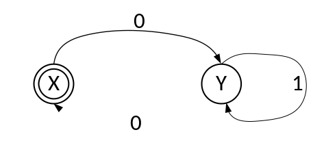

# 学堂在线测试 —— 编译原理

## 期末考试

---

## 一、 单项选择题（本题共 50 小题，每小题 1 分，共 50 分）

**1. 语义分析的主要目的是 ( )。**

* A. 识别源程序的语法结构是否符合文法规则
* B. 检查源程序的语义正确性，并收集类型信息等用于后续翻译
* C. 将源程序转换为中间代码
* D. 优化目标代码的执行效率

**2. 词法分析器的输出结果被直接用于 ( )。**

* A. 语义分析
* B. 代码生成
* C. 语法分析
* D. 代码优化

**3. 下列哪项不属于语义分析的常见任务 ( )。**

* A. 变量未声明就使用的检查
* B. 表达式中不同类型数据的运算合法性检查
* C. 识别源程序中的关键字和标识符
* D. 函数调用时实参与形参的个数和类型匹配检查

**4. 中间代码生成所依据的是语言的 ( )。**

* A. 词法规则
* B. 语法规则
* C. 语义规则
* D. 产生规则

**5. 下列哪种文法可能存在二义性 ( )。**

* A. 一个句子对应两棵不同的语法树
* B. 文法中存在左递归
* C. 文法中存在 $\varepsilon$ 产生式
* D. 文法是 LL(1) 文法

**6. 下面的存储分配策略中能够在编译时对所有数据对象分配固定存储单元的是 ( )**

* A. 静态分配策略
* B. 简单栈式分配策略
* C. 栈式动态分配策略
* D. 堆式动态分配策略

**7. 由文法的开始符号经 0 步或多步推导产生的不含非终结符号的文法符号序列是 ( )**

* A. 短语
* B. 句柄
* C. 句型
* D. 句子

**8. 构造编译程序应该掌握 ( )**

* A. 源程序
* B. 目标语言
* C. 编译方法
* D. 以上三项都是

**9. 若两个有限自动机等价，则它们 ( )**

* A. 状态数相同
* B. 接受的语言相同
* C. 都有 $\varepsilon$-转换
* D. 初始状态数量相同

**10. 下面的变换方法中不是循环优化的是 ( )**

* A. 强度削弱
* B. 代码外提
* C. 删除归纳变量
* D. 删除无用代码

**11. 在 C 语言中，词法分析器遇到字符串 `"123abc"` 时，会将其识别为 ( )。**

* A. 一个整数常量
* B. 一个标识符
* C. 非法单词（错误）
* D. 整数 and 标识符的组合

**12. 关于文法制导翻译，下列说法正确的是 ( )。**

* A. 它将语法分析和语义分析结合起来
* B. 它仅用于语法错误检测
* C. 它只专注于代码优化
* D. 它仅用于中间代码生成

**13. 编译过程中，对源程序进行词法分析的目的是 ( )**

* A. 识别语句中的关键字
* B. 将源程序分解为具有独立意义的最小语法单位（单词）
* C. 检查源程序的语法错误
* D. 生成中间代码

**14. 两个 LR(1) 项目集如果除去下列哪一项后是相同的，则称这两个 LR(1) 项目集同心：( )**

* A. 项目
* B. 活前缀
* C. 搜索符
* D. 前缀

**15. 编译程序在逻辑上可划分为 ______、______、______、______、______。**

* A. 解释阶段、汇编阶段、编译阶段、链接阶段、运行阶段
* B. 词法分析、语法分析、语义分析与中间代码生成、代码优化、目标代码生成
* C. 词法分析、词法生成、语法生成、语义分析、语义生成
* D. 词法分析、语法分析、中间代码生成、运行分析、结果分析

**16. 关于编译程序和解释程序，下列说法正确的是 ( )**

* A. 编译程序和解释程序都生成目标代码
* B. 编译程序和解释程序都不生成目标代码
* C. 编译程序生成目标代码，而解释程序不生成目标代码
* D. 编译程序不生成目标代码，而解释程序生成目标代码

**17. 词法分析器在识别单词时，通常依据的是 ( )。**

* A. 上下文无关文法
* B. 正则文法
* C. 上下文有关文法
* D. 短语结构文法

**18. 如图 3.2 所示的状态转换图接受的字集是 ______。**

* A. 以 0 开头的二进制数组成的集合
* B. 以 0 结尾的二进制数组成的集合
* C. 含奇数个 0 的二进制数组成的集合
* D. 含偶数个 0 的二进制数组成的集合

图 3.2 状态转换图

**19. 下列各项不可能是目标代码的是 ( )**

* A. 汇编指令代码
* B. 可重定位指令代码
* C. 绝对指令代码
* D. 三地址代码

**20. 下列属于语义分析阶段完成的工作是 ( )。**

* A. 消除文法的左递归
* B. 记录变量的类型和作用域
* C. 将 `a + b` 转换为 `add(a, b)`
* D. 优化循环结构

**21. 词法分析器的输入是 ______。**

* A. 单词符号串
* B. 源程序
* C. 语法单位
* D. 目标程序

**22. 程序运行时，存储局部变量的区域是 ( )**

* A. 代码区
* B. 静态数据区
* C. 栈区
* D. 堆区

**23. 在自底向上的语法分析中，“归约” 是指 ( )。**

* A. 从开始符号推导出当前句型
* B. 将输入串中的一部分替换为某个产生式的左部符号
* C. 检查输入串是否符合文法的终止条件
* D. 消除文法中的左递归

**24. 关于综合属性，下列说法正确的是 ( )。**

* A. 其值由其子节点的值计算得到
* B. 其值由其父节点的值计算得到
* C. 其值从父节点传递到子节点
* D. 用于语义检查

**25. 下列关于继承属性的描述，正确的是 ( )。**

* A. 继承属性的值由该节点的子节点属性计算得到
* B. 继承属性的值从父节点或兄弟节点传递而来
* C. 综合属性和继承属性不能同时出现在同一个文法符号中
* D. 继承属性仅用于表示常量或变量的取值

**26. 下列关于确定有限自动机 (DFA) 的描述，正确的是 ( )**

* A. DFA 的一个状态对同一输入符号可以有多个不同的后继状态
* B. DFA 的初始状态可以有多个
* C. DFA 的转换函数是从 “状态 × 输入符号” 到 “状态” 的单值映射
* D. DFA 可以没有接受状态

**27. 下列不属于文法制导翻译应用场景的是 ( )。**

* A. 计算表达式的值
* B. 检查变量是否声明
* C. 生成中间代码（如三地址码）
* D. 对源程序进行词法分析

**28. LR 分析法中，基于 LR(0) 项目集规范族的分析表有 ( )**

* A. LR(0) 和 LR(1)
* B. LR(0) 和 LALR(1)
* C. SLR(1) 和 LR(0)
* D. SLR(1) 和 LALR(1)

**29. 下列关于二义性文法的说法，错误的是 ( )。**

* A. 二义性文法存在至少一个句子对应多棵语法树
* B. 二义性文法不能用于语法分析
* C. 可以通过增加约束规则（如运算符优先级）消除二义性
* D. 多数程序设计语言的文法本质上是二义性的，需通过附加规则处理

**30. 中间代码生成时所遵循的是 ( )**

* A. 语法规则
* B. 词法规则
* C. 语义规则
* D. 等价变换规则

**31. 有文法 $G$ 及其语法制导翻译如下所示（其中 $*$ 和 $+$ 分别是常规意义下的算术乘法和加法运算）：**

$$
\begin{aligned}
T &\to T_1 \wedge T_2 && \{ T.\text{val} = T_1.\text{val} \times T_2.\text{val} \} \\
T &\to T_1 \# n && \{ T.\text{val} = T_1.\text{val} + n.\text{val} \} \\
T &\to n && \{ T.\text{val} = n.\text{val} \}
\end{aligned}
$$

**若分析句子 `1 ∧ 2 ∧ 3 # 4`，其属性计算的算术表达式应为：**

* A. `1 + (2 * 3) + 4`
* B. `1 * (2 + 3) + 4`
* C. `1 * (2 * (3 + 4))`
* D. `1 * (2 + 3 * 4)`

**32. 编译程序各阶段工作都涉及 ______。**

* A. 词法分析
* B. 表格管理
* C. 语法分析
* D. 语义分析

**33. 下面哪种说法正确？( )**

* A. 标识符是语义概念，名字是语法概念
* B. 标识符是语法概念，名字是语义概念

**34. 在高级语言编译程序常用的语法分析方法中，预测分析方法属于 ( )**

* A. 自左至右分析法
* B. 自上而下分析法
* C. 自下而上分析法
* D. 自右至左分析法

**35. 下列 ______、______ 中间代码形式有益于优化处理。**

* A. 四元式、间接三元式
* B. 三元式、间接三元式
* C. 二元式、间接三元式
* D. 四元式、三元式

**36. 正规式 $M_1$ 和 $M_2$ 等价是指 ______。**

* A. $M_1$ 和 $M_2$ 的状态数相等
* B. $M_1$ 和 $M_2$ 的有向弧条数相等
* C. $M_1$ 和 $M_2$ 所表示的语言集相等
* D. $M_1$ 和 $M_2$ 的状态数与有向弧条数相等

**37. 翻译方法与属性文法的主要区别在于 ( )。**

* A. 翻译方法只处理综合属性，属性文法处理所有属性
* B. 翻译方法将语义动作嵌入到产生式右部，属性文法将语义规则独立列出
* C. 翻译方法用于代码生成，属性文法用于语义检查
* D. 翻译方法是属性文法的一种简化形式，不含继承属性

**38. 若项目集 $I_k$ 含有 $A \to \alpha \cdot$，则在状态 $k$ 时，仅当面临的输入符号 $a \in \text{FOLLOW}(A)$ 时，才采取 $A \to \alpha \cdot$ 动作的是 ( )。**

* A. LALR 文法
* B. LR(0) 文法
* C. LR(1) 文法
* D. SLR(1) 文法

**39. 词法分析阶段不负责处理的错误是 ( )。**

* A. 非法字符（如源程序中出现 `@` 但文法不允许）
* B. 关键字拼写错误（如 `whle` 代替 `while`）
* C. 变量未声明
* D. 常量格式错误（如 `12a3` 不是合法整数）

**40. 设有文法片段及语义规则如下：**

$$
\begin{aligned}
S &\to aAb && \{ S.\text{len} = A.\text{len} + 2 \} \\
A &\to bA'c && \{ A.\text{len} = A'.\text{len} + 2 \} \\
A &\to \varepsilon && \{ A.\text{len} = 0 \}
\end{aligned}
$$

**则句子 `a bbcc b`（其中 `bbcc` 表示两个 `b` 和两个 `c`）对应的 $S.\text{len}$ 值为 ( )。**

* A. 4
* B. 6
* C. 8
* D. 10

**41. 下面哪些有可能是可归约串？**

* A. 连续出现的单词序列
* B. 短语
* C. 字符串

**42. 已知文法 $G$：**

* A. $T \to (F)$
* B. $F \to T + F \mid T$ （并给出句型 $((t)+T)$ 的短语、直接短语）
* C. $T \to t \mid \varepsilon$

**43. 代码优化中，“删除公共子表达式” 属于 ( )**

* A. 局部优化
* B. 循环优化
* C. 全局优化
* D. 目标代码优化

**44. 基本块内的优化为 ( )**

* A. 代码外提，删除归纳变量
* B. 删除多余运算，删除无用赋值
* C. 强度削弱，代码外提
* D. 循环展开，循环合并

**45. 若文法 $G$ 经消除左递归后得到文法 $G'$，则下列说法正确的是 ( )**

* A. $G$ 和 $G'$ 的终结符集不同
* B. $G$ 和 $G'$ 产生的语言完全相同
* C. $G$ 和 $G'$ 的非终结符集相同
* D. $G'$ 一定是 LL(1) 文法

**46. 与正规式$(a \mid b)^*$等价的正规式是 (  )**

* A. $(a \mid b)^+$
* B. $(a^* \mid b^*)^*$
* C. $(ab)^*$
* D. $a^* \mid b^*$

**47. 给定产生式 $A \to \alpha B \beta$，计算 $\text{FIRST}(\alpha \beta)$ 时，以下哪项是正确的？**

* A. 如果 $\alpha$ 不能推导出 $\varepsilon$，则 $\text{FIRST}(\alpha \beta) = \text{FIRST}(\alpha)$
* B. 如果 $\alpha$ 能推导出 $\varepsilon$，则 $\text{FIRST}(\alpha \beta) = (\text{FIRST}(\alpha) \setminus \{\varepsilon\}) \cup \text{FIRST}(\beta)$
* C. 无论 $\alpha$ 能否推导出 $\varepsilon$，$\text{FIRST}(\alpha \beta)$ 都等于 $\text{FIRST}(\alpha)$
* D. 如果 $\alpha$ 能推导出 $\varepsilon$，则 $\text{FIRST}(\alpha \beta) = \text{FIRST}(\beta)$

**48. 语义分析阶段收集的信息通常存储在 ( ) 中，供后续代码生成等阶段使用。**

* A. 语法树
* B. 符号表
* C. 中间代码
* D. 目标代码

**49. 一个 ______ 指明了在分析过程中的某时刻所能看到的产生式多大一部分。**

* A. 活前缀
* B. 前缀
* C. 项目
* D. 项目集

**50. 对于表达式 `x + 5`，若 `x` 是字符串类型，语义分析阶段会 ( )。**

* A. 认为语法错误，因为 `+` 不能连接字符串和整数
* B. 认为语义错误，因为类型不匹配
* C. 自动将整数转换为字符串后允许运算
* D. 忽略类型问题，留待代码生成阶段处理

---

## 二、 填空题（本题共 10 小题，每小题 2 分，共 20 分）

**1. 编译前段是指和 ______ 有关和 ______ 无关的部分。**

**2. 优化需要遵循的原则有 ______、有效原则、合算原则。**

**3. 词法分析过程中，用正规式和 ______ 描述词法规则；**

**4. 语义分析和中间代码生成阶段，用 ______ 描述语义规则。**

**5. 设有字母表 $\Sigma = \{a, b\}$，正规式 ______ 表示 $\Sigma$ 上所有的字。**

**6. `if a goto p` 的四元式形式为 ______，`if x rop y goto p` 的四元式形式为 ______，`goto p` 的四元式形式为 ______。**

**7. 目标代码的生成需要着重考虑两个问题，一是 ______，二是 ______。**

**8. S-属性文法中只含有 ______ 属性。**

**9. 计算机执行高级语言有 ______ 和解释两种方式，它们之间的主要区别是是否产生目标代码。**

**10. 语法分析最常用的两类方法是 ______ 和 ______ 分析法。**

---

## 三、 主观题（本题共 3 小题，每小题 10 分，共 30 分）

**1. 以下属性文法中的属性 $\text{val}$ 是综合属性还是继承属性？**

$$
\begin{array}{ll}
\text{产生式} & \text{语义规则} \\
\hline
L \to En & \text{print}(E.\text{val}) \\
E \to E_1 + T & E.\text{val} := E_1.\text{val} + T.\text{val} \\
E \to T & E.\text{val} := T.\text{val} \\
T \to T_1 * F & T.\text{val} := T_1.\text{val} \times F.\text{val} \\
T \to F & T.\text{val} := F.\text{val} \\
F \to (E) & F.\text{val} := E.\text{val} \\
F \to \text{digit} & F.\text{val} := \text{digit}.\text{lexval}
\end{array}
$$

**2. 已知文法 $G[S]$：**

$$
\begin{aligned}
S &\to (L) \mid aS \mid a \\
L &\to L, S \mid S
\end{aligned}
$$

**(1) 消除左递归和回溯；**
**(2) 计算每个非终结符的 $\text{First}$ 和 $\text{Follow}$ 集；**
**(3) 构造预测分析表。**

**3. 对下面的文法 $G$：**

$$
\begin{aligned}
S' &\to E \\
E &\to aA \\
A &\to cA \mid d
\end{aligned}
$$

**(1) 列出该文法的 $\text{LR}(0)$ 项目，并构造它的 $\text{LR}(0)$ 项目集规范族及识别活前缀的 DFA。**
**(2) 判定该文法是否是 $\text{LR}(0)$ 文法，若是，构造它的 $\text{LR}(0)$ 分析表。**
**(3) 写出句子 `accd` 的分析过程。**
