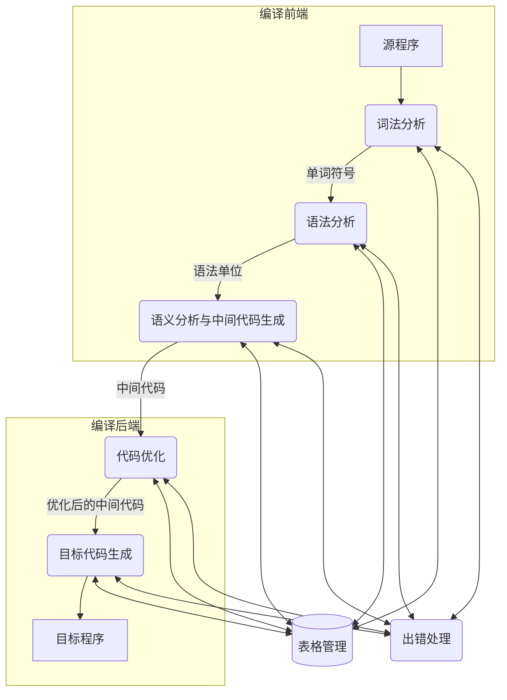

# 编译原理题型与答案整理提纲

## 一、 填空题

1. 编译程序的工作过程一般可以划分为五个阶段：**词法分析**、**语法分析**、**语义分析与中间代码生成**、**代码优化**（或**优化**）、**目标代码生成**。
2. 所谓“遍”就是对**源程序**或**源程序的中间结果**从头到尾扫描一次，并作有关的加工处理，生成新的**中间结果**或**目标程序**。
3. 设 $\Sigma$ 是一个有穷字母表，它的每个元素称为一个**符号**。
4. 规定 $V^0 = \{\varepsilon\}$。令 $V^* = V^0 \cup V^1 \cup V^2 \cup V^3 \cup \dots$，称 $V^*$ 是 $V$ 的**闭包**。记 $V^+ = V V^*$，则称 $V^+$ 是 $V$ 的**正则闭包**。
5. 一个上下文无关文法 $G$ 包括四个组成部分：一组**终结符号**、一组**非终结符号**、一个**开始符号**，以及一组**产生式**。
6. 所谓**终结符号**乃是组成语言的基本符号，如**基本字**、**标识符**、**常数**、**算符**和**界符**。**非终结符**（也称**语法变量**）用来代表**语法范畴**（或**语义范畴**）。
7. 对于推导过程 $\alpha_1 \Rightarrow^* \alpha_n$，其中 $*$ 表示需要 $0$ 步或若干步；$\alpha_1 \Rightarrow^+ \alpha_n$，其中 $+$ 表示需要 $1$ 步或若干步。
8. 如果一个文法**存在某个句子对应两棵不同的语法树**，则称这个文法是**二义的**。
9. 文法分为四种类型：$0$ 型、$1$ 型、$2$ 型和 $3$ 型。**$0$ 型文法**也称为**短语文法**；**$1$ 型文法**也称为**上下文有关文法**；**$2$ 型文法**也称为**上下文无关文法**；**$3$ 型文法**也称为**右线性文法**，亦称为**正规文法**。
10. 转换图是一张**有限方向图**。结点代表**状态**，用**圆圈**表示。状态之间用**箭弧**连结。箭弧上的标记（字符）代表在射出结点（即箭弧始结点）状态下可能出现的**输入字符**或**字符类**。
11. 一个含有 $m$ 个状态和 $n$ 个输入符号的 NFA 可表示成一张状态转换图，整张图**至少**含有**一个初态结点**以及**若干个（可以是 0 个）**终态结点。
12. 我们可以粗略地把语法分析方法分为两类：一类是**自上而下分析法**，另一类是**自下而上分析法**。
13. 自上而下分析法存在困难和缺点，如**左递归性问题**和**回溯问题**。
14. 令 $G$ 是一个不含左递归的文法，对 $G$ 的所有非终结符的每个候选 $\alpha$ 定义它的首终结符集 $\text{FIRST}(\alpha)$ 为：
    $$
    \text{FIRST}(\alpha) = \{ a \mid \alpha \Rightarrow^* a\dots, a \in V_{\text{T}} \}
    $$
15. 提取公共左因子的作用是把一个文法改造成任何**非终结符**的所有**候选首字符集**（**候选首符集**）**两两不相交**。
16. $\text{LL}(1)$ 中的第一个 $\text{L}$ 表示**从左到右扫描输入串**，第二个 $\text{L}$ 表示**最左推导**，$1$ 表示**分析时每一步只需向前查看一个符号**。
17. 自上而下分析的两个分析程序：**递归下降分析器**和**预测分析程序**（或**分析预测程序**）。
18. $\text{LR}$ 分析器的核心部分是一张分析表，每一项 $\text{ACTION}[s, a]$ 所规定的动作是下列四种之一：**移进**、**归约**、**接收**、**报错**。
19. 所谓活前缀是指规范句型的一个前缀，这种前缀**不含句柄之后的任何符号**。
20. 属性通常分为两类：**综合属性**和**继承属性**。需要特别强调的是，终结符**只有综合属性**，它们由**词法分析器**提供；非终结符既可以有**综合属性**也可以有**继承属性**；文法开始符号的所有继承属性作为属性计算前的**初始值**。
21. 在抽象语法树中，操作符和关键字都不作为**叶结点**出现，而是把它们作为**内部结点**，即作为这些叶结点的**父结点**。
22. 紧接在词法分析和语法分析之后，编译程序要做的工作就是进行**静态语义检查**和**翻译**。
23. 静态语义检查通常包括：**类型检查**、**控制流检查**、**一致性检查**、**相关名字检查**。
24. 三地址代码语句通常有三种表示方法：**四元式**、**三元式**和**间接三元式**。
25. 所谓**基本块**，是指程序中**一顺序执行的语句序列**，其中只有一个入口和一个出口，入口就是其中的第一个语句，出口就是其中的最后一个语句。
26. 局限于基本块范围内的优化称为**基本块内的优化**，或称为**局部优化**。
27. 基本块内可以实现的优化变换包括：**合并已知量**、**临时变量改名**、**交换语句的位置**、**代数变换**。
28. 常见的优化方法包括：**代码外提**、**强度削弱**和**删除归纳变量**。

---

## 二、 简答题

### 1. 简述编译程序工作的一般过程

* **词法分析**：
  > 输入源程序，对构成源程序的字符串进行扫描和分解，识别出一个个的单词。
  >
* **语法分析**：
  > 在词法分析的基础上，根据语言的语法规则，把单词符号串分解成各类语法单位，如“短语”、“子句”、“句子”、“程序段”和“程序”等。
  >
* **语义与中间代码产生**：
  > 对语法分析所识别出的各类语义范畴，分析其含义，并进行初步翻译（产生中间代码）。
  >
* **优化**：
  > 优化的任务在于对前阶段产生的中间代码进行加工变换，以期在最后阶段能产生更为高效（节省时间和空间）的目标代码。
  >
* **目标代码生成**：
  > 把中间代码（或经优化处理后的代码）变换为特定机器上的低级语言代码。
  >

### 2. 编译程序总框

为了直观展示编译程序各个阶段的工作及其相互联系，以下给出**编译程序总框**的结构图：

### 3. 正规式和正规集的递归定义

设 $\Sigma$ 是一个有穷字母表。$\Sigma$ 上的正规式和正规集递归定义如下：

1. $\varepsilon$ 和 $\emptyset$ 都是 $\Sigma$ 上的正规式，它们所表示的正规集分别为 $\{\varepsilon\}$ 和 $\emptyset$；
2. 对于任何 $a \in \Sigma$，$a$ 是 $\Sigma$ 上的一个正规式，它所表示的正规集为 $\{a\}$；
3. 假定 $U$ 和 $V$ 都是 $\Sigma$ 上的正规式，它们所表示的正规集分别记为 $L(U)$ 和 $L(V)$，那么：
   - $(U \mid V)$ 是正规式，其表示的正规集为 $L(U) \cup L(V)$（并集）；
   - $(U \cdot V)$ 是正规式，其表示的正规集为 $L(U)L(V)$（连接积）；
   - $(U)^* $ 是正规式，其表示的正规集为 $(L(U))^*$（克林闭包）。

### 4. 确定有限自动机（DFA）和非确定有限自动机（NFA）的区别

* **确定有限自动机（DFA）**：
  - 对于给定的当前状态和输入符号，有且仅有一个唯一的后继状态（即转移函数 $\delta(s, a) = s'$ 是单值函数）；
  - 初态是唯一的；
  - 弧上的标记只能是字母表 $\Sigma$ 中的符号，不允许存在空弧 $\varepsilon$。
* **非确定有限自动机（NFA）**：
  - 对于给定的当前状态和输入符号，可以有多个可能的后继状态（即转移函数 $\delta(s, a) = \{s_1, s_2, \dots\}$ 返回一个状态集）；
  - 初态可以是一个集合（包含多个初态）；
  - 弧上的标记可以是字母表中的符号，也可以是空字 $\varepsilon$（允许空状态转移）。

*（更多对比参见课本 P47 下和 P49 上）*

### 5. 正规文法与有限自动机的等价性

1. 对于每一个右线性正规文法 $G_R$ 或左线性正规文法 $G_L$，都存在一个有限自动机（FA）$M$，使得 $L(M) = L(G_R) = L(G_L)$。
2. 对于每一个有限自动机 $M$，都存在一个右线性正规文法 $G_R$ 和左线性正规文法 $G_L$，使得 $L(M) = L(G_R) = L(G_L)$。

### 6. $\text{LL}(1)$ 文法自上而下分析的决策步骤

在 $\text{LL}(1)$ 预测分析中，当非终结符 $A$ 面临当前输入符号 $a$，且 $a$ 不属于 $A$ 的任何候选产生式右部的首终结符集（候选首符集）时，其决策规则如下：

1. 若 $\varepsilon$ 属于某个候选首符集 $\text{FIRST}(\alpha_i)$，且 $a \in \text{FOLLOW}(A)$，则选择产生式 $A \to \varepsilon$（即让 $A$ 与 $\varepsilon$ 自动匹配）；
2. 否则，$a$ 的出现是一种语法错误。

### 7. 代码优化遵循的原则

1. **等价原则**：经过优化后不应该改变程序运行的结果。
2. **有效原则**：使优化后产生的目标代码运行时间更短，占用的存储空间更小。
3. **合算原则**：应尽可能以较低的代价取得较好的优化效果。

### 8. 常用的优化技术

* **删除公共子表达式**（Common Subexpression Elimination）
* **复写传播**（Copy Propagation）
* **删除无用代码**（Dead Code Elimination）
* **代码外提**（Loop Invariant Code Motion）
* **强度削弱**（Strength Reduction）
* **删除归纳变量**（Induction Variable Elimination）

---

## 三、 计算题与分析题

### 1. 构造文法

**题目 (P30 例2.3)**：
构造一个文法 $G_3$，使其产生的语言为 $L(G_3) = \{a^n b^n \mid n \ge 1\}$。

**解答**：
构造的文法 $G_3$ 产生式为：

$$
\begin{aligned}
S &\to aSb \mid ab
\end{aligned}
$$

### 2. 文法的推导与语言分析

**题目 (P36 题6)**：
令文法 $G_6$ 为：

$$
\begin{aligned}
N &\to D \mid ND \\
D &\to 0 \mid 1 \mid 2 \mid 3 \mid 4 \mid 5 \mid 6 \mid 7 \mid 8 \mid 9
\end{aligned}
$$

1. $G_6$ 的语言 $L(G_6)$ 是什么？
2. 给出句子 `0127`、`34` 和 `568` 的最左推导和最右推导。

**解答**：

1. **$L(G_6)$ 的含义**：
   $L(G_6)$ 是由所有非空数字字符组成的字符串集合，即无符号整数（允许包含前导零）。
2. **最左推导与最右推导**：

   * **对于句子 `34`**：
     - 最左推导：$N \Rightarrow ND \Rightarrow DD \Rightarrow 3D \Rightarrow 34$
     - 最右推导：$N \Rightarrow ND \Rightarrow N4 \Rightarrow D4 \Rightarrow 34$
   * **对于句子 `568`**：
     - 最左推导：$N \Rightarrow ND \Rightarrow NDD \Rightarrow DDD \Rightarrow 5DD \Rightarrow 56D \Rightarrow 568$
     - 最右推导：$N \Rightarrow ND \Rightarrow N8 \Rightarrow ND8 \Rightarrow N68 \Rightarrow D68 \Rightarrow 568$
   * **对于句子 `0127`**：
     - 最左推导：$N \Rightarrow ND \Rightarrow NDD \Rightarrow NDDD \Rightarrow DDDD \Rightarrow 0DDD \Rightarrow 01DD \Rightarrow 012D \Rightarrow 0127$
     - 最右推导：$N \Rightarrow ND \Rightarrow N7 \Rightarrow ND7 \Rightarrow N27 \Rightarrow ND27 \Rightarrow N127 \Rightarrow D127 \Rightarrow 0127$

### 3. 正规式到正规集

**题目 (P47 例3.1)**：
令字母表 $\Sigma = \{a, b\}$，下面是 $\Sigma$ 上的正规式，写出相应的正规集：

**解答**：
*(本题在教材中通常作为示例展示正规式的各种表达形式，例如)*：

1. 正规式为 $a(a \mid b)^*$
   - **正规集**：所有以 $a$ 开头的由 $a$ 和 $b$ 组成的非空字符串集合。
2. 正规式为 $(a \mid b)^*b$
   - **正规集**：所有以 $b$ 结尾的由 $a$ 和 $b$ 组成的非空字符串集合。
3. 正规式为 $(a \mid b)^*a(a \mid b)^*$
   - **正规集**：所有至少包含一个字符 $a$ 的字符串集合。

### 4. 构造正规式

**题目 (P64 题8(1)(2))**：
给出下列语言的正规式（正规表达式）：

1. 以 `01` 结尾的二进制数串。
2. 能被 $5$ 整除的十进制整数。

**解答**：

1. **以 `01` 结尾的二进制数串**：
   $$
   (0 \mid 1)^*01
   $$
2. **能被 $5$ 整除的十进制整数**：
   - 考虑不包含前导零的自然数（除了 0 本身以外不能以 0 开头），正规式为：
     $$
     0 \mid (1 \mid 2 \mid 3 \mid 4 \mid 5 \mid 6 \mid 7 \mid 8 \mid 9)(0 \mid 1 \mid 2 \mid 3 \mid 4 \mid 5 \mid 6 \mid 7 \mid 8 \mid 9)^*(0 \mid 5)
     $$
   - 若允许前导零，则可简化为：
     $$
     (0 \mid 1 \mid 2 \mid 3 \mid 4 \mid 5 \mid 6 \mid 7 \mid 8 \mid 9)^*(0 \mid 5)
     $$

### 5. 有限自动机确定化与最小化

**题目 (P64 题12(a))**：
将下列给定的有限自动机确定化并最小化：

* **初始状态与接受状态**：$0$
* **状态转移**：
  * 状态 $0$：输入 $a$ 转移到 $\{0, 1\}$；输入 $b$ 转移到 $\{1\}$。
  * 状态 $1$：输入 $a$ 转移到 $\{0\}$；输入 $b$ 转移到空集 $\emptyset$。

**解答**：

#### 1. 确定化（子集构造法）

NFA 五元组表示中，初态为 $\{0\}$，接受状态为包含 $0$ 的状态集。

* **初态子集**：$A = \{0\}$（因包含 $0$，为接受状态）
* **计算转移**：
  * $\text{move}(A, a) = \delta(0, a) = \{0, 1\} = B$（包含 $0$，为接受状态）
  * $\text{move}(A, b) = \delta(0, b) = \{1\} = C$（不包含 $0$，为非接受状态）
* **对于状态 $B = \{0, 1\}$**：
  * $\text{move}(B, a) = \delta(0, a) \cup \delta(1, a) = \{0, 1\} \cup \{0\} = \{0, 1\} = B$
  * $\text{move}(B, b) = \delta(0, b) \cup \delta(1, b) = \{1\} \cup \emptyset = \{1\} = C$
* **对于状态 $C = \{1\}$**：
  * $\text{move}(C, a) = \delta(1, a) = \{0\} = A$
  * $\text{move}(C, b) = \delta(1, b) = \emptyset = \Phi$（引入死状态/空状态）
* **对于死状态 $\Phi$**：
  * $\text{move}(\Phi, a) = \Phi$
  * $\text{move}(\Phi, b) = \Phi$

**确定化后的 DFA 转换表**：

| 状态                   | 输入$a$ | 输入$b$ | 是否接受 |
| :--------------------- | :-------- | :-------- | :------- |
| **$A$** (初态) | $B$     | $C$     | 是       |
| **$B$**        | $B$     | $C$     | 是       |
| **$C$**        | $A$     | $\Phi$  | 否       |
| **$\Phi$**     | $\Phi$  | $\Phi$  | 否       |

---

#### 2. 最小化（等价状态合并）

将状态集划分为接受状态组 $S_1 = \{A, B\}$ 和非接受状态组 $S_2 = \{C, \Phi\}$。

* **考察 $S_1 = \{A, B\}$**：
  * 对于输入 $a$：$A \xrightarrow{a} B$，$B \xrightarrow{a} B$。两者的转移状态都在 $S_1$ 中。
  * 对于输入 $b$：$A \xrightarrow{b} C$，$B \xrightarrow{b} C$。两者的转移状态都在 $S_2$ 中。
  * 由于 $A$ 和 $B$ 的行为完全一致（无法区分），因此 $A$ 和 $B$ 等价，可以合并为新状态 $\{A, B\}$，记为 $AB$（包含初态和接受状态）。
* **考察 $S_2 = \{C, \Phi\}$**：
  * 对于输入 $a$：$C \xrightarrow{a} A \in S_1$，而 $\Phi \xrightarrow{a} \Phi \in S_2$。
  * 由于它们转移至不同状态组，因此 $C$ 和 $\Phi$ 不等价，必须拆分。

**最小化后的 DFA 状态转移表**：

| 状态                    | 输入$a$ | 输入$b$ | 是否接受 |
| :---------------------- | :-------- | :-------- | :------- |
| **$AB$** (初态) | $AB$    | $C$     | 是       |
| **$C$**         | $AB$    | $\Phi$  | 否       |
| **$\Phi$**      | $\Phi$  | $\Phi$  | 否       |

### 6. 消除左递归

**题目 (P69 例4.2)**：
消除下面算术表达式文法 $G[E]$ 的左递归：

$$
\begin{aligned}
E &\to E + T \mid T \\
T &\to T * F \mid F \\
F &\to (E) \mid id
\end{aligned}
$$

**解答**：
该文法存在直接左递归。利用规则 $A \to A\alpha \mid \beta$ 转换为右递归形式 $A \to \beta A', A' \to \alpha A' \mid \varepsilon$，消除左递归后的等价文法为：

$$
\begin{aligned}
E &\to T E' \\
E' &\to + T E' \mid \varepsilon \\
T &\to F T' \\
T' &\to * F T' \mid \varepsilon \\
F &\to (E) \mid id
\end{aligned}
$$

### 7. 计算 FIRST 与 FOLLOW 集

**题目 (P81 题2(1))**：
对于给定的文法 $G$，计算每个非终结符的 $\text{FIRST}$ 和 $\text{FOLLOW}$ 集合：

$$
\begin{aligned}
E &\to T E' \\
E' &\to +E \mid \varepsilon \\
T &\to F T' \\
T' &\to T \mid \varepsilon \\
F &\to P F' \\
F' &\to *F' \mid \varepsilon \\
P &\to (E) \mid a \mid b \mid \wedge
\end{aligned}
$$

**解答**：

#### 1. 各非终结符的 $\text{FIRST}$ 集合

根据自底向上的依赖关系计算：

* $\text{FIRST}(P) = \{ (, a, b, \wedge \}$
* $\text{FIRST}(F') = \{ *, \varepsilon \}$
* $\text{FIRST}(F) = \text{FIRST}(P) = \{ (, a, b, \wedge \}$
* $\text{FIRST}(T') = \text{FIRST}(T) \cup \{ \varepsilon \} = \{ (, a, b, \wedge, \varepsilon \}$ （由 $T' \to T \mid \varepsilon$ 和 $T \to F T'$ 递推得出）
* $\text{FIRST}(T) = \text{FIRST}(F) = \{ (, a, b, \wedge \}$
* $\text{FIRST}(E') = \{ +, \varepsilon \}$
* $\text{FIRST}(E) = \text{FIRST}(T) = \{ (, a, b, \wedge \}$

#### 2. 各非终结符的 $\text{FOLLOW}$ 集合

起始符号为 $E$：

* $\text{FOLLOW}(E) = \{ \$, ) \}$
* $\text{FOLLOW}(E') = \text{FOLLOW}(E) = \{ \$, ) \}$
* $\text{FOLLOW}(T) = (\text{FIRST}(E') \setminus \{\varepsilon\}) \cup \text{FOLLOW}(E) \cup \text{FOLLOW}(T') = \{ +, \$, ) \}$
* $\text{FOLLOW}(T') = \text{FOLLOW}(T) = \{ +, \$, ) \}$
* $\text{FOLLOW}(F) = (\text{FIRST}(T') \setminus \{\varepsilon\}) \cup \text{FOLLOW}(T) = \{ (, a, b, \wedge, +, \$, ) \}$
* $\text{FOLLOW}(F') = \text{FOLLOW}(F) = \{ (, a, b, \wedge, +, \$, ) \}$
* $\text{FOLLOW}(P) = (\text{FIRST}(F') \setminus \{\varepsilon\}) \cup \text{FOLLOW}(F) = \{ *, (, a, b, \wedge, +, \$, ) \}$

### 8. 规范句型的短语、直接短语和句柄分析

**题目 (P133 题1)**：
考虑算术表达式文法 $G[E]$：

$$
\begin{aligned}
E &\to E + T \mid T \\
T &\to T * F \mid F \\
F &\to (E) \mid id
\end{aligned}
$$

找出句型 $E + T * F$ 的所有短语、直接短语和句柄。

**解答**：
从文法开始符号 $E$ 出发，存在如下推导过程：

$$
E \Rightarrow E + T \Rightarrow E + T * F
$$

对应的语法分析树中：

* **短语**（Subtree leaves）：
  - 整个句型 $E + T * F$（以 $E$ 为根的子树叶子）
  - 子串 $T * F$（以非终结符 $T$ 为根的子树叶子）
* **直接短语**（Single-step derivation subtree leaves）：
  - $T * F$ （因为有产生式 $T \to T * F$ 直接一步推导）
* **句柄**（Leftmost direct phrase）：
  - $T * F$

### 9. 规范推导过程分析

**题目 (P133 题2(1))**：
已知列表文法 $G[S]$：

$$
\begin{aligned}
S &\to a \mid \varepsilon \mid (T) \\
T &\to T, S \mid S
\end{aligned}
$$

给出句子 $(a, (a, a))$ 的最左推导和最右推导过程。

**解答**：

* **最左推导**：
  $$
  \begin{aligned}
  S &\Rightarrow (T) \\
  &\Rightarrow (T, S) \\
  &\Rightarrow (S, S) \\
  &\Rightarrow (a, S) \\
  &\Rightarrow (a, (T)) \\
  &\Rightarrow (a, (T, S)) \\
  &\Rightarrow (a, (S, S)) \\
  &\Rightarrow (a, (a, S)) \\
  &\Rightarrow (a, (a, a))
  \end{aligned}
  $$
* **最右推导**（规范推导）：
  $$
  \begin{aligned}
  S &\Rightarrow (T) \\
  &\Rightarrow (T, S) \\
  &\Rightarrow (T, (T)) \\
  &\Rightarrow (T, (T, S)) \\
  &\Rightarrow (T, (T, a)) \\
  &\Rightarrow (T, (S, a)) \\
  &\Rightarrow (T, (a, a)) \\
  &\Rightarrow (S, (a, a)) \\
  &\Rightarrow (a, (a, a))
  \end{aligned}
  $$

### 10. 计算 FIRSTVT 和 LASTVT 集

**题目 (P133 题3(1))**：
考虑算术表达式文法 $G[E]$：

$$
\begin{aligned}
E &\to E + T \mid E - T \mid T \\
T &\to T * F \mid T / F \mid F \\
F &\to (E) \mid i
\end{aligned}
$$

计算每个非终结符的 $\text{FIRSTVT}$ 和 $\text{LASTVT}$ 集合。

**解答**：
根据算符优先分析中算符集构造算法：

#### 1. $\text{FIRSTVT}$ 集合

* $\text{FIRSTVT}(F) = \{ (, i \}$（由 $F \to (E) \mid i$ 得出）
* $\text{FIRSTVT}(T) = \{ *, / \} \cup \text{FIRSTVT}(F) = \{ *, /, (, i \}$（由 $T \to T * F \mid T / F \mid F$ 得出）
* $\text{FIRSTVT}(E) = \{ +, - \} \cup \text{FIRSTVT}(T) = \{ +, -, *, /, (, i \}$（由 $E \to E + T \mid E - T \mid T$ 得出）

#### 2. $\text{LASTVT}$ 集合

* $\text{LASTVT}(F) = \{ ), i \}$（由 $F \to (E) \mid i$ 得出）
* $\text{LASTVT}(T) = \{ *, / \} \cup \text{LASTVT}(F) = \{ *, /, ), i \}$（由 $T \to T * F \mid T / F \mid F$ 得出）
* $\text{LASTVT}(E) = \{ +, - \} \cup \text{LASTVT}(T) = \{ +, -, *, /, ), i \}$（由 $E \to E + T \mid E - T \mid T$ 得出）
