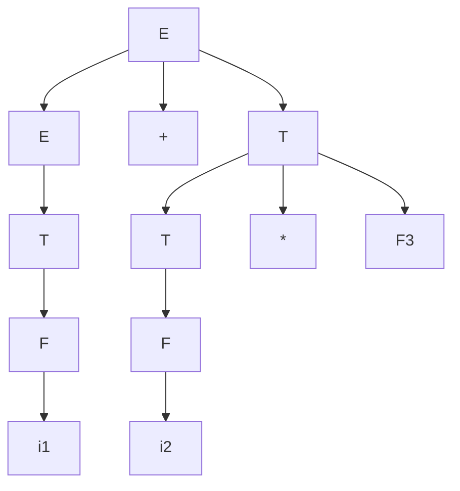

# 2026年编译原理期末复习总结与核心考点速查

---

## 一、 编译程序总览与全局框架 (Global Compiler Overview)

本模块前置介绍编译器的整体运行架构、工作阶段、错误处理、变量名词概念及运行期内存布局，帮助建立全局认知。

### 1. 编译器各阶段的核心任务与输入/输出产物对比

编译程序是一个将高级语言源程序翻译为等价目标程序的转换系统，其核心工作流包含六个阶段，各阶段的典型输入与输出对应关系如下：

| 编译阶段 | 核心任务 | 输入 (Input) | 输出 (Output) |
| :--- | :--- | :--- | :--- |
| **词法分析** | 扫描源程序字符，匹配出独立的单词符号 | 源程序字符流 | **单词符号 (Token) 序列** |
| **语法分析** | 分析单词序列如何依据文法规则组合成语法成分 | Token 序列 | **语法分析树 / 语法树** |
| **语义分析** | 进行上下文相关的静态语义审查与类型兼容性检查 | 语法分析树 | **带语义信息的语法树** (注释语法树) |
| **中间代码生成** | 将语义树转换为与机器无关的中间表达形式 | 带语义信息的语法树 | **中间表示 (IR)** (如四元式、三元式、后缀式) |
| **代码优化** | 对中间代码进行等价变换，以提高目标代码的时空效率 | 中间表示 (IR) | **优化后的中间表示 (IR)** |
| **目标代码生成** | 将优化后的中间代码翻译为目标机器指令 | 优化后的中间表示 (IR) | **目标代码** (汇编/绝对机器指令/可重定位二进制) |

* **概念对比（错项排除）**：
  * *四元式 / 三地址码* 是**中间代码生成**阶段的产物，不属于词法或语法分析；
  * *语法树节点* 是**语法分析**阶段构建的树结构元素，不属于词法分析的单词符号。
* **目标代码生成需要着重考虑的两大核心问题**：
  1. **指令选择**：如何生成尽可能短且执行效率最高的目标代码。
  2. **寄存器分配**：如何充分并合理地利用有限的硬件寄存器，尽量将使用频度高的变量保存在寄存器中以减少内存访问开销。
* **目标代码的高效性判定**：
  * 目标代码的高效性应当同时体现在两个维度：**运行时间短（时间高效）且占用存储空间小（空间高效）**。
* **各阶段表格管理（最核心表格：符号表）**：
  * 编译器的每个工作阶段都涉及表格的构造、查阅和更新。词法分析扫描出名字填入表，语义分析填入类型，目标代码生成分配地址。表格管理贯穿编译全过程。

### 2. 标识符 (Identifier) 与名字 (Name) 的区别与联系

在高级语言中，这两个概念极易混淆：
* **标识符** 是一个**语法概念**：指的是符合语言语法拼写规则的字符序列（例如“以字母或下划线开头，后跟字母、数字或下划线”）。它仅具有词法和句法上的形式特征，是名字的载体。
* **名字** 是一个**语义概念**：指的是将一个形式标识符与程序中某个具体的运行期数据对象或实体（如变量、函数、类）进行绑定。只有当一个标识符被赋予了具体的类型、值和作用域，能够指代某一物理实体时，它才被称为名字。

### 3. 编译器各阶段常见错误类型对比

编译器在不同阶段对源程序进行不同层次的审查，发现并定位不同类别的错误：

* **词法错误 (Lexical Errors)**：在单词拼写或字符流层面发生的规则违背。例如：
  * 源程序中出现了字母表以外的非法字符（如 `$` 或非法的 `@`）；
  * 字符串常量缺少闭合的右引号（如 `"hello`）；
  * 数值常量的拼写格式不合规则（如十进制常量中含有非十六进制字母 `12a3`，或 C 语言中出现 `123abc` 以数字开头夹杂字母的非法单词）。
* **语法错误 (Syntax Errors)**：单词序列的搭配违背了程序设计的句法规则。例如：
  * 圆括号、花括号不匹配；
  * 语句末尾缺失必要的分号或界符；
  * `if-else` 控制流语句结构残缺。
* **静态语义错误 (Semantic Errors)**：程序语法完全正确，但是在声明、类型或作用域逻辑上存在矛盾（编译时类型检查）。例如：
  * 表达式中出现不同类型的数据进行无意义运算（如字符串变量加上一个整数 `x + 5`）；
  * 函数调用时，传入的实参个数或类型与函数声明的形参不匹配；
  * 变量未定义就直接使用，或者在同一作用域下标识符重复定义。

### 4. 编译器的遍数 (Pass) 与前/后端划分

* **遍数 (Pass)**：指编译器对源程序（或其等价的中间表示）从头到尾完整扫描的次数。
  * **多遍扫描的优点**：能够使得编译器的结构更加清晰、各阶段分工明确，且由于信息收集更充分，极其**有利于进行中间代码优化**。
  * **多遍扫描的缺点**：每次扫描都需要进行数据传输，编译器的**编译运行速度会变慢**。
  * **一遍扫描的优点**：编译速度极快（一遍扫描分析器只做最少遍数的磁盘/内存读取）。
* **前/后端划分**：
  * **前端**：与源语言紧密相关的工作，包括词法分析、语法分析、语义分析与中间代码生成。
  * **后端**：与目标机器硬件紧密相关的工作，包括目标代码的生成，以及与机器指令相关的优化。

### 5. 运行时的存储分配策略对比

程序在运行时，其内存空间按分配策略划分为以下三个核心区域：

* **静态数据区 (Static Data Area)**：
  * *策略*：**静态分配策略**。在编译期即为所有数据对象分配好固定的、大小已知的存储单元。
  * *特点*：运行时无法动态调整。不支持动态大小的数据，**不支持递归调用**（因为同一函数的多次重入需要各自独立的空间）。
* **栈区 (Stack Area)**：
  * *策略*：**动态栈式分配策略**。随着函数调用的进入和退出来进行动态的空间分配与释放。栈区以“活动记录”为单位伸缩。
  * *特点*：运行时动态管理，支持局部变量在函数调用周期内自动分配，**完美支持递归调用**。
* **堆区 (Heap Area)**：
  * *策略*：**动态堆式分配策略**。
  * *特点*：用于满足程序员手动的、动态的内存管理需求。程序员需要通过系统 API（如 `malloc`、`new`）进行手动申请，其生命周期不受函数调用周期限制，由程序具体运行决定，需要手动释放。

---

## 二、 词法分析与正规文法 (Lexical Analysis & Chomsky Grammar)

词法分析是翻译的起点，主要负责从字符流中匹配并分割出独立的单词符号。

### 1. 词法分析的工作原理

* **Token 的输出格式**：
  词法分析器向语法分析器输出的是 **Token 二元组**，形式为：
  $$\text{Token} = (\text{种别编码}, \text{属性值})$$
  * **种别编码**：指明单词的类型（如关键字、标识符、常数、算符、界符）。
  * **属性值**：指明单词的具体内容。如果该 Token 是常数，属性值为其具体的字面数值；如果该 Token 是标识符，其属性值通常是指向符号表特定项的指针；如果是关键字或单一种别算符，属性值一般为空。
* **超前搜索 (Lookahead)**：
  在扫描输入字符流时，为了确定当前单词的右边界，词法分析器在读取字符时往往需要多向后读取一两个字符进行试探。
  * *实例*：遇到 `=` 必须看下一字符是否也是 `=` 才能区分是赋值号还是比较号 `==`；遇到 `i`, `n`, `t` 后，如果下一字符是 `o`，则识别为标识符 `into`，否则为关键字 `int`。
* **最长匹配原则 (Longest Match)**：
  当输入流中的子串可以匹配为多个合法 Token 时，词法分析器优先匹配最长的子串。
  * *实例*：对于输入 `ifx`，应整体匹配为标识符 `ifx`，而不能拆分为关键字 `if` 和标识符 `x`；输入 `i++` 应匹配为标识符 `i` 和自增算符 `++`，而不能拆成 `+` 和 `+`。
* **与语法分析的关系**：
  词法分析并不必须完全在语法分析之前跑完。实际编译器中，词法分析器常作为语法分析器的**子程序**，由语法分析器在需要下一个单词时**按需调用**。

### 2. 乔姆斯基四大文法分类及其特性对比

乔姆斯基文法体系（Chomsky Hierarchy）根据产生式的限制条件将文法分为四类，限制逐级增加，描述能力和包含范围逐级递减（嵌套包含关系为：0型 $\supset$ 1型 $\supset$ 2型 $\supset$ 3型）：

| 文法类型 | 常见名称 | 左侧限制 | 右侧限制 | 对应自动机 | 在编译器中的作用 |
| :--- | :--- | :--- | :--- | :--- | :--- |
| **0型** | 短语结构文法 | 至少包含一个非终结符 | 无限制 | 图灵机 (Turing Machine) | 理论计算模型 |
| **1型** | 上下文有关文法 | 至少包含一个非终结符 | 长度 $\ge$ 左侧长度（特例 $S \to \varepsilon$ 除外） | 线性界限自动机 | 部分语义分析 |
| **2型** | 上下文无关文法 | 单独一个非终结符 | 无限制 | 下推自动机 (Pushdown Automaton) | **语法分析** (定义程序语法结构) |
| **3型** | 正规文法 | 单独一个非终结符 | 只能是：单终结符，或单终结+单非终结（左右线性必须统一） | 有限自动机 (DFA/NFA) | **词法分析** (描述单词拼写结构) |

* *考点提示*：
  * 限制最严格的 **3 型文法** 是 2 型文法（上下文无关文法）的真子集。
  * 词法分析器在识别单词时，其理论依据正是 **正则文法 (3 型文法)**，它等价于正则表达式与有限自动机。

### 3. 正规式的代数性质与等价性证明

正规式在并（$\mid$）、连接（$\cdot$）和克林闭包（$^*$）运算上满足多种代数恒等式，这是自动机等价化简的基础。

#### 核心代数公式：
1. **幂等律**：$A \mid A = A$
2. **闭包幂等**：$(A^*)^* = A^*$
3. **闭包展开**：$A^* = \varepsilon \mid A A^*$
4. **环路移位**：$(AB)^*A = A(BA)^*$
5. **等价方程（Arden 引理）**：若 $\varepsilon \notin L(a)$，则方程 $A = b \mid aA$ 有且仅有唯一解 $A = a^*b$。
6. **等价正规式判定**：$(a \mid b)^*$ 与 $(a^* \mid b^*)^*$ 彼此等价。
   * *解析*：$(a \mid b)^*$ 可生成由 $a$ 和 $b$ 组成的所有字符串。$(a^* \mid b^*)^*$ 中，括号内能单独生成任意个 $a$ 或任意个 $b$，外部再加上克林闭包，同样可以生成 $a$ 和 $b$ 混杂的任意组合字符串，故二者等价。

#### 环路移位等价证明示例：证明 $(AB)^*A = A(BA)^*$
* **左式展开**：
  $$ L((AB)^*A) = L((AB)^*) L(A) = \{ \varepsilon, AB, ABAB, ABABAB, \ldots \} L(A) = \{ A, ABA, ABABA, ABABABA, \ldots \} $$
* **右式展开**：
  $$ L(A(BA)^*) = L(A) L((BA)^*) = L(A) \{ \varepsilon, BA, BABA, BABABA, \ldots \} = \{ A, ABA, ABABA, ABABABA, \ldots \} $$
* **结论**：两边展开集合完全相同，故等价。

### 4. 有限自动机的等价性判定

* **等价定义**：如果两个有限自动机（DFA 或 NFA）**接受的语言完全相同**，则称这两个自动机是等价的。
* **判定误区提示**：自动机的等价性仅与它们能够识别的语言集是否相同有关，与它们**内部的状态个数是否相同、是否含有 $\varepsilon$-转换、初始状态的个数是否相同完全无关**。等价自动机的状态数可以各不相同，我们可以通过 DFA 最小化算法将其化简至唯一的、状态数最少的等价 DFA。

### 5. 字母表与符号串代数运算示例

* **字母表与运算实战**：设字母表 $\Sigma = \{a, b\}$，$U = \{ab, b\}$，$V = \{aa, bb\}$。
  * $UV = \{abaa, abbb, baa, bbb\}$
    * 计算过程：$ab \cdot aa = abaa$；$ab \cdot bb = abbb$；$b \cdot aa = baa$；$b \cdot bb = bbb$。
  * $\Sigma^* = \{\varepsilon, a, b, aa, ab, ba, bb, aaa, aab, \ldots\}$，即 $\{a, b\}$ 上所有长度字符串的集合（包含空串 $\varepsilon$）。
  * $\Sigma^+ = \Sigma^* - \{\varepsilon\} = \{a, b, aa, ab, ba, bb, aaa, aab, \ldots\}$，即 $\{a, b\}$ 上所有非空字符串的集合。

### 6. 实战大题：DFA 确定化与子集构造法

* **题目**：构造正规式 $1(0 \mid 1)^*101$ 相应的 DFA。
* **解答步骤**：
  
  #### (1) 构造相应的 NFA
  该正规式表示以 $1$ 开头，且末尾 3 位必须匹配 $101$ 的所有二进制串（长度至少为 4）。其 NFA 的状态转移如下：
  *   $\delta(q_0, 0) = \{q_0\}$
  *   $\delta(q_0, 1) = \{q_0, q_1\}$
  *   $\delta(q_1, 0) = \{q_2\}$
  *   $\delta(q_1, 1) = \emptyset$
  *   $\delta(q_2, 0) = \emptyset$
  *   $\delta(q_2, 1) = \{q_3\}$ （$q_3$ 为终态）

  #### (2) 使用子集构造法确定化
  1.  **初态子集**：$A = \varepsilon\text{-closure}(\{q_0\}) = [q_0]$
  2.  **计算状态 A 的转移**：
      *   $I_a = \text{move}(A, 0) = \{q_0\}$，$\varepsilon\text{-closure}(I_a) = [q_0] = A$
      *   $I_b = \text{move}(A, 1) = \{q_0, q_1\}$，$\varepsilon\text{-closure}(I_b) = [q_0, q_1] = B$
  3.  **计算新状态 $B = [q_0, q_1]$ 的转移**：
      *   $I_a = \text{move}(B, 0) = \{q_0, q_2\}$，$\varepsilon\text{-closure}(I_a) = [q_0, q_2] = C$
      *   $I_b = \text{move}(B, 1) = \{q_0, q_1\}$，$\varepsilon\text{-closure}(I_b) = [q_0, q_1] = B$
  4.  **计算新状态 $C = [q_0, q_2]$ 的转移**：
      *   $I_a = \text{move}(C, 0) = \{q_0\}$，$\varepsilon\text{-closure}(I_a) = [q_0] = A$
      *   $I_b = \text{move}(C, 1) = \{q_0, q_1, q_3\}$，$\varepsilon\text{-closure}(I_b) = [q_0, q_1, q_3] = D$（包含 NFA 的终态 $q_3$，因此 $D$ 是 DFA 接受状态）
  5.  **计算新接受状态 $D = [q_0, q_1, q_3]$ 的转移**：
      *   $I_a = \text{move}(D, 0) = \{q_0, q_2\}$，$\varepsilon\text{-closure}(I_a) = [q_0, q_2] = C$
      *   $I_b = \text{move}(D, 1) = \{q_0, q_1\}$，$\varepsilon\text{-closure}(I_b) = [q_0, q_1] = B$
  
  #### (3) 构造 DFA 状态转移表
  
  | 状态子集 | 输入 $0$ | 输入 $1$ | 是否接受 (终态) |
  | :--- | :--- | :--- | :--- |
  | **$A$** (初态) | $A$ | $B$ | 否 |
  | **$B$** | $C$ | $B$ | 否 |
  | **$C$** | $A$ | $D$ | 否 |
  | **$D$** (终态) | $C$ | $B$ | **是** |

  #### (4) DFA 状态转换图 (Mermaid 表示)
  
  ```mermaid
  stateDiagram-v2
      [*] --> A
      A --> A : 0
      A --> B : 1
      B --> B : 1
      B --> C : 0
      C --> A : 0
      C --> D : 1
      D --> B : 1
      D --> C : 0
      classDef accept fill:#f9f,stroke:#333,stroke-width:2px;
      class D accept;
  ```

---

## 三、 语法分析：自顶向下与自底向上的实现 (Syntax Analysis)

语法分析是编译的核心，负责识别 Token 序列是否符合语言的语法规则，并建立语法树。

### 1. 自顶向下与自底向上基本思想对比

语法分析根据推导方向的不同，分为两大基本派系：

* **自顶向下 (Top-Down / 自上而下)**：
  * **基本思想**：从文法的开始符号 $S$ 出发，试图寻找一个最左推导序列，使得推导出的终结符串与当前的输入单词序列完全一致。
  * **常用方法**：递归下降分析法 (Recursive Descent)、LL(1) 预测分析法 (Predictive Parsing)。
* **自底向上 (Bottom-Up / 自下而下)**：
  * **基本思想**：从当前的输入符号串出发，寻找可归约串（句柄），将其归约为相应的产生式左部非终结符。这个过程是从叶子节点向根节点反向建立语法树，对应**最右推导的逆过程**（即**规范归约**）。
  * **常用方法**：LR 分析法系列（LR(0), SLR(1), LALR(1), LR(1)）、算符优先分析法 (Operator Precedence)。

---

### 2. 自顶向下分析技术 (LL(1) 文法)

* **LL(1) 命名的含义**：
  * 第一个 **L** (Left-to-right)：表示从左到右扫描输入符号串。
  * 第二个 **L** (Leftmost derivation)：表示分析过程中使用最左推导。
  * **1** (Lookahead 1)：每次选择产生式分支时，只需超前看一个输入符号。
* **避免回溯与判定条件**：
  * 为了在推导时避免回溯，文法必须是 **LL(1)** 的。其判定时需要精确的 FIRST 集规则。对于拼接符号串 $\alpha \beta$，其 $\text{FIRST}(\alpha \beta)$ 计算的严格规则如下：
    1. **若 $\alpha$ 不能推空 ($\alpha \not\Rightarrow^* \varepsilon$)**：则 $\text{FIRST}(\alpha \beta) = \text{FIRST}(\alpha)$。
    2. **若 $\alpha$ 能够推空 ($\alpha \Rightarrow^* \varepsilon$)**：则 $\text{FIRST}(\alpha \beta) = (\text{FIRST}(\alpha) \setminus \{\varepsilon\}) \cup \text{FIRST}(\beta)$。
  * **无二义性**：满足 LL(1) 的文法其预测分析表中每个单元格至多包含一个产生式分支，因而**一定是无二义的**。但反过来，无二义的上下文无关文法不一定是 LL(1) 的。
* **左递归文法 (Left Recursion)**：
  * **直接左递归**：产生式形如 $A \to A\alpha \mid \beta$。
  * **间接左递归**：指产生式中不直接包含非终结符位于右部开头的形式，但在经过多步推导后，能够导出以其自身开头的符号串，即存在 $A \Rightarrow^+ A\alpha$ 的情况。
    * *间接左递归判定实例*：文法为：$S \to Aa \mid b$ 且 $A \to Sc \mid d$。
      我们可以进行如下推导：$S \Rightarrow Aa \Rightarrow Sca$，其中非终结符 $S$ 通过两步推导产生了以 $S$ 本身开头的符号串 $Sca$；同理 $A \Rightarrow Sc \Rightarrow Aac$，因此存在间接左递归。
  * **危害与策略**：左递归会导致自顶向下分析器（如递归下降分析法）在读入字符前就进行无限自我递归调用，引发栈溢出。左递归文法**绝对不能直接用于自顶向下分析**，必须先消除左递归；但它**可以被自底向上（LR 分析）方法直接处理**而无需任何改造。

#### 编写递归下降子程序的通用伪代码教程

在自顶向下递归下降分析中，每个非终结符对应一个同名过程（函数）。构造规则为：
1. 根据当前读入的符号（`lookahead`）决定使用哪条产生式。
2. 产生式右部如果是**终结符**，则调用 `match(a)` 匹配读取；如果是**非终结符**，则直接调用其对应同名函数过程（如 `T()`）。
3. 如果当前产生式分支可以推空（$\varepsilon$），则当 `lookahead` 属于该非终结符的 $\text{FOLLOW}$ 集时，选择直接跳过（即不动作，匹配 $\varepsilon$）。
4. 其余情况调用 `error()` 报错。

##### 递归下降子程序设计实战：对文法 $S \to a \mid \wedge \mid (T)$，消除左递归后的产生式：
$$ S \to a \mid \wedge \mid (T) \ , \ T \to S T' \ , \ T' \to , S T' \mid \varepsilon $$

其伪代码实现如下：
```pascal
procedure S;
begin
  if lookahead = 'a' then
    match('a')
  else if lookahead = '^' then
    match('^')
  else if lookahead = '(' then
    begin
      match('(');
      T;
      match(')');
    end
  else
    error("Syntax Error in S");
end;

procedure T;
begin
  S;
  T';
end;

procedure T';
begin
  if lookahead = ',' then
    begin
      match(',');
      S;
      T';
    end
  else if lookahead = ')' then
    { 对应 T' -> ε 归空分支，由于 ) 属于 FOLLOW(T')，故当读入为 ) 时不作动作安全返回 }
    begin end
  else
    error("Syntax Error in T'");
end;
```

#### 实战大题案例一：FIRST 集与 FOLLOW 集计算基本套路

* **分析案例**：给定文法 $G[S]$：
  $$S \to ABBA \ , \ A \to a \mid \varepsilon \ , \ B \to b \mid \varepsilon$$
  求各非终结符的 $\text{FIRST}$ 集和 $\text{FOLLOW}$ 集（约定 $\$$ 为输入串结束符）。
  
  * **FIRST 集求解过程**：
    * $\text{FIRST}(A) = \{a, \varepsilon\}$，$\text{FIRST}(B) = \{b, \varepsilon\}$。
    * 对于 $\text{FIRST}(S)$，观察产生式右部 $ABBA$。首先加入第一个 $A$ 的非空元素 $a$；因为 $A$ 能推空，继续看后面的 $B$，加入其非空元素 $b$；因为第一个 $B$ 也能推空，看第二个 $B$（已含 $b$）；再因为第二个 $B$ 也能推空，看最后一个 $A$（已含 $a$）；最后，因为右侧所有非终结符都可以推空，说明整个右部可以推导为空，因此将 $\varepsilon$ 放入 $\text{FIRST}(S)$。得：
      $$\text{FIRST}(S) = \{a, b, \varepsilon\}$$
  * **FOLLOW 集求解过程**：
    * $\text{FOLLOW}(S) = \{\$\}$ （$S$ 为开始符号且未在右部出现）。
    * 对于 $\text{FOLLOW}(A)$，产生式右部含有 $A$ 的位置为 $S \to A_1 B_1 B_2 A_2$。
      * 对于 $A_1$，紧跟其后的是 $B_1 B_2 A_2$，加入 $\text{FIRST}(B_1 B_2 A_2) - \{\varepsilon\} = \{a, b\}$。若其后所有符号全部推导为空，将左部符号的 $\text{FOLLOW}(S) = \{\$\}$ 加入。
      * 对于最右侧的 $A_2$，处于产生式末尾，将左部符号的 $\text{FOLLOW}(S) = \{\$\}$ 加入。得：
        $$\text{FOLLOW}(A) = \{a, b, \$\}$$
    * 对于 $\text{FOLLOW}(B)$，右部位置为 $S \to A_1 B_1 B_2 A_2$。
      * 对于第一个 $B_1$，其后是 $B_2 A_2$，加入 $\text{FIRST}(B_2 A_2) - \{\varepsilon\} = \{a, b\}$；若 $B_2 A_2$ 全部推空，加入 $\text{FOLLOW}(S)$ 的 $\$$。
      * 对于第二个 $B_2$，其后是 $A_2$，加入 $\text{FIRST}(A_2) - \{\varepsilon\} = \{a\}$；若 $A_2$ 推空，将左部符号 $\text{FOLLOW}(S) = \{\$\}$ 加入。得：
        $$\text{FOLLOW}(B) = \{a, b, \$\}$$
  * **结果汇总表**：
    
    | 非终结符 | FIRST 集 | FOLLOW 集 |
    | :--- | :--- | :--- |
    | **$S$** | $\{a, b, \varepsilon\}$ | $\{\$\}$ |
    | **$A$** | $\{a, \varepsilon\}$ | $\{a, b, \$\}$ |
    | **$B$** | $\{b, \varepsilon\}$ | $\{a, b, \$\}$ |

#### 实战大题案例二：自顶向下语法分析综合设计

* **题目**：已知文法 $G[S]$ 如下，对其进行消除左递归、消除回溯处理，并计算各非终结符的 $\text{FIRST}$ 与 $\text{FOLLOW}$ 集合，最后构造其 LL(1) 预测分析表：
  $$S \to (L) \mid aS \mid a \ , \ L \to L, S \mid S$$
* **解答步骤**：
  
  #### (1) 消除左递归和回溯
  * 对于非终结符 $S \to (L) \mid aS \mid a$，右部分支 $aS$ 和 $a$ 有共同的左因子 $a$，为了避免回溯需要提取左因子：
    $$ S \to (L) \mid aS' $$
    $$ S' \to S \mid \varepsilon $$
  * 对于非终结符 $L \to L, S \mid S$，它存在直接左递归，应用公式消除左递归：
    $$ L \to S L' $$
    $$ L' \to , S L' \mid \varepsilon $$
  * 得到消除左递归与回溯后的等价文法为：
    $$ S \to (L) \mid aS' \ , \ S' \to S \mid \varepsilon \ , \ L \to S L' \ , \ L' \to , S L' \mid \varepsilon $$

  #### (2) 计算各非终结符的 $\text{FIRST}$ 和 $\text{FOLLOW}$ 集合
  * **计算 FIRST 集合**：
    * $\text{FIRST}(S) = \{ (, a \}$
    * $\text{FIRST}(S') = \text{FIRST}(S) \cup \{\varepsilon\} = \{ (, a, \varepsilon \}$
    * $\text{FIRST}(L) = \text{FIRST}(S) = \{ (, a \}$
    * $\text{FIRST}(L') = \{ \text{,} , \varepsilon \}$
  * **计算 FOLLOW 集合**：
    * $\text{FOLLOW}(S)$：
      * $S$ 为开始符号，包含 $\$$（或写为 $\#$）。
      * 由产生式 $S \to aS'$ 可知，当 $S'$ 归空时，$S'$ 的后随集也是 $S$ 的后随集，但此时推导由右部 $S'$ 结束不改变追随关系。
      * 由 $L \to S L'$ 可知，$\text{FIRST}(L') \setminus \{\varepsilon\} \subseteq \text{FOLLOW}(S)$，故逗号 $\text{,}$ 属于 $\text{FOLLOW}(S)$。
      * 当 $L' \to \varepsilon$ 时，$\text{FOLLOW}(L) \subseteq \text{FOLLOW}(S)$，因为 $S \to (L)$，所以右括号 $)\in \text{FOLLOW}(L) \subseteq \text{FOLLOW}(S)$。
      * 综上，得：$\text{FOLLOW}(S) = \{ \$, \text{,} , ) \}$。
    * $\text{FOLLOW}(S')$：由 $S \to aS'$ 可知 $\text{FOLLOW}(S') = \text{FOLLOW}(S) = \{ \$, \text{,} , ) \}$。
    * $\text{FOLLOW}(L)$：由 $S \to (L)$ 可知 $\text{FOLLOW}(L) = \{ ) \}$。
    * $\text{FOLLOW}(L')$：由 $L \to S L'$ 可知 $\text{FOLLOW}(L') = \text{FOLLOW}(L) = \{ ) \}$。

  #### (3) 构造预测分析表
  根据 FIRST 和 FOLLOW 的映射规则，填入分析表如下：
  
  | 非终结符 | $a$ | $,$ | $($ | $)$ | $\$$ (或 $\#$) |
  | :--- | :--- | :--- | :--- | :--- | :--- |
  | **$S$** | $S \to aS'$ | | $S \to (L)$ | | |
  | **$S'$** | $S' \to S$ | $S' \to \varepsilon$ | $S' \to S$ | $S' \to \varepsilon$ | $S' \to \varepsilon$ |
  | **$L$** | $L \to SL'$ | | $L \to SL'$ | | |
  | **$L'$** | | $L' \to , SL'$ | | $L' \to \varepsilon$ | |

---

### 3. 自底向上分析技术 (LR 文法与移进-归约)

* **项目 (Item) 的物理含义**：
  在产生式右部的某个位置加上圆点 "$\cdot$" 来构成项目，如 $[A \to \alpha \cdot \beta]$。圆点的位置直白地指明了在语法分析的某时刻，对应的产生式右部已经被移进/识别了多大一部分。
* **规范归约的核心：句柄**：
  在规范归约中，每次进行归约的那个可归约子串正是当前句型的**句柄**，句柄的定义是**句型中最左的直接短语**。
* **LR 分析表的内部构造**：
  LR 分析表由 ACTION 表和 GOTO 表两部分组成，用以驱动移进-归约过程：
  * **ACTION 表**：行是分析器状态，列是**终结符**（包含输入串结束符 $\$$）。其动作有：
    * 移进 $s_j$：表示把终结符移入栈，并跳转到状态 $j$（这正对应着当转移函数 $GOTO(i, a) = j$ 且 $a$ 是终结符的情况）。
    * 归约 $r_k$：使用第 $k$ 个产生式进行归约。
    * 接受 $acc$：分析成功结束。
    * 报错：发现语法错误。
  * **GOTO 表**：行是分析器状态，列是**非终结符**。其对应的值是发生归约后，栈顶状态面对新非终结符所转移到的下一个状态编号。
  * **判定边界（错项对比）**：ACTION 表不用于非终结符的转移；GOTO 表不用于终结符的动作。
* **SLR(1)、LR(1) 与 LALR(1) 的对比与合并同心集**：
  为了解决 LR(0) 过于严苛、易产生冲突的问题，编译原理引入了向前看（Lookahead）的物理思想。它们的能力包含关系为：
  $$\text{LR}(0) \subset \text{SLR}(1) \subset \text{LALR}(1) \subset \text{LR}(1)$$
  * **SLR(1) 解决冲突规则**：其状态机与 LR(0) 完全相同。当遇到冲突时，它会检查非终结符的全局 $\text{FOLLOW}$ 集。假设状态中包含归约项目 $[A \to \alpha \cdot]$。只有上面临的输入符号 $a \in \text{FOLLOW}(A)$ 时，才采取归约动作。
  * **LR(1) 的局部精确搜索符**：在项目内部引入了局部的搜索符，项目形如 $[A \to \alpha \cdot \beta, a]$，精确记录了在该推导位置后面能接的终结符，识别能力极强。但由于搜索符不同，状态会发生“状态爆炸”，分析表空间消耗过大。
  * **LALR(1) 合并同心集**：将 LR(1) 状态机中**核心项目相同，只有搜索符不同**的“同心项目集”强行合并为一个状态，并将搜索符取并集。
    * **状态数**：合并后状态数与 LR(0) / SLR(1) 相同，极大减小了分析表所占空间。
    * **冲突合并性质**：合并操作**绝对不会产生新的移进/归约冲突**，但**可能会产生新的归约/归约冲突**。

#### 实战大题案例：自底向上语法分析综合设计

* **题目**：已知文法如下，请构造其 $\text{LR}(0)$ 项目集规范族及识别活前缀的 DFA，判定其是否为 $\text{LR}(0)$ 文法，若是则构造其分析表，并给出对句子 `accd` 的移进-归约分析过程表：
  $$ S' \to E \ , \ E \to aA \ , \ A \to cA \mid d $$
* **解答步骤**：
  
  #### (1) 对产生式编号并列出所有项目
  产生式编号为：
  * (0) $S' \to E$
  * (1) $E \to aA$
  * (2) $A \to cA$
  * (3) $A \to d$
  
  对应的 $\text{LR}(0)$ 项目集为：
  * $S' \to \cdot E$ ， $S' \to E \cdot$
  * $E \to \cdot aA$ ， $E \to a \cdot A$ ， $E \to aA \cdot$
  * $A \to \cdot cA$ ， $A \to c \cdot A$ ， $A \to cA \cdot$
  * $A \to \cdot d$ ， $A \to d \cdot$

  #### (2) 构造项目集规范族与活前缀识别 DFA
  由初态闭包 $\text{closure}(\{S' \to \cdot E\})$ 递推构建：
  * **$I_0$**：
    $$S' \to \cdot E$$
    $$E \to \cdot aA$$
  * **$I_1 = \text{GO}(I_0, E)$**：
    $$S' \to E \cdot$$
  * **$I_2 = \text{GO}(I_0, a)$**：
    $$E \to a \cdot A$$
    $$A \to \cdot cA$$
    $$A \to \cdot d$$
  * **$I_3 = \text{GO}(I_2, A)$**：
    $$E \to aA \cdot$$
  * **$I_4 = \text{GO}(I_2, c)$**：
    $$A \to c \cdot A$$
    $$A \to \cdot cA$$
    $$A \to \cdot d$$
  * **$I_5 = \text{GO}(I_2, d)$**：
    $$A \to d \cdot$$
  * **$I_6 = \text{GO}(I_4, A)$**：
    $$A \to cA \cdot$$
  
  *状态转换关系为*：
  * $I_0 \xrightarrow{E} I_1$ ， $I_0 \xrightarrow{a} I_2$
  * $I_2 \xrightarrow{A} I_3$ ， $I_2 \xrightarrow{c} I_4$ ， $I_2 \xrightarrow{d} I_5$
  * $I_4 \xrightarrow{A} I_6$ ， $I_4 \xrightarrow{c} I_4$ ， $I_4 \xrightarrow{d} I_5$

  #### (3) 判定 LR(0) 属性并构造分析表
  * 检查各项目集：每个状态子集内均不包含“移进-归约”或“归约-归约”冲突项目，因此该文法是 **$\text{LR}(0)$ 文法**。
  * 构造 $\text{LR}(0)$ 分析表如下：
    
    | 状态 | ACTION (输入终结符与结束符) | | | | GOTO (面临非终结符跳转) | |
    | :--- | :--- | :--- | :--- | :--- | :--- | :--- |
    | | $a$ | $c$ | $d$ | $\$$ | $E$ | $A$ |
    | **$0$** | $S_2$ | | | | $1$ | |
    | **$1$** | | | | $acc$ | | |
    | **$2$** | | $S_4$ | $S_5$ | | | $3$ |
    | **$3$** | $r_1$ | $r_1$ | $r_1$ | $r_1$ | | |
    | **$4$** | | $S_4$ | $S_5$ | | | $6$ |
    | **$5$** | $r_3$ | $r_3$ | $r_3$ | $r_3$ | | |
    | **$6$** | $r_2$ | $r_2$ | $r_2$ | $r_2$ | | |

  #### (4) 句子 `accd` 的移进-归约分析执行过程表
  
  | 步骤 | 状态栈 | 符号栈 | 面临输入串 | 采取动作与产生式 | 说明与 GOTO 跳转 |
  | :--- | :--- | :--- | :--- | :--- | :--- |
  | **1** | $0$ | $\$$ | $accd\$$ | $S_2$ (移进状态2) | 将 $a$ 和状态 $2$ 入栈 |
  | **2** | $0 \ 2$ | $\$a$ | $ccd\$$ | $S_4$ (移进状态4) | 将 $c$ 和状态 $4$ 入栈 |
  | **3** | $0 \ 2 \ 4$ | $\$ac$ | $cd\$$ | $S_4$ (移进状态4) | 将 $c$ 和状态 $4$ 入栈 |
  | **4** | $0 \ 2 \ 4 \ 4$ | $\$acc$ | $d\$$ | $S_5$ (移进状态5) | 将 $d$ 和状态 $5$ 入栈 |
  | **5** | $0 \ 2 \ 4 \ 4 \ 5$ | $\$accd$ | $\$$ | $r_3$ (用产生式 3 归约) | 弹出 $d$ 及状态 $5$，面临状态 $4$，$\text{GOTO}[4, A]=6$，入栈 $A, 6$ |
  | **6** | $0 \ 2 \ 4 \ 4 \ 6$ | $\$accA$ | $\$$ | $r_2$ (用产生式 2 归约) | 弹出 $cA$ 及状态 $4, 6$，面临状态 $4$，$\text{GOTO}[4, A]=6$，入栈 $A, 6$ |
  | **7** | $0 \ 2 \ 4 \ 6$ | $\$acA$ | $\$$ | $r_2$ (用产生式 2 归约) | 弹出 $cA$ 及状态 $4, 6$，面临状态 $2$，$\text{GOTO}[2, A]=3$，入栈 $A, 3$ |
  | **8** | $0 \ 2 \ 3$ | $\$aA$ | $\$$ | $r_1$ (用产生式 1 归约) | 弹出 $aA$ 及状态 $2, 3$，面临状态 $0$，$\text{GOTO}[0, E]=1$，入栈 $E, 1$ |
  | **9** | $0 \ 1$ | $\$E$ | $\$$ | $acc$ (接受) | 分析成功 |

### 4. 核心语法概念图解：句型、句子、短语、直接短语、句柄与素短语

在自底向上语法分析中，准确识别和理解句型、句子、短语、直接短语、句柄以及素短语至关重要。

#### (1) 基本概念定义
*   **句型 (Sentential Form)**：任何可以从文法的开始符号 $S$ 经 0 步或多步推导产生的符号序列 $\alpha$（其中可包含终结符与非终结符），即 $S \Rightarrow^* \alpha$。
*   **句子 (Sentence)**：一个**只包含终结符号**的句型。即 $S \Rightarrow^* w$，其中 $w \in V_T^*$。
*   **短语 (Phrase)**：对于句型 $\phi \alpha \psi$，如果存在一步或多步推导 $S \Rightarrow^* \phi A \psi \Rightarrow^+ \phi \alpha \psi$，则称子串 $\alpha$ 是句型 $\phi \alpha \psi$ 对应于非终结符 $A$ 的短语。
    *   *树形图示理解*：语法树中**任意一颗子树**（子树根节点为非终结符且高度 $\ge 1$）的所有叶子节点从左到右拼接而成的子串。
*   **直接短语 (Direct Phrase / Simple Phrase)**：对于句型 $\phi \alpha \psi$，若存在仅一步的推导 $S \Rightarrow^* \phi A \psi \Rightarrow \phi \alpha \psi$（即应用了产生式 $A \to \alpha$），则称子串 $\alpha$ 是该句型对应于 $A$ 的直接短语。
    *   *树形图示理解*：语法树中**高度为 1 的子树**（即其父节点直接通过一次产生式导出所有叶子节点子树，子树节点即为叶子）的所有叶子拼接而成的子串。
*   **句柄 (Handle)**：一个句型的**最左直接短语**。
    *   *树形图示理解*：语法树中**最左侧那个高度为 1 的子树**的叶子拼接串。句柄是规范归约（最右推导的逆过程）中每一步应当首先被归约的子串。
*   **素短语 (Prime Phrase)**：满足以下两个条件的子串：
    1.  它是一个至少包含一个**终结符**的短语。
    2.  它除了自身以外，不包含任何其他更小的也包含终结符的短语。
    *   *算符优先分析考点*：在算符优先分析法中，每次进行规约的子串被称为**最左素短语**。

---

#### (2) 结合实例与语法树的分步解析
我们以经典的表达式文法 $G[E]$ 为例：
$$ E \to E + T \mid T $$
$$ T \to T * F \mid F $$
$$ F \to (E) \mid i $$

考虑它的一个推导句型：$$\gamma = i_1 + i_2 * F_3$$
（为了区分，我们给终结符 $i$ 和非终结符 $F$ 下标标记为 $i_1, i_2, F_3$）。

##### 该句型的语法分析树 (Mermaid 图示)：



##### 依据此语法树，分步寻找并罗列所有概念产物：

1.  **寻找所有的子树 $\to$ 确定“短语”**：
    *   子树根节点为 $F_1$：叶子节点为 `i1`。$\to$ **短语：`i1`**
    *   子树根节点为 $T_2$：叶子节点为 `i1`。$\to$ **短语：`i1`**
    *   子树根节点为 $E_2$：叶子节点为 `i1`。$\to$ **短语：`i1`**
    *   子树根节点为 $F_2$：叶子节点为 `i2`。$\to$ **短语：`i2`**
    *   子树根节点为 $T_3$：叶子节点为 `i2`。$\to$ **短语：`i2`**
    *   子树根节点为 $F_3$：叶子节点为 `F3`。$\to$ **短语：`F3`**
    *   子树根节点为 $T_1$：叶子节点从左到右包含 $T_3$ (导出`i2`)、`*`、 $F_3$。$\to$ **短语：`i2 * F3`**
    *   整棵树根节点为 $E_1$：叶子节点为全部。$\to$ **短语：`i1 + i2 * F3`**
    *   **所有短语汇总为**：`i1`, `i2`, `F3`, `i2 * F3`, `i1 + i2 * F3`。

2.  **寻找高度为 1 的子树 $\to$ 确定“直接短语”**：
    *   $F_1 \to i_1$：高度为 1 的子树。$\to$ **直接短语：`i1`**
    *   $F_2 \to i_2$：高度为 1 的子树。$\to$ **直接短语：`i2`**
    *   *注意*：$T_1 \to T_3 * F_3$ 的高度大于 1（因为 $T_3$ 节点下面还挂着 $F_2 \to i_2$），所以 `i2 * F3` 虽然是短语，但**不是**直接短语。
    *   **所有直接短语汇总为**：`i1`, `i2`。

3.  **寻找最左侧的直接短语 $\to$ 确定“句柄”**：
    *   在直接短语 `i1` 和 `i2` 中，最左侧的是 `i1`。
    *   **句柄为：`i1`** （分析器进行规范归约时，首先将 `i1` 归约为 $F$）。

4.  **根据素短语定义筛选 $\to$ 确定“素短语”**：
    *   短语中包含终结符的有：`i1`、`i2`、`i2 * F3`、`i1 + i2 * F3`。
    *   根据定义进行最小化筛选：
        *   `i1` 不包含更小含终结符短语。$\to$ **素短语**
        *   `i2` 不包含更小含终符短语。$\to$ **素短语**
        *   `i2 * F3` 包含了终结符 `*`，但它包含了更小的含终结符短语 `i2`，这违背了素短语的“不包含更小”原则，因此它**不是**素短语。
        *   `i1 + i2 * F3` 同理，包含了更小的素短语 `i1` 和 `i2`，**不是**素短语。
    *   **所有素短语汇总为**：`i1`, `i2`。

---

### 5. 四大语法分析器驱动核心机制对比

不同语法分析器的核心驱动机制和数据结构如下：
* **LR 分析器**：依靠**移进 - 归约表（ACTION & GOTO 分析表）**驱动。
* **LL 分析器**：依靠**预测分析表**和符号栈驱动。
* **递归下降分析**：依靠文法符号对应的**递归调用函数集合**驱动。
* **算符优先分析**：依靠运算符之间的**优先关系表**驱动。

---

## 四、 语义分析、语法制导翻译与属性计算 (Semantic & Translation)

语义分析对程序进行静态正确性判定，而语法制导翻译则在语法分析中嵌入语义计算，用于生成中间代码。

### 1. 程序语义定义的分类与判定边界

* **静态语义**：在编译期间可以进行检查的语义规则。典型工作如类型检查（实参形参是否相符、类型是否兼容）、变量是否声明等。
* **动态语义**：在程序运行期间才能体现出来的功能和具体含义。例如：函数调用时实参的传递方式（是值传递还是引用传递）、多态的动态绑定等。
* **语用语义**：语言的使用上下文含义。
* **判定边界（错项对比）**：表达式括号必须配对、类声明必须以 `class` 开头、函数体必须用 `return` 结尾等属于 **语法（形式结构）** 限制，不属于语义。

### 2. 语法制导翻译的定义方案对比 (SDD vs SDT)

* **语法制导定义 (SDD / 属性文法)**：是高层的抽象说明。它独立列出产生式和相关的语义方程，不明确指定语义动作执行的具体时机和执行顺序。属性可用来表示类型、常量值、语法树深度等，但不用于表示源代码文件的行号等物理信息。
* **语法制导翻译方案 (SDT / 翻译方案 / 翻译方法)**：是具体的实现方式。它将具体的语义动作（如 `{ print(val) }`）直接嵌入在产生式右部的特定位置，以此明确指定在语法分析扫描到该符号位置时立即执行该语义动作。

### 3. 综合属性与继承属性的流动与判定

* **综合属性（“拼儿子”型）**：
  * **流动方向**：自底向上（从子节点传递给父节点）。
  * **判定规则**：对于产生式 $A \to X_1 X_2 \ldots X_k$，若左边符号 $A$ 的属性值是根据右侧符号的属性值计算得来的，那它就是综合属性。
  * **属性计算遍历方法**：综合属性最适合在对语法树进行**后序遍历**时完成计算。
* **继承属性（“拼爹”或“拼兄弟”型）**：
  * **流动方向**：自顶向下或自左向右（从父节点或左侧兄弟节点传递而来）。
  * **判定规则**：对于产生式 $A \to X_1 X_2 \ldots X_k$，若右边某个符号 $X_i$ 的属性值是由左侧符号 $A$ 或其左侧兄弟符号的属性值赋给它的，那它就是继承属性。
* **属性特性限制**：
  * **终结符**：位于语法树最底层叶子节点。终结符**只有综合属性**（一般由词法分析器直接提供，如常数的值、标识符的名称），**绝对没有继承属性**。
  * **非终结符**：既可以有综合属性，也可以有继承属性。
  * **唯一性限制**：对于某个特定符号的特定属性，它**要么是综合属性，要么是继承属性**，绝不能一个属性既是综合的又是继承的（流向相反且互斥）。
* **判定案例**：产生式 $A \to B C$ 的语义规则为：$C.d := B.c + 1$ 且 $A.b := A.a + B.c$。
  * 继承属性有：$a$ 和 $d$。$C.d$ 是右侧符号的属性且被赋值，故 $d$ 为继承属性；$A.a$ 是左侧符号的属性且被作为输入，说明是由外界传递给 $A$ 的，故 $a$ 为继承属性。
  * 综合属性有：$b$ 和 $c$。$A.b$ 是左侧符号的属性且被赋值，故 $b$ 为综合属性；$B.c$ 是右侧符号的属性且作为输入，说明是由 $B$ 的子树计算上浮的，故 $c$ 为综合属性。

#### 实战大题案例：用 S-属性文法计算二进制小数对应的十进制值

* **题目**：设计一个属性文法，能够自底向上计算二进制小数（例如 `101.101`）对应的十进制数值（即 `5.625`）。
* **解答步骤**：
  为非终结符定义以下属性：
  * $B.val$：对应二进制位自身的值（$0$ 或 $1$）。
  * $L.val$：当前二进制串对应的十进制数值。
  * $L.len$：当前二进制串的字符长度（用来作为高位位移计算）。
  
  构造全综合属性的 **S-属性文法** (SDD) 如下：
  
  | 产生式 | 语义规则 |
  | :--- | :--- |
  | **$S \to L_1 . L_2$** | $S.val = L_1.val + L_2.val \times 2^{-L_2.len}$ |
  | **$S \to L$** | $S.val = L.val$ |
  | **$L \to L_1 B$** | $L.val = L_1.val \times 2 + B.val$<br>$L.len = L_1.len + 1$ |
  | **$L \to B$** | $L.val = B.val$<br>$L.len = 1$ |
  | **$B \to 0$** | $B.val = 0$ |
  | **$B \to 1$** | $B.val = 1$ |

  *原理举例*：对于输入 `101.101`：
  1. 整数部分 $L_1 = 101$，自底向上计算得 $L_1.val = 5, L_1.len = 3$。
  2. 小数部分 $L_2 = 101$，同样计算得 $L_2.val = 5, L_2.len = 3$。
  3. 最终代入 $S.val = L_1.val + L_2.val \times 2^{-3} = 5 + 5 \times 0.125 = 5.625$，计算正确。

### 4. S-属性文法与 L-属性文法对比

* **S-属性文法**：只允许使用综合属性。它可以在自底向上（LR 分析）的语法分析过程中借助于分析栈（后序遍历）来完成语义动作的计算。
* **L-属性文法**：可以有综合属性，也可以有继承属性，但限制继承属性只依赖于其左侧兄弟节点或父节点的属性。这使其适合在自顶向下（一遍扫描）的分析过程中完成计算。
* **关系**：S-属性文法是 L-属性文法的一种特例。属性文法中某些符号可以没有任何属性。

### 5. 符号表在编译中的核心作用

* **作用**：符号表是编译器的核心数据结构，用于在语义分析阶段收集源程序中各类标识符名字的属性（包括类型、作用域、内存地址偏移等）。它是后面进行静态类型匹配检查、中间代码生成及最终目标代码生成时必不可少的全局参考。

---

## 五、 中间代码生成与表示 (Intermediate Representation)

中间代码作为独立于机器的编译中介表示，是进行平台无关优化的关键桥梁。

### 1. 中间表示 (IR) 与 其它代码表示 的对比归类

编译各阶段中使用的形式有严格的归类，不可混淆：
* **中间代码表示**：后缀式（逆波兰式）、三地址代码（三元式、四元式、间接三元式）、抽象语法树。
* **目标代码形式**：绝对指令代码（可直接装入执行的机器语言）、可重定位二进制指令代码、汇编指令代码。
* **判定边界（错项对比）**：DFA、NFA 和正规式是词法分析阶段的描述与匹配实体，不是中间表示或目标表示。

### 2. 后缀式（逆波兰式）、三元式、四元式的转换方法与实战示例

在中间代码生成阶段，我们需要把复杂的算术表达式转换为简短的底层单步指令。以下是这三种常见的中间表示：

##### (1) 后缀式（逆波兰式）
* **概念**：后缀式不需要圆括号。它的特点是：**把运算符放在参与运算的两个操作数之后**（如 $a + b$ 写作 $ab+$）。
* **转换小贴士**：在纸上做转换时，可以按运算符的优先级给表达式**完整加上括号**，然后把每一个运算符**都移动到它所在的那层右括号的外面**，最后把所有的括号擦掉，得到的序列就是正确的逆波兰式。
* **单目负号说明**：后缀表达式中单目减号一般使用特殊的 `uminus`（或 `@`）算符来替代表示，以此和普通减号做区分。
* **实战案例 1**：`a * (b + c)`
  1. 加上优先级括号：`(a * (b + c))`
  2. 移括号内的运算符后移：`b + c` 变为 `bc+`，式子变为 `(a * (bc+))`
  3. 移乘号到大括号右侧：`a (bc+) *`
  4. 擦掉括号得最终结果：`a b c + *`
* **实战案例 2**：`a + b * (c - d) / e`
  1. 最优先算括号：`c - d` 变成 `cd-`。
  2. 接着算乘法：`b * cd-` 变成 `b cd- *` 即 `bcd-*`。
  3. 接着算除法：`bcd-* / e` 变成 `bcd-* e /`。
  4. 最后算加法：`a + (bcd-*e/)` 变成 `a bcd-*e/ +`。
  5. 最终结果：`a b c d - * e / +`。
* **其它转换示例**：
  * `(a+b)/(c-d)` $\to$ `ab+cd-/`。
  * `(a+b)*c` $\to$ `ab+c*`。
  * `a * ( - b + c )` 带单目负号：`a b uminus c + *`。
  * `not A or not ( C or not D )` 布尔代数式（`not` 优于 `or`）：`A not C D not or not or`。

##### (2) 三元式
* **格式**：`(序号) (操作符 op, 操作数 1, 操作数 2)`
* **特点**：没有独立的临时变量。当后面的步骤需要用到前面某步的计算结果时，**直接在其操作数位置写那一步的行号**（如 `(1)` ）。
* **实战案例：将 `a + b * (c - d) / e` 转为三元式**
  * (1) `( - , c , d )` （计算 $c - d$）
  * (2) `( * , b , (1) )` （用 $b$ 乘以第 (1) 步的值）
  * (3) `( / , (2) , e )` （用第 (2) 步的值除以 $e$）
  * (4) `( + , a , (3) )` （用 $a$ 加上第 (3) 步的值）

##### (3) 四元式
* **格式**：`(序号) (操作符 op, 操作数 1, 操作数 2, 结果变量)`
* **特点**：显式引入了**临时变量（如 $T_1, T_2, T_3 \ldots$）**来存放每一步的计算结果。如果是单目取负运算（无操作数 2），用 `_` 留空占位。
* **实战案例：将 `a := b * -c + b * -c` 转为四元式**
  * (0) `( uminus , c , _ , T1 )` （单目取负：$-c$，结果存入 $T_1$）
  * (1) `( * , b , T1 , T2 )` （计算 $b \times T_1$，结果存入 $T_2$）
  * (2) `( uminus , c , _ , T3 )` （单目取负：$-c$，结果存入 $T_3$）
  * (3) `( * , b , T3 , T4 )` （计算 $b \times T_3$，结果存入 $T_4$）
  * (4) `( + , T2 , T4 , T5 )` （将两次乘法结果相加，存入 $T_5$）
  * (5) `( := , T5 , _ , a )` （把最终结果 $T_5$ 赋值给 $a$）

---

### 3. 跳转控制指令的四元式标准结构与短路计算案例

在四元式中，控制流跳转主要依靠以下几种标准格式（跳转地址为 $p$）：
* **条件跳转 (单操作数)**：`if a goto p` 形式 $\to$ **`(jnz, a, -, p)`** （若 `a` 不为零则跳）
* **条件跳转 (双操作数比较)**：`if x rop y goto p` 形式 $\to$ **`(jrop, x, y, p)`** （其中 `rop` 可以是 `<`, `<=`, `=`, `>=`, `>`, `<>` 等，四元式表现为 `j<`, `j>=`, `j=` 等）
* **无条件跳转**：`goto p` 形式 $\to$ **`(j, -, -, p)`**

#### 实战大题案例：将程序控制段翻译为短路计算的四元式序列

* **题目**：把程序段 `while a < b do if c < d then x := y + z` 翻译为四元式序列，假设语句标号从 $100$ 开始。
* **解答步骤**：
  采用短路计算逻辑，产生式生成步骤为：
  * (100) `(j<, a, b, 102)`  （若条件 $a < b$ 为真，跳到内层 `if` 条件判定行 102）
  * (101) `(j, -, -, 107)`  （否则为假，说明 `while` 条件不满足，短路跳出循环体，出口在 107）
  * (102) `(j<, c, d, 104)`  （内层条件 $c < d$ 为真，跳到赋值运算的起始端 104）
  * (103) `(j, -, -, 100)`  （否则为假，`if` 不成立，不动作，直接跳回 while 循环的头部条件判断端 100）
  * (104) `(+, y, z, T1)`    （执行加法：$T_1 = y + z$）
  * (105) `(=, T1, _, x)`    （执行赋值：$x = T_1$）
  * (106) `(j, -, -, 100)`    （内层 then 分支执行完毕，自动跳回 while 循环头部条件判断端 100）
  * (107)                     （外层 `while` 循环的出口终点位置）

---

### 4. 有益于优化处理的中间代码对比

在进行代码优化（如公共项消除、计算外提）时，需要频繁移动或调整语句顺序，这导致各种表示形式的优化适应能力不同：
* **四元式**：通过显式临时变量来传递中间计算结果，各语句之间解耦，移动顺序非常简单，最利于优化。
* **间接三元式**：使用间接码表来指针引用三元式。优化时仅需重组间接码表中的执行顺序，无需改动三元式数组本身，同样便于优化。
* **三元式**：直接通过行号（物理偏移）互相引用（例如用 `(1)` 代表第一行结果），一旦移动了某句的物理行号，所有后续引用都会发生严重错位，因此极不利于优化。

---

## 六、 代码优化与优化级别 (Code Optimization)

代码优化通过对中间表示进行等价变换，在不改变源程序语义的基础上提高其时空效率。

### 1. 代码优化的三个基本原则

* **等价原则**：优化必须保证原程序的语义和运行效果不变（不能引入新bug或改变计算结果）。
* **有效原则**：优化后的目标代码在运行速度上必须真正更快，或占用的内存空间真正更小。
* **合算原则**：进行优化本身所消耗的编译资源和时间，要明显低于其带来的运行性能提升。
* **判定边界（错项对比）**：不存在所谓的“必要原则”。

### 2. 代码优化的层级分类与主要技术对比

优化技术可以应用在程序的多个不同语法层级上：

* **局部优化（基本块内优化）**：在单进单出的基本块内部完成。典型手段有：
  * 删除多余运算（局部公共子表达式消除）；
  * 删除无用赋值（无用代码消除）；
  * 常量合并（常量折叠，如将编译期的 `3 + 5` 算好并改写为 `8`）；
  * 常量传播。
* **循环优化**：针对循环体进行的结构优化，提升效果最明显。主要包括：
  * *代码外提*：把循环内多次重复计算但值不变的表达式移出循环前执行。
  * *强度削弱*：用低开销运算替代高开销运算（如将循环内的乘法改为加法，除法改为乘法）。
  * *删除归纳变量*：删除循环中多余的计数归纳变量。
  * *循环展开与合并*。
* **全局优化**：跨基本块的控制流图级优化。
* **目标代码优化**：主要在生成目标指令时进行，如寄存器分配、窥孔优化。

---

### 3. 实战大题案例：程序基本块划分与控制流图 (CFG) 构造

* **基本块入口语句 (Leader) 的三条判定规则**：
  1. 程序的第一条语句。
  2. 任何能由跳转指令（条件或无条件跳转）跳转到的**目标语句**。
  3. 紧跟在条件跳转指令**后面**的那一条语句。
* **基本块划分规则**：从一个 Leader 语句开始，直到遇到下一个 Leader 语句的前一条，或者遇到一条转移/终止语句（含该语句）为止。
* **实战题目**：将以下高级指令程序划分基本块，并画出控制流图 (CFG)：
  ```pascal
  real C
  A := 0
  B := 1
  L1: A := A + B
  if B >= C goto L2
  B := B + 1
  goto L1
  L2: write A
  halt
  ```
* **解答步骤**：
  
  #### (1) 判定所有基本块入口语句 (Leaders)
  * **Leader 1**：程序第一条语句，即第 1 行 `real C`。
  * **Leader 2**：跳转指令 `goto L1` 的目标语句，即第 4 行 `L1: A := A + B`。
  * **Leader 3**：紧跟在条件转移语句 `if B >= C goto L2` 后面的语句，即第 6 行 `B := B + 1`。
  * **Leader 4**：条件转移语句的目标语句，即第 8 行 `L2: write A`。

  #### (2) 划分基本块
  * **基本块 $B_1$** （从 Leader 1 到 Leader 2 前一句）：
    ```pascal
    real C
    A := 0
    B := 1
    ```
  * **基本块 $B_2$** （从 Leader 2 到 Leader 3 前一句）：
    ```pascal
    L1: A := A + B
    if B >= C goto L2
    ```
  * **基本块 $B_3$** （从 Leader 3 到 Leader 4 前一句，含转移语句）：
    ```pascal
    B := B + 1
    goto L1
    ```
  * **基本块 $B_4$** （从 Leader 4 开始直至程序终止）：
    ```pascal
    L2: write A
    halt
    ```

  #### (3) 构造控制流图 (CFG)
  * $B_1$ 执行完后无条件流入 $B_2$。
  * $B_2$ 条件跳转判断：
    * 若 $B \ge C$ (条件成立)，跳转至 $B_4$。
    * 若 $B < C$ (条件不成立)，流入 $B_3$。
  * $B_3$ 的结尾是无条件跳转 `goto L1`，跳回基本块 $B_2$ 头部。
  
  *CFG 拓扑图 (Mermaid 表示)*：
  
  ```mermaid
  graph TD
      B1["<b>基本块 B1</b><br/>real C<br/>A := 0<br/>B := 1"]
      B2["<b>基本块 B2</b><br/>L1: A := A + B<br/>if B &gt;= C goto L2"]
      B3["<b>基本块 B3</b><br/>B := B + 1<br/>goto L1"]
      B4["<b>基本块 B4</b><br/>L2: write A<br/>halt"]
  
      B1 --> B2
      B2 -->|"B >= C (True)"| B4
      B2 -->|"B < C (False)"| B3
      B3 --> B2
  ```
